# Arduino C 教程 Windows 系统

## 开发环境设置

**1.Windows系统：**


1.1. 下载安装Arduino软件：

(1)首先，进入Arduino官方网站：[https://www.arduino.cc/](https://www.arduino.cc/) ，点击“**SOFTWARE**”进入下载页面，如下图所示：

 


(2)然后，根据你的操作系统选择并下载相应的安装程序。如果你是Windows用户，请选择安装2.0.3版本Arduino IDE，当点击“**Windows** Win10 and newer,64bits”或“**Windows** MSI installer”，代表下载安装文件(.exe) ，需要手动安装; 当点击“**Windows** ZIP file”，代表直接下载2.0.3版本Arduino IDE，是一个压缩文件，解压就可以直接使用，无需安装。


 点击下面图标，就可直接安装Arduino IDE了。


一般情况下，点击“**JUST DOWNLOAD**”就可以下载了，当然如果你愿意，你可以选择小小的赞助，以帮助伟大的Arduino开源事业。

(3)Arduino软件下载完成后,如果你是点击“**Windows** Win10 and newer,64bits”或“**Windows** MSI installer”下载的(.exe)文件“**arduino-ide_2.0.3_Windows_64bit.exe**” ，需要双击(.exe)文件继续安装，当你收到操作系统的警告时，请点击“**Allow access**”允许驱动程序安装。首先点击“**I Agree**”, 然后选择“Anyone who uses this computer(all users)”后再点击Next。


(4)点击“**Next**”后，如果又出现下面页面，点击“**I Agree**”。


(5)选择安装目录(我们建议保持默认目录)，然后点击“**Install**”。


(6)如果出现以下界面，则应选择“**Install**”。


该过程将提取并安装所有必需的文件，以正确执行Arduino软件(IDE)。


(7)安装完成后，会在桌面上生成一个Arduino IDE软件快捷方式。

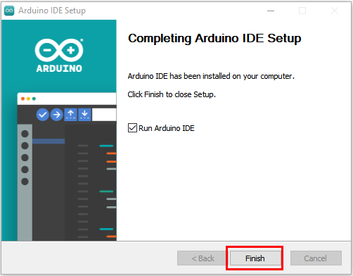


1.2. 在Windows系统上安装驱动：

（<span style="color: rgb(255, 76, 65);">注意：如果电脑已经安装了驱动程序，则不需要再安装驱动；如果没有，则需要进行以下操作</span>）
在使用ESP32主板之前，必须安装驱动程序，否则ESP32主板将无法与计算机通信。将主控板用USB线连接在电脑上，一般MacOS和Windows10系统的电脑会自动安装驱动。如果没能自动安装，则需要手动安装驱动。

（1）查看电脑是否自动安装好驱动：

点击“**计算机**”--“**属性**”--“**设备管理器**”，显示如下图是安装成功的了：


（2）如果没能自动安装，那就手动安装，步骤如下：

下载CP2102驱动程序的链接：[https://www.silabs.com/developers/usb-to-uart-bridge-vcp-drivers?tab=downloads](https://www.silabs.com/developers/usb-to-uart-bridge-vcp-drivers?tab=downloads)

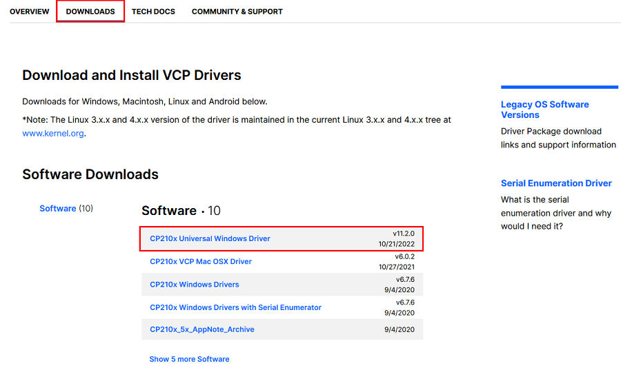

右键点击“**USB Serial**”，选择“**更新驱动程序(P)**”并点击。

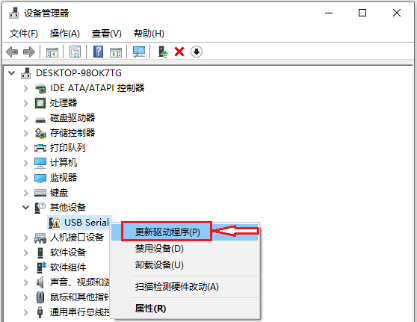

跳转到以下页面，选择“**浏览我的电脑以查找驱动程序(R)**”并点击。


我们在对应的文件夹中也提供有CP210X系列芯片的驱动文件，位置如下：

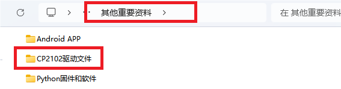

你可以先将驱动文件复制到电脑桌面上，然后点击“**浏览(R)...**”,选中CP210X系列芯片的驱动，最后点击“**下一页**”。

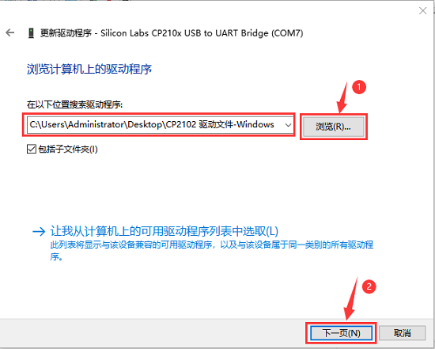

过一会儿，驱动安装成功。


这个时候再打开计算机设备管理器，就可以看到CP2102驱动程序已经安装成功了，刚刚那个黄色的感叹号不见了。


1.3. Arduino IDE工具栏介绍：

点击电脑桌面上的图标，打开Arduino IDE。

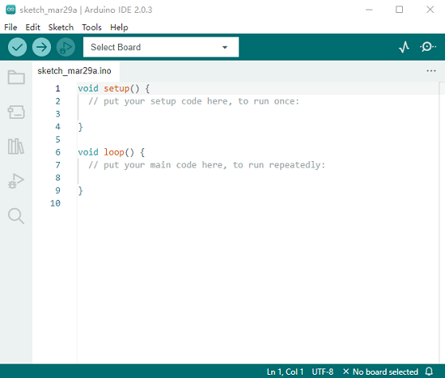

 -- 用于检查是否存在任何编译错误。

 -- 用于将程序上传到Arduino板。

 -- 用于编写程序时的单步调试。

 -- 用于从板接收串行数据并将串行数据发送到板的串行监视器。

 -- 用于串口接收的数据转换成动态曲线图。

 -- 用于打开最近保存的示例草图。

 -- 用手动安装开发板。

**语言切换功能：**

（1）单击“File”→“Preferences”，在 Preferences 页面中将语言“English”切换成“简体中文”，点击“OK”就可以了。


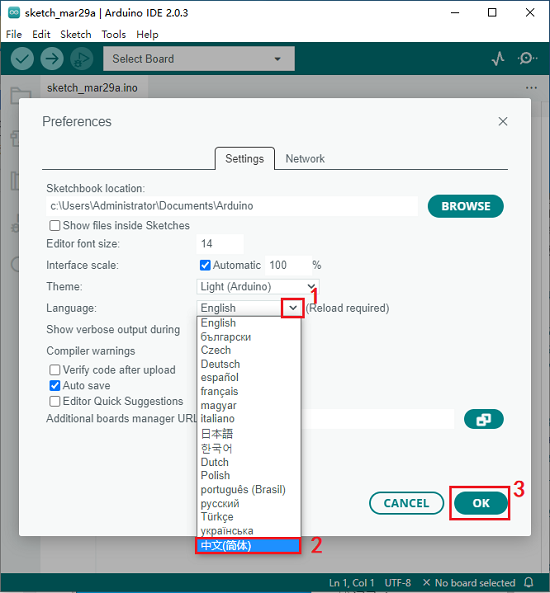

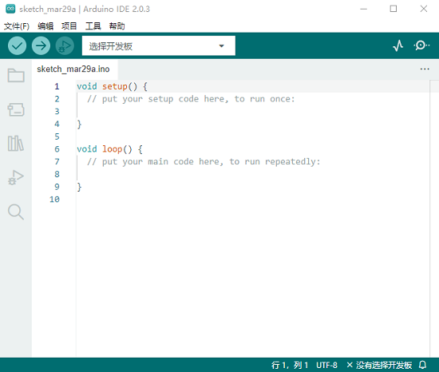


1.4. 在Arduino IDE上安装ESP32：

上面已经学习了怎么下载ArduinoIDE和怎么安装驱动，那下面就要在Arduino IDE上安装ESP32，请执行以下步骤：

<span style="color: rgb(255, 76, 65);">特别注意：你需要Arduino IDE 1.8.5或更高版本才能在其上安装ESP32。</span>

(1)点击电脑桌面上的图标，打开Arduino IDE。


(2)点击“文件” →“首选项”，如下图：


(3)打开下图标出的按钮。


(4)将这个地址：https://espressif.github.io/arduino-esp32/package_esp32_index.json ，复制粘贴到里面去再点击“**确定**”保存这个地址，如下图：

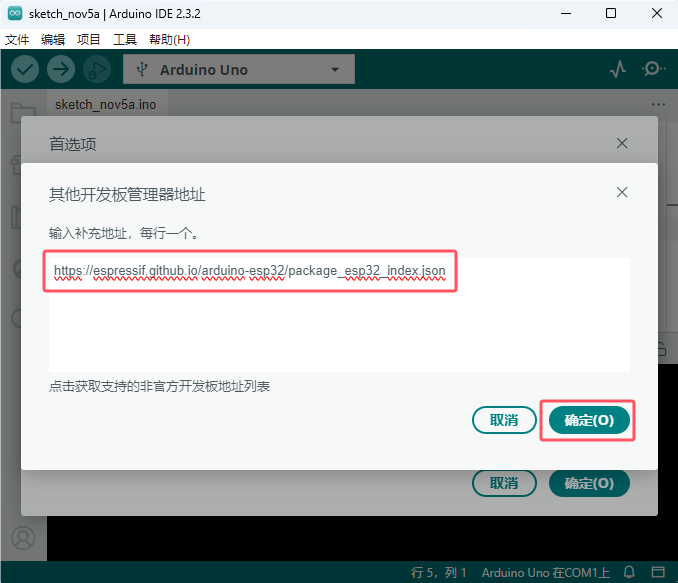

(5)再点击“**确定**”。

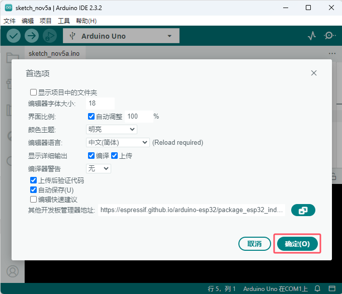

（6）先点击“**工具**”→“**开发版:**”，，再点击“**开发版管理器...**”进入“**开发版管理器**”页面，在文本框中输入“**esp32**”，选择 <span style="color: rgb(255, 76, 65);">1.06</span> 版本进行安装，安装包不大，点击“**安装**”开始安装相关安装包。如下图：**<span style="color: rgb(255, 76, 0);">（特别提醒：选择更高版本或最新版本，可能会出现安装失败。）</span>**


（7）点击“**工具**”→“**开发版:**”，就可以看到安装好的ESP32 Arduino，你可以在里面查看到各种不同型号ESP32开发板，选择对应的ESP32开发板型号。


（8）设置好板型后，再选择正确的COM口（安装驱动成功后可看到对应COM口），设置如下图。


**2.Mac系统:**


2.1.下载安装Arduino IDE:

进入Arduino官方网站：https://www.arduino.cc/ ，点击“**SOFTWARE**”进入下载页面，如下图所示：


2.2.如何安装CP2102驱动程序：

（注意：如果已经安装了驱动程序，则不需要再安装驱动；如果没有，则需要进行以下操作）
（1）用USB线将ESP32主板连接到你的MacOS系统电脑上，并打开Arduino IDE。

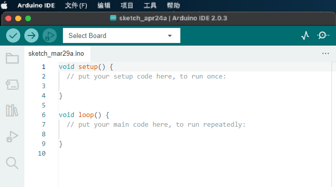

（2）CP2102驱动下载链接：[https://cn.silabs.com/developers/usb-to-uart-bridge-vcp-drivers?tab=downloads](https://cn.silabs.com/developers/usb-to-uart-bridge-vcp-drivers?tab=downloads)

（3）点击下载MacOS 版本。

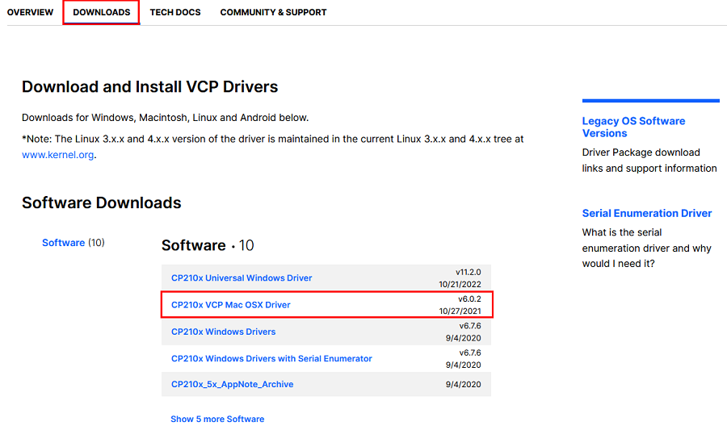

（4）解压下载好的压缩包。


（5）打开文件夹，双击“SiLabsUSBDriverDisk.dmg”文件。


可以看到以下文件。


（6）双击“Install CP210x VCP Driver”，勾选“Don’t warn me when opening application on this disk image”并单击“Open”。


（7）单击“Continue”。

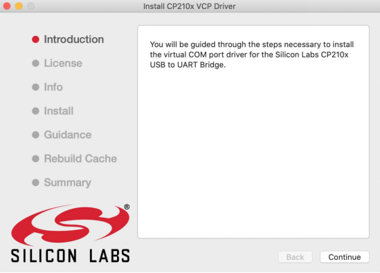

（8）先点击“Agree”，然后点击“Continue”。


（9）继续点击“Continue”，然后输入你的用户密码

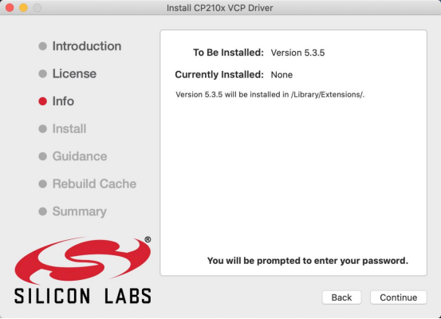


（10）选择“Open Security Preferences”。


（11）点击安全锁，输入你的用户密码来授权。


（12）看到锁被打开了，点击“Allow”。


（13）回到安装界面，根据提示等待安装.


（14）安装成功


2.3. 在Arduino IDE上安装ESP32：

上面已经学习了怎么下载ArduinoIDE和怎么安装驱动，那下面就要在Arduino IDE上安装ESP32，请执行以下步骤：

<span style="color: rgb(255, 76, 65);">特别注意：你需要Arduino IDE 1.8.5或更高版本才能在其上安装ESP32。</span>

(1)点击电脑桌面上的图标，打开Arduino IDE。点击“Arduino IDE” →“首选项”，如下图：

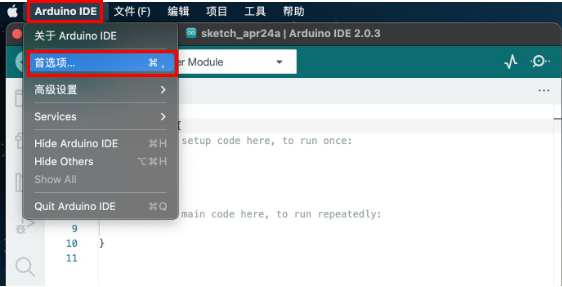

(2)打开下图标出的按钮


(3)将这个地址：https://espressif.github.io/arduino-esp32/package_esp32_index.json ，复制粘贴到里面去再点击“**确定**”保存这个地址，如下图：


(4)再点击“**确定**”。


（5）先点击“**工具**”→“**开发版:**”，，再点击“**开发版管理器...**”进入“**开发版管理器**”页面，在文本框中输入“**esp32**”，选择 <span style="color: rgb(255, 76, 65);">1.06</span> 版本进行安装，安装包不大，点击“**安装**”开始安装相关安装包。如下图：**<span style="color: rgb(255, 76, 0);">（特别提醒：选择更高版本或最新版本，可能会出现安装失败。）</span>**


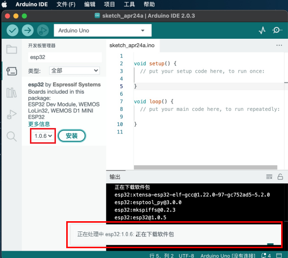

（6）点击“**工具**”→“**开发版:**”，就可以看到安装好的ESP32 Arduino，你可以在里面查看到各种不同型号ESP32开发板，选择对应的ESP32开发板型号。


（7）设置好板型后，再选择正确的COM口（安装驱动成功后可看到对应COM口），设置如下图。


**3.添加arduino库文件**

<span style="color: rgb(0, 209, 0); background: rgb(255, 251, 0);">特别提醒：库文件在上面 **<span style="color: rgb(255, 76, 65);">资料下载</span>** 处提供有，请下载并且安装好库文件。</span>

我们提供的Arduino库文件的路径：**..库文件\Arduino_C_Windows系统**。如下图：

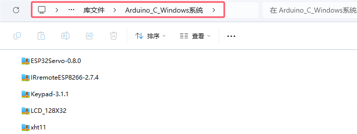

3.1. Windows系统添加库文件的方法：

（1）打开Arduino IDE，在Arduino IDE界面点击“**项目**”→“**包含库**”→“**添加.ZIP库...**”。

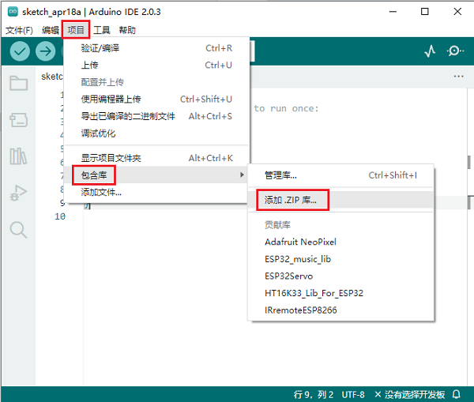

（2）找到库文件存放的位置，选中对应的库文件，点击“**打开**”添加即可。库文件只能一个一个的添加。（<span style="color: rgb(255, 76, 65);">注意：库文件需要压缩为 **.ZIP格式**；这里以“**ESP32Servo-0.8.0.ZIP**”为演示，其他库文件的添加方法是一样的。</span>）

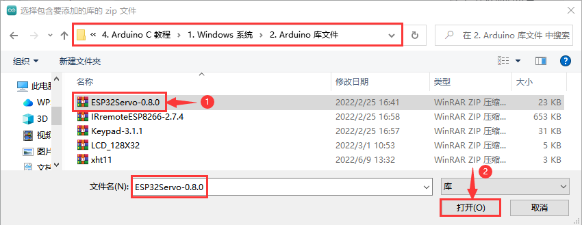

3.2. MacOS系统的库文件添加方法: 

（1）arduino IDE界面选择“**项目**” > “**包含库**” > “**添加.ZIP库...**”。

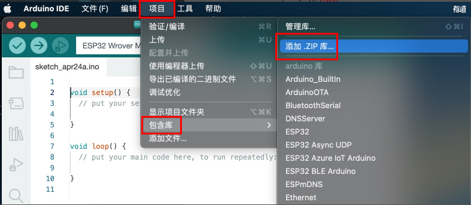

（2）找到库文件存放的位置，选中对应的库文件，点击“**打开**”添加即可。库文件只能一个一个的添加。（<span style="color: rgb(255, 76, 65);">这里以添加“ESP32Servo-0.8.0.ZIP”库文件为例，其他库文件的添加方法一样</span>），如下图：

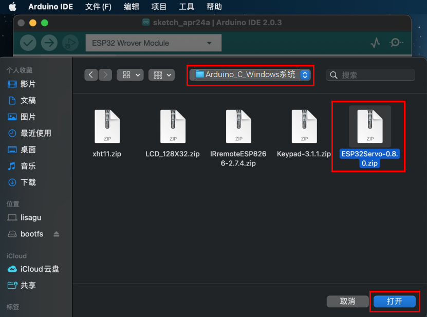

到这，正常是安装成功的了。


## 项目01 Hello World

**1.项目介绍：**

对于ESP32的初学者，我们将从一些简单的东西开始。在这个项目中，你只需要一个ESP32主板，USB线和电脑就可以完成“Hello World!”项目。它不仅是ESP32主板和电脑的通信测试，也是ESP32的初级项目。

**2.项目元件：**

|||
| :--: | :--: |
| ESP32*1 | USB 线*1 |

**3.项目接线：**

在本项目中，我们通过USB线将ESP32和电脑连接起来。


**4.项目代码：**

你可以打开我们提供的代码，本项目中使用的代码保存在（即路径)：**..\程序代码\Arduino_C_Windows系统_代码**。（**<span style="color: rgb(255, 76, 65);">后面的项目代码保存的路径也一样，即：同下</span>。**）

```
//*************************************************************************************
/*
 * 文件名 : Hello World
 * 描述 : 输入字母R，串口显示“Hello World”.
*/
char val;// 定义变量val
void setup()
{
Serial.begin(115200);// 设置波特率为115200
}
void loop()
{
  if (Serial.available() > 0) {
    val=Serial.read();// 读取并赋值给val
    if(val=='R')// 检查输入的字母“R”
    {  // 如果是这样的话,    
     Serial.println("Hello World!");// 显示“Hello World !”.
    }
  }
}
//*************************************************************************************

```
在上传项目代码到ESP32之前，点击“**工具**”→“**开发板**”，选择“**ESP32 Wrover Module**”。（**<span style="color: rgb(255, 76, 65);">后面上传项目代码的步骤也一样，即：同下</span>。**）

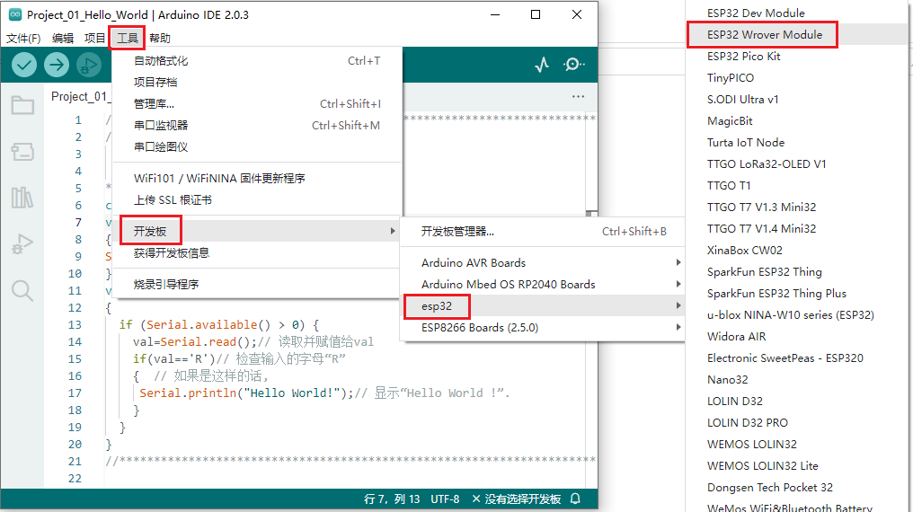

选择正确的端口（COM）。(<span style="color: rgb(255, 76, 65);">注意：</span>将ESP32主板通过USB线连接到计算机后才能看到对应的端口。)

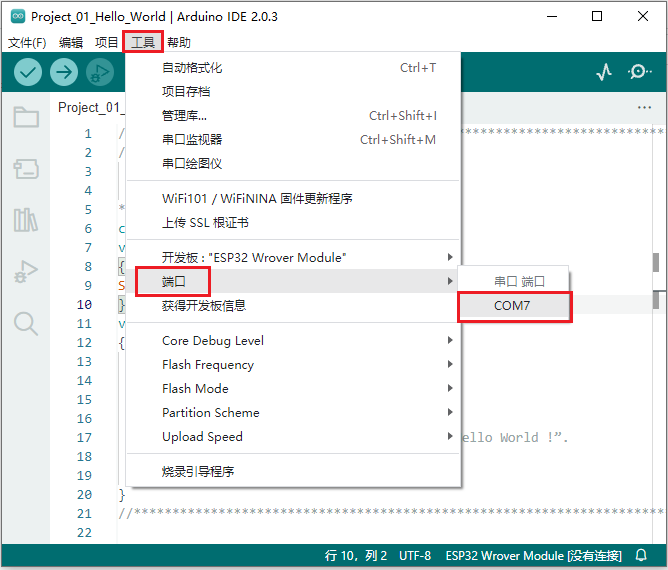

<span style="color: rgb(255, 76, 65);">注意：</span>对于macOS用户，如果上传失败，在单击之前，请设置波特率为**115200**。


单击将项目代码上传到ESP32主板上。


<span style="color: rgb(255, 76, 65);">注意：</span> 如果上传代码不成功，可以再次点击后用手按住ESP32主板上的Boot键，出现上传进度百分比数后再松开Boot键，如下图所示：


项目代码上传成功！


**5.项目结果：**

项目代码上传成功后，单击图标进入串行监视器，设置波特率为115200，在文本框输入字母“R”，按下回车键(Enter 键)，这样串口监视器打印“Hello World!”。


## 项目02 点亮LED

**1.项目介绍：**

在这个项目中，我们将向你展示点亮LED。我们使用ESP32的数字引脚打开LED，使LED被点亮。

**2.项目元件：**

||||
| :--: | :--: | :--: |
|ESP32*1|面包板*1|红色LED*1|
|| ||
|220Ω电阻*1|跳线*2|USB 线*1|

**3.元件知识：**

**（1）LED**


LED是一种被称为“发光二极管”的半导体，是一种由半导体材料(硅、硒、锗等)制成的电子器件。它有正极和负极。短腿为负极，接GND，长腿为正极，接3.3V或5V。


**（2）五色环电阻**

电阻是电路中限制或调节电流流动的电子元件。左边是电阻器的外观，右边是电阻在电路中表示的符号。电阻(R)的单位为欧姆(Ω)，1 mΩ= 1000 kΩ，1kΩ= 1000Ω。
   
我们可以使用电阻来保护敏感组件，如LED。电阻的强度（以Ω为单位）用小色环标记在电阻器的主体上。每种颜色代表一个数字，你可以用电阻对照卡查找。

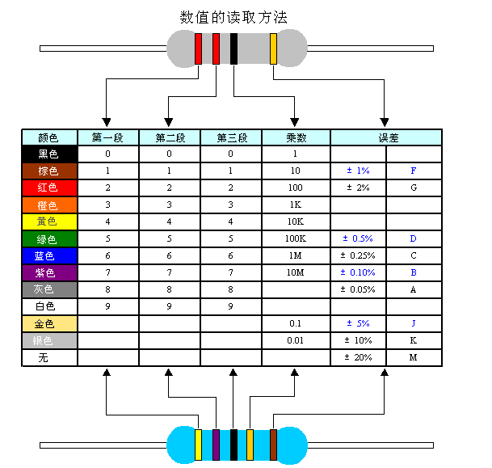

在这个套件中，我们提供了3个具有不同电阻值的五色环电阻。这里以3个五色环电阻为例：

220Ω电阻×10


10KΩ电阻×10


1KΩ电阻×10


在相同的电压下，会有更小的电流和更大的电阻。电流、电压、电阻之间的联系可以用公式表示：I=U/R。在下图中，目前通过R1的电流: I = U / R = 3 V / 10 KΩ= 0.0003A= 0.3mA。


不要把电阻值很低的电阻直接连接在电源两极，这样会使电流过高而损坏电子元件。电阻是没有正负极之分。

**（3）面包板**

面包板是实验室中用于搭接电路的重要工具。面包板上有许多孔，可以插入集成电路和电阻等电路元件。熟练掌握面包板的使用方法是提高实验效率，减少实验故障出现几率的重要基础之一。下面就面包板的结构和使用方法做简单介绍。一个典型的面包板如下所示：


 面包板的外观和内部结构如上图所示，常见的最小单元面包板分上、中、下三部分，上面和下面部分一般是由一行或两行的插孔构成的窄条，中间部分是由中间一条隔离凹槽和上下各5 行的插孔构成的条。


在面包板的两个窄条分别有两行插孔，两行之间是不连通的，一般是作为电源引入的通路。上方第一行标有“+”的一行有10组插孔（内部都是连通），均为正极；上方第二行标有“-”的一行有10组插孔，（内部都是连通），均为接地。面包板下方的第一行与第二行结构同上。如需用到整个面包板，通常将“+”与“+”用导线连接起来，“-”与“-”用导线连接起来。

中间部分宽条是由中间一条隔离凹槽和上下各5 行的插孔构成。在同一列中的5 个插孔是互相连通的，列和列之间以及凹槽上下部分则是不连通的。外观及结构如下图：

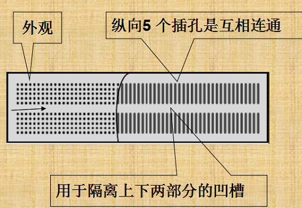

中间部分宽条的连接孔分为上下两部分，是面包板的主工作区，用来插接原件和跳线。在同一列中的5个插孔（即a-b-c-d-e，f-g-h-i-j）是互相连通的；列和列之间以及凹槽上下部分是不连通的。在做实验的时候，通常是使用两窄一宽组成的小单元，在宽条部分搭接电路的主体部分，上面的窄条取一行做电源，下面的窄条取一行做接地。中间宽条用于连接电路，由于凹槽上下是不连通的，所以集成块一般跨插在凹槽上。

**(4)电源**

ESP32需要3.3V-5V电源，在本项目中，我们通过用USB线将ESP32和电脑连起来。


**4.项目接线图：**

首先，切断ESP32的所有电源。然后根据接线图搭建电路。电路搭建好并验证无误后，用USB线将ESP32连接到电脑上。

<span style="color: rgb(255, 76, 65);">注意：</span>避免任何可能的短路(特别是连接3.3V和GND)!

<span style="color: rgb(255, 76, 65);">警告：短路可能导致电路中产生大电流，造成元件过热，并对硬件造成永久性损坏。</span>


<span style="color: rgb(255, 76, 65);">注意: </span>

怎样连接LED 


怎样识别五色环220Ω电阻


**5.项目代码：**

你可以打开我们提供的代码，本项目中使用的代码保存在（即路径)：**..\程序代码\Arduino_C_Windows系统_代码**。（**<span style="color: rgb(255, 76, 65);">后面的项目代码保存的路径也一样，即：同下</span>。**）

```
//**********************************************************************
/*
 * 文件名 : 点亮LED
 * 描述 : 点亮一盏灯.
*/
#define LED_BUILTIN 15

// 复位或单板上电时，setup功能只运行一次
void setup() {
  // 初始化数字引脚LED_BUILTIN作为输出.
  pinMode(LED_BUILTIN, OUTPUT);
}
void loop() {
  digitalWrite(LED_BUILTIN, HIGH);   // 打开LED (HIGH为高电平)
}
//*************************************************************************************

```
在上传项目代码到ESP32之前，点击“**工具**”→“**开发板**”，选择“**ESP32 Wrover Module**”。（**<span style="color: rgb(255, 76, 65);">后面上传项目代码的步骤也一样，即：同下</span>。**）

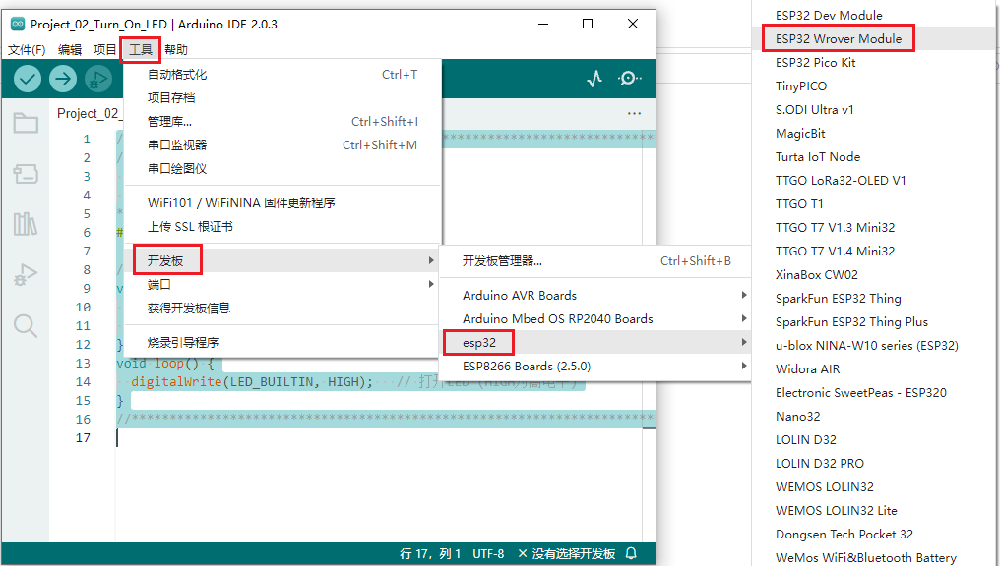

选择正确的端口（COM）。(<span style="color: rgb(255, 76, 65);">注意：</span>将ESP32主板通过USB线连接到计算机后才能看到对应的端口。)


<span style="color: rgb(255, 76, 65);">注意：</span>对于macOS用户，如果上传失败，在单击之前，请设置波特率为**115200**。

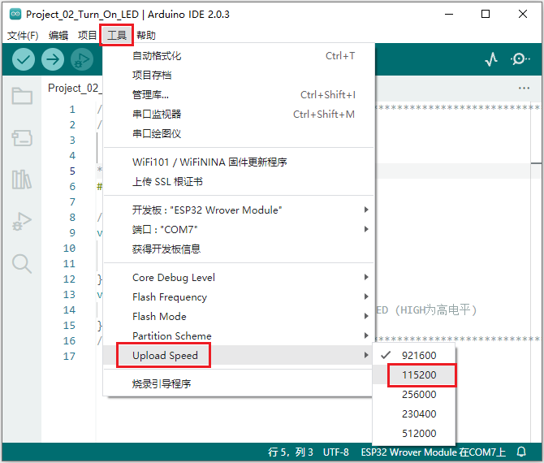

单击将项目代码上传到ESP32主板上。

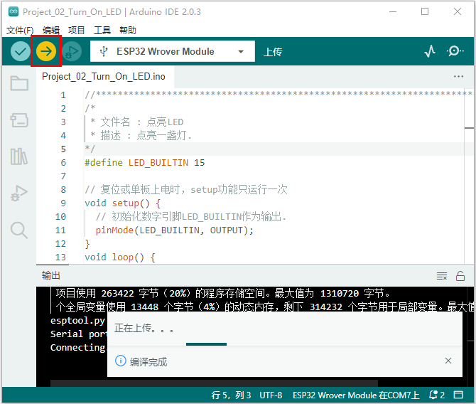

<span style="color: rgb(255, 76, 65);">注意：</span> 如果上传代码不成功，可以再次点击后用手按住ESP32主板上的Boot键，出现上传进度百分比数后再松开Boot键，如下图所示：


项目代码上传成功！

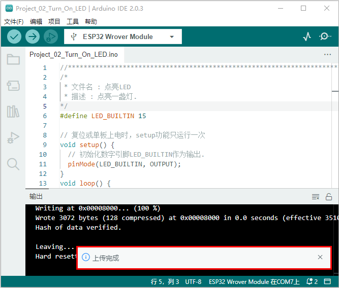

**6.项目现象：**

项目代码上传成功后，利用USB线供电，LED被点亮。


## 项目03 LED闪烁

**1.项目介绍：**

在这个项目中，我们将向你展示LED闪烁效果。我们使用ESP32的数字引脚打开LED，让它闪烁。

**2.项目元件：**

||||
| :--: | :--: | :--: |
|ESP32*1|面包板*1|红色LED*1|
|| ||
|220Ω电阻*1|跳线*2|USB 线*1|

**3.项目接线图：**

首先，切断ESP32的所有电源。然后根据电路图和接线图搭建电路。电路搭建好并验证无误后，用USB线将ESP32连接到电脑上。

<span style="color: rgb(255, 76, 65);">注意：</span>避免任何可能的短路(特别是连接3.3V和GND)!

<span style="color: rgb(255, 76, 65);">警告：短路可能导致电路中产生大电流，造成元件过热，并对硬件造成永久性损坏。 </span>


<span style="color: rgb(255, 76, 65);">注意: </span>

怎样连接LED 


怎样识别五色环220Ω电阻


**4.项目代码：**

你可以打开我们提供的代码，本项目中使用的代码保存在（即路径)：**..\程序代码\Arduino_C_Windows系统_代码**。（**<span style="color: rgb(255, 76, 65);">后面的项目代码保存的路径也一样，即：同下</span>。**）

```
//**********************************************************************
/*
 * 文件名 : LED 闪烁
 * 描述 : 让led闪烁.
*/
#define PIN_LED   15   //定义led引脚

// 复位或单板上电时，setup功能只运行一次
void setup() {
  // 初始化数字引脚LED作为输出.
  pinMode(PIN_LED, OUTPUT);
}

// 循环函数永远重复运行
void loop() {
  digitalWrite(PIN_LED, HIGH);   // 打开LED (HIGH为高电平)
  delay(500);                       // 延时 0.5s
  digitalWrite(PIN_LED, LOW);    // 关闭LED，使电压低
  delay(500);                       // 延时 0.5s
}
//*************************************************************************************

```
在上传项目代码到ESP32之前，请检查Arduino IDE的配置。（**<span style="color: rgb(255, 76, 65);">后面上传项目代码的步骤也一样，即：同下</span>。**）

单击“**工具**”，确认“**开发板**”板型和“**端口(COM)**”，如下所示：(<span style="color: rgb(255, 76, 65);">注意：</span>将ESP32主板通过USB线连接到计算机后才能看到对应的端口。)

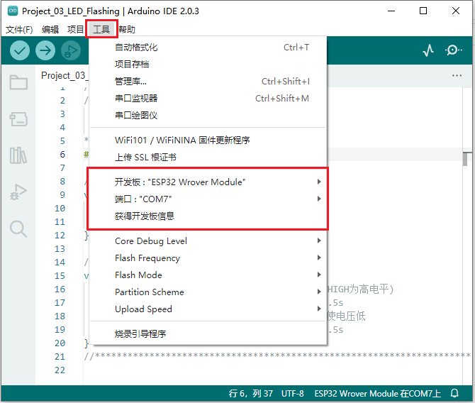

单击将项目代码上传到ESP32主板上。


<span style="color: rgb(255, 76, 65);">注意：</span> 如果上传代码不成功，可以再次点击后用手按住ESP32主板上的Boot键，出现上传进度百分比数后再松开Boot键，如下图所示：


项目代码上传成功！


**5.项目现象：**

项目代码上传成功后，利用USB线上电，可以看到的现象是：可以看到电路中的LED会反复闪烁。


## 项目04 呼吸灯

**1.项目介绍：**

在之前的研究中，我们知道LED有亮/灭状态，那么如何进入中间状态呢?如何输出一个中间状态让LED“半亮”?这就是我们将要学习的。呼吸灯，即LED由灭到亮，再由亮到灭，就像“呼吸”一样。那么，如何控制LED的亮度呢?我们将使用ESP32的PWM来实现这个目标。

**2.项目元件：**

||||
| :--: | :--: | :--: |
|ESP32*1|面包板*1|红色LED*1|
|| ||
|220Ω电阻*1|跳线*2|USB 线*1|

**3.元件知识：**


**模拟信号 & 数字信号** 

模拟信号在时间和数值上都是连续的信号。相反，数字信号或离散时间信号是由一系列数字组成的时间序列。生活中的大多数信号都是模拟信号，一个熟悉的模拟信号的例子是: 全天的温度是连续不断变化的，而不是突然从0到10的瞬间变化。然而，数字信号的值可以瞬间改变，这个变化用数字表示为1和0(二进制代码的基础)。如下图所示，我们可以更容易地看出它们的差异。


在实际应用中，我们经常使用二进制作为数字信号，即一系列的0和1。由于二进制信号只有两个值(0或1)，因此具有很大的稳定性和可靠性。最后，可以将模拟信号和数字信号相互转换。

**PWM：**

脉宽调制(PWM)是一种利用数字信号控制模拟电路的有效方法。普通处理器不能直接输出模拟信号。PWM技术使这种转换(将数字信号转换为模拟信号)非常方便。PWM技术利用数字引脚发送一定频率的方波，即高电平和低电平的输出，交替持续一段时间。每一组高电平和低电平的总时间一般是固定的，称为周期(注:周期的倒数是频率)。高电平输出的时间通常称为脉宽，占空比是脉宽(PW)与波形总周期(T)之比的百分比。高电平输出持续时间越长，占空比越长，模拟信号中相应的电压也就越高。下图显示了对应于脉冲宽度0%-100%的模拟信号电压在0V-3.3V(高电平为3.3V)之间的变化情况.


PWM占空比越长，输出功率越高。既然我们了解了这种关系，我们就可以用PWM来控制LED的亮度或直流电机的速度等等。从上面可以看出，PWM并不是真实的模拟信号，电压的有效值等于相应的模拟信号。因此，我们可以控制LED和其他输出模块的输出功率，以达到不同的效果。

**ESP32 与 PWM**

在ESP32上，LEDC(PWM)控制器有16个独立通道，每个通道可以独立控制频率，占空比，甚至精度。与传统的PWM引脚不同，ESP32的PWM输出引脚是可配置的，每个通道有一个或多个PWM输出引脚。最大频率与比特精度的关系如下公式所示：

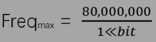

其中比特的最大值为31。例如: 生成PWM的8位精度(2ˆ8 = 256。取值范围为0 ~ 255)，最大频率为80,000,000/255 = 312,500Hz。)

**4.项目接线图：** 


**5.项目代码：**

<span style="color: rgb(255, 76, 65);">本项目设计使GPIO15 输出PWM，脉宽由0%逐渐增加到100%，再由100%逐渐减小到0%。</span>

你可以打开我们提供的代码，本项目中使用的代码保存在（即路径)：**..\程序代码\Arduino_C_Windows系统_代码**。（**<span style="color: rgb(255, 76, 65);">后面的项目代码保存的路径也一样，即：同下</span>。**）

```
//**********************************************************************
/*
 * 文件名 : 呼吸灯
 * 描述 : 让led灯像呼吸一样忽亮忽灭.
*/
#define PIN_LED   15   //定义led引脚
#define CHN       0   //定义PWM通道
#define FRQ       1000  //定义PWM频率
#define PWM_BIT   8     //定义PWM精度
void setup() {
  ledcSetup(CHN, FRQ, PWM_BIT); //设置PWM通道
  ledcAttachPin(PIN_LED, CHN);  //将led引脚连接到PWM通道
}

void loop() {
  for (int i = 0; i < 255; i++) { //让LED逐渐变亮
    ledcWrite(CHN, i);
    delay(10);
  }
  for (int i = 255; i > -1; i--) {  //让LED逐渐变暗
    ledcWrite(CHN, i);
    delay(10);
  }
}
//*************************************************************************************

```
在上传项目代码到ESP32之前，请检查Arduino IDE的配置。（**<span style="color: rgb(255, 76, 65);">后面上传项目代码的步骤也一样，即：同下</span>。**）

单击“**工具**”，确认“**开发板**”板型和“**端口(COM)**”，如下所示：(<span style="color: rgb(255, 76, 65);">注意：</span>将ESP32主板通过USB线连接到计算机后才能看到对应的端口。)

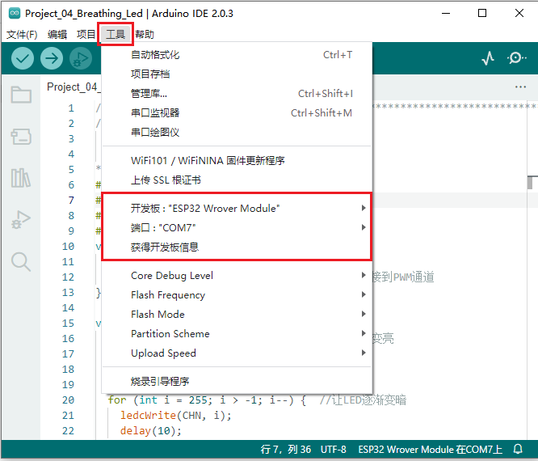

单击将项目代码上传到ESP32主板上。

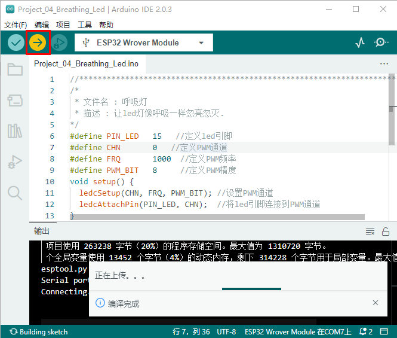

<span style="color: rgb(255, 76, 65);">注意：</span> 如果上传代码不成功，可以再次点击后用手按住ESP32主板上的Boot键，出现上传进度百分比数后再松开Boot键，如下图所示：


项目代码上传成功！


**6.项目现象：**

项目代码上传成功后，利用USB线上电，可以看到的现象是：电路中的LED从暗逐渐变亮，再从亮逐渐变暗，就像呼吸一样。


## 项目05 交通灯

**1.项目介绍：**

交通灯在我们的日常生活中很普遍。根据一定的时间规律，交通灯是由红、黄、绿三种颜色组成的。每个人都应该遵守交通规则，这可以避免许多交通事故。在这个项目中，我们将使用ESP32和一些led(红，黄，绿)来模拟交通灯。

**2.项目元件：**

|||||
| :--: | :--: | :--: | :--: |
|ESP32*1|面包板*1|红色LED*1|黄色 LED*1|
||| ||
|绿色LED*1|220Ω电阻*3|跳线若干|USB 线*1|

**3.项目接线图：**

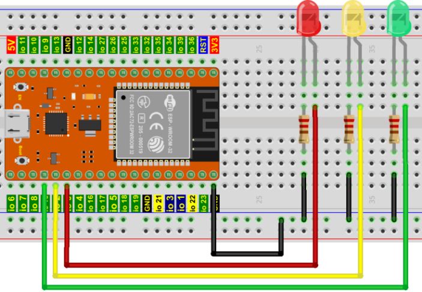

**4.项目代码：**

你可以打开我们提供的代码，本项目中使用的代码保存在（即路径)：**..\程序代码\Arduino_C_Windows系统_代码**。（**<span style="color: rgb(255, 76, 65);">后面的项目代码保存的路径也一样，即：同下</span>。**）

```
//**********************************************************************
/*
 * 文件名  : 交通灯
 * 描述 : 模拟交通灯.
*/
#define PIN_LED_RED   0   //定义红色引脚
#define PIN_LED_YELLOW   2   //定义黄色引脚
#define PIN_LED_GREEN  15   //定义绿色引脚

void setup() {
  pinMode(PIN_LED_RED, OUTPUT);
  pinMode(PIN_LED_YELLOW, OUTPUT);
  pinMode(PIN_LED_GREEN, OUTPUT);
}

void loop() {
   digitalWrite(PIN_LED_RED, HIGH);// 点亮红色的灯
   delay(5000);// 延时 5 s
   digitalWrite(PIN_LED_RED, LOW); // 熄灭红色的灯
   delay(500);// 延时 0.5 s
   for(int i=0;i<3;i++)// 闪烁 3 次.
  {
   digitalWrite(PIN_LED_YELLOW, HIGH);// 点亮黄色的灯
   delay(500);// 延时 0.5 s
   digitalWrite(PIN_LED_YELLOW, LOW);// 熄灭黄色的灯
   delay(500);// 延时 0.5 s
   } 
   digitalWrite(PIN_LED_GREEN, HIGH);// 点亮绿色的灯
   delay(5000);// 延时 5 s
   digitalWrite(PIN_LED_GREEN, LOW);// 
  delay(500);// 延时 0.5 s
}
//*************************************************************************************

```
在上传项目代码到ESP32之前，请检查Arduino IDE的配置。（**<span style="color: rgb(255, 76, 65);">后面上传项目代码的步骤也一样，即：同下</span>。**）

单击“**工具**”，确认“**开发板**”板型和“**端口(COM)**”，如下所示：(<span style="color: rgb(255, 76, 65);">注意：</span>将ESP32主板通过USB线连接到计算机后才能看到对应的端口。)


单击将项目代码上传到ESP32主板上。


<span style="color: rgb(255, 76, 65);">注意：</span> 如果上传代码不成功，可以再次点击后用手按住ESP32主板上的Boot键，出现上传进度百分比数后再松开Boot键，如下图所示：


项目代码上传成功！


**5.项目现象：**

项目代码上传成功后，利用USB线上电，你会看到的现象是：1.首先，红灯会亮5秒，然后熄灭；2.其次，黄灯会闪烁3次，然后熄灭；3.然后，绿灯会亮5秒，然后熄灭；4.继续运行上述1-3个步骤。


## 项目06 RGB LED


**1.项目介绍：**

RGB led由三种颜色(红、绿、蓝)组成，通过混合这三种基本颜色可以发出不同的颜色。在这个项目中，我们将向你介绍RGB LED，并向你展示如何使用ESP32控制RGB LED发出不同的颜色光。即使RGB LED是非常基本的，但这也是一个介绍自己或他人电子和编码基础的伟大方式。

**2.项目元件：**

||||
| :--: | :--: | :--: |
|ESP32*1|面包板*1|RGB LED*1|
|| ||
|220Ω电阻*3|跳线若干|USB 线*1|

**3.元件知识：**

显示器大多遵循RGB颜色标准，电脑屏幕上的所有颜色都是由红、绿、蓝三种颜色以不同比例混合而成。


这个RGB LED有4个引脚，每个颜色(红，绿，蓝)和一个共同的阴极。为了改变RGB led的亮度，我们可以使用ESP的PWM引脚。PWM引脚会给RGB led不同占空比的信号以获得不同的颜色。
如果我们使用3个10位PWM来控制RGBLED，理论上我们可以通过不同的组合创建2^10 ×2^10 ×2^10= 1,073,741,824(10亿)种颜色。

**4.项目接线图：**


**5.项目代码：**


```
//**********************************************************************
/*
 * 文件名  : RGB LED
 * 描述 : 使用RGB 显示随机颜色.
*/
int ledPins[] = {0, 2, 15};    //定义红、绿、蓝引脚
const byte chns[] = {0, 1, 2};        //定义PWM通道
int red, green, blue;
void setup() {
  for (int i = 0; i < 3; i++) {   //设置pwm通道，1KHz,8bit
    ledcSetup(chns[i], 1000, 8);
    ledcAttachPin(ledPins[i], chns[i]);
  }
}

void loop() {
  red = random(0, 256);
  green = random(0, 256);
  blue = random(0, 256);
  setColor(red, green, blue);
  delay(200);
}

void setColor(byte r, byte g, byte b) {
  ledcWrite(chns[0], 255 - r); //共阴极LED，高电平开启LED.
  ledcWrite(chns[1], 255 - g);
  ledcWrite(chns[2], 255 - b);
}
//*************************************************************************************

```


**6.项目现象：**

代码上传成功后，利用USB线上电后，你会看到的现象是：RGB LED开始显示随机颜色。


## 项目07 流水灯

**1.项目介绍：**

在日常生活中，我们可以看到许多由不同颜色的led组成的广告牌。他们不断地改变灯光(像流水一样)来吸引顾客的注意。在这个项目中，我们将使用ESP32控制10个leds实现流水的效果。

**2.项目元件：**

||||
| :--: | :--: | :--: |
|ESP32*1|面包板*1|红色LED*10|
|| ||
|220Ω电阻*10|跳线若干|USB 线*1|

**3.项目接线图:**


**4.项目代码：**

本项目是设计制作一个流水灯。这是这些行动：首先打开LED #1，然后关闭它。然后打开LED #2，然后关闭…并对所有10个LED重复同样的操作，直到最后一个LED关闭。这一过程反复进行，以实现流水的“运动”。


```
//**********************************************************************
/* 
 * 文件名 : 流水灯
 * 描述 : 用十个led来演示流动灯
*/
byte ledPins[] = {22, 21, 19, 18, 17, 16, 4, 0, 2, 15};
int ledCounts;

void setup() {
  ledCounts = sizeof(ledPins);
  for (int i = 0; i < ledCounts; i++) {
    pinMode(ledPins[i], OUTPUT);
  }
}

void loop() {
  for (int i = 0; i < ledCounts; i++) {
    digitalWrite(ledPins[i], HIGH);
    delay(100);
    digitalWrite(ledPins[i], LOW);
  }
  for (int i = ledCounts - 1; i > -1; i--) {
    digitalWrite(ledPins[i], HIGH);
    delay(100);
    digitalWrite(ledPins[i], LOW);
  }
}
//**********************************************************************

```


**5.项目现象：**

代码上传成功后，利用USB线上电后，你会看到的现象是：10个LED将从左到右点亮，然后从右到左返回。


## 项目08 一位数码管

**1.项目介绍：**

七段数码管是一种显示十进制数字的电子显示设备，广泛应用于数字时钟、电子仪表、基本计算器和其他显示数字信息的电子设备。甚至我们在电影中看到的炸弹也有七段数码管。也许七段数码管看起来不够现代，但它们是更复杂的点阵显示器的替代品，在有限的光线条件下和强烈的阳光下都很容易使用。在这个项目中，我们将使用ESP32控制一位数码管显示数字。

**2.项目元件：**

||||
| :--: | :--: | :--: |
|ESP32*1|面包板*1|一位数码管*1|
|| ||
|220Ω电阻*8|跳线若干|USB 线*1|

**3.元件知识：**


**一位数码管显示原理：** 数码管显示是一种半导体发光器件。它的基本单元是一个发光二极管(LED)。数码管显示根据段数可分为7段数码管和8段数码管。8段数码管比7段多一个LED单元(用于小数点显示)。七段LED显示屏的每段是一个单独的LED。根据LED单元接线方式，数码管可分为共阳极数码管和共阴极数码管。

在共阴极7段数码管中，分段LED的所有阴极(或负极)都连接在一起，你应该把共阴极连接到GND，要点亮一个分段LED，你可以将其关联的引脚设置为HIGH。

在共阳极7段数码管中，所有段的LED阳极(正极)都连接在一起，你应该把共阳极连接到+5V。要点亮一个分段LED，你可以将其关联的引脚设置为LOW。


数码管的每个部分由一个LED组成。所以当你使用它的时候，你也需要使用一个限流电阻。否则，LED会被烧坏。在这个实验中，我们使用了一个普通的<span style="color: rgb(255, 76, 65);">共阴极一位数码管</span>。正如我们上面提到的，你应该将公共阴极连接到GND, 要点亮一个分段LED，你可以将其关联的引脚设置为HIGH。

**4.项目接线图：**

<span style="color: rgb(255, 76, 65);">注意：</span>插入面包板的七段数码管方向与接线图一致，右下角多一个点。


**5.项目代码：**

数字显示分7段，小数点显示分1段。当显示某些数字时，相应的段将被点亮。例如，当显示数字1时，b和c段将被打开。

```
//**********************************************************************
/* 
 * 文件名 : 一位数码管
 * 描述 : 一位数管显示从9到0的数字.
*/
// 设置每个段的IO PIN
int a=16; // 段a的数字PIN 16
int b=4; // 段b的数字PIN 4
int c=5; // 段c的数字PIN 5
int d=18; // 段d的数字PIN 18
int e=19; // 段e的数字PIN 19
int f=22; // 段f的数字PIN 22
int g=23; // 段g的数字PIN 23
int dp=17; // 段dp的数字PIN 17
void digital_0(void) // 显示数字0
{
digitalWrite(a,HIGH);
digitalWrite(b,HIGH);
digitalWrite(c,HIGH);
digitalWrite(d,HIGH);
digitalWrite(e,HIGH);
digitalWrite(f,HIGH);
digitalWrite(g,LOW);
digitalWrite(dp,LOW);
}
void digital_1(void) // 显示数字 1
{
digitalWrite(a,LOW);
digitalWrite(b,HIGH);
digitalWrite(c,HIGH);
digitalWrite(d,LOW);
digitalWrite(e,LOW);
digitalWrite(f,LOW);
digitalWrite(g,LOW);
digitalWrite(dp,LOW);
}
void digital_2(void) // 显示数字 2
{
digitalWrite(a,HIGH);
digitalWrite(b,HIGH);
digitalWrite(c,LOW);
digitalWrite(d,HIGH);
digitalWrite(e,HIGH);
digitalWrite(f,LOW);
digitalWrite(g,HIGH);
digitalWrite(dp,LOW);
}
void digital_3(void) // 显示数字 3
{
digitalWrite(a,HIGH);
digitalWrite(b,HIGH);
digitalWrite(c,HIGH);
digitalWrite(d,HIGH);
digitalWrite(f,LOW);
digitalWrite(e,LOW);
digitalWrite(dp,LOW);
digitalWrite(g,HIGH);
}
void digital_4(void) // 显示数字 4
{
digitalWrite(a,LOW);
digitalWrite(b,HIGH);
digitalWrite(c,HIGH);
digitalWrite(d,LOW);
digitalWrite(e,LOW);
digitalWrite(f,HIGH);
digitalWrite(g,HIGH);
digitalWrite(dp,LOW);
}
void digital_5(void) // 显示数字 5
{
digitalWrite(a,HIGH);
digitalWrite(b,LOW);
digitalWrite(c,HIGH);
digitalWrite(d,HIGH);
digitalWrite(e,LOW);
digitalWrite(f,HIGH);
digitalWrite(g,HIGH);
digitalWrite(dp,LOW);
}
void digital_6(void) // 显示数字 6
{
digitalWrite(a,HIGH);
digitalWrite(b,LOW);
digitalWrite(c,HIGH);
digitalWrite(d,HIGH);
digitalWrite(e,HIGH);
digitalWrite(f,HIGH);
digitalWrite(g,HIGH);
digitalWrite(dp,LOW);
}
void digital_7(void) // 显示数字 7
{
digitalWrite(a,HIGH);
digitalWrite(b,HIGH);
digitalWrite(c,HIGH);
digitalWrite(d,LOW);
digitalWrite(e,LOW);
digitalWrite(f,LOW);
digitalWrite(g,LOW);
digitalWrite(dp,LOW);
}
void digital_8(void) // 显示数字 8
{
digitalWrite(a,HIGH);
digitalWrite(b,HIGH);
digitalWrite(c,HIGH);
digitalWrite(d,HIGH);
digitalWrite(e,HIGH);
digitalWrite(f,HIGH);
digitalWrite(g,HIGH);
digitalWrite(dp,LOW);
}
void digital_9(void) // 显示数字 9
{
digitalWrite(a,HIGH);
digitalWrite(b,HIGH);
digitalWrite(c,HIGH);
digitalWrite(d,HIGH);
digitalWrite(e,LOW);
digitalWrite(f,HIGH);
digitalWrite(g,HIGH);
digitalWrite(dp,LOW);
}
void setup()
{
  // 初始化数字引脚LED作为输出.
  pinMode(a, OUTPUT);
  pinMode(b, OUTPUT);
  pinMode(c, OUTPUT);
  pinMode(d, OUTPUT);
  pinMode(e, OUTPUT);
  pinMode(f, OUTPUT);
  pinMode(g, OUTPUT);
  pinMode(dp, OUTPUT);
}
void loop()
{
while(1)
{
digital_9();// 显示数字 9
delay(1000); // 延时 1 s
digital_8();// 显示数字 8
delay(1000); 
digital_7();// 显示数字 7
delay(1000); 
digital_6();// 显示数字 6
delay(1000); 
digital_5();// 显示数字 5
delay(1000); 
digital_4();// 显示数字 4
delay(1000); 
digital_3();// 显示数字 3
delay(1000); 
digital_2();// 显示数字 2
delay(1000);
digital_1();// 显示数字 1
delay(1000);
digital_0();// 显示数字 0
delay(1000);
}}
//**********************************************************************

```


**6.项目现象：**

代码上传成功后，利用USB线上电后，你会看到的现象是：一位数码管将显示从9到0的数字。


## 项目09 四位数码管

**1.项目介绍：**

四位数码管是一种非常实用的显示器件，电子时钟的显示，球场上的记分员，公园里的人数都是需要的。由于价格低廉，使用方便，越来越多的项目将使用4位数码管。在这个项目中，我们使用ESP32控制四位数码管来显示数字。

**2.项目元件：**

|||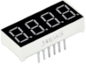 |
| :--: | :--: | :--: |
|ESP32*1|面包板*1|四位数码管*1|
|| ||
|220Ω电阻*8|跳线若干|USB 线*1|

**3.元件知识：**


**四位数码管：** 四位数码管有共阳极和共阴极两种四位数码管，显示原理是和一位数码管是类似的，都是8个GPIO口控制数码管的显示段，就是8个led灯，不过，这里是4位的，所以就还需要4个GPIO口来控制位选择端，就是选择哪个单个数码管亮，位的切换很快，肉眼区分不出来，这样看起来是多个数码管同时显示。

<span style="color: rgb(255, 76, 65);">我们的四位数码管是共阴极的</span>。

下图为4位数码管的引脚图，G1、G2、G3、G4就是控制位的引脚。


下图为4位数码管内部布线原理图


**4.项目接线图：**


**5.项目代码：**


```
//**********************************************************************
/* 
 * 文件名  : 四位数码管
 * 描述 : 四位数管显示从0到9999的数字。
*/
#define d_a 18   //定义数码管a至引脚18
#define d_b 13
#define d_c 2
#define d_d 16
#define d_e 17
#define d_f 19
#define d_g 0
#define d_dp 4

#define G1 21   //定义第一组nixtube G1到引脚21
#define G2 22
#define G3 14
#define G4 15

//数码管0-F码值
unsigned char num[17][8] =
{
 //a  b  c  d  e  f  g  dp 
  {1, 1, 1, 1, 1, 1, 0, 0},     //0
  {0, 1, 1, 0, 0, 0, 0, 0},     //1
  {1, 1, 0, 1, 1, 0, 1, 0},     //2
  {1, 1, 1, 1, 0, 0, 1, 0},     //3
  {0, 1, 1, 0, 0, 1, 1, 0},     //4
  {1, 0, 1, 1, 0, 1, 1, 0},     //5
  {1, 0, 1, 1, 1, 1, 1, 0},     //6
  {1, 1, 1, 0, 0, 0, 0, 0},     //7
  {1, 1, 1, 1, 1, 1, 1, 0},     //8
  {1, 1, 1, 1, 0, 1, 1, 0},     //9
  {1, 1, 1, 0, 1, 1, 1, 1},     //A
  {1, 1, 1, 1, 1, 1, 1, 1},     //B
  {1, 0, 0, 1, 1, 1, 0, 1},     //C
  {1, 1, 1, 1, 1, 1, 0, 1},     //D
  {1, 0, 0, 1, 1, 1, 1, 1},     //E
  {1, 0, 0, 0, 1, 1, 1, 1},     //F
  {0, 0, 0, 0, 0, 0, 0, 1},     //.
};

void setup()
{
  pinMode(d_a,OUTPUT);    //设置为输出引脚
  pinMode(d_b,OUTPUT);
  pinMode(d_c,OUTPUT);
  pinMode(d_d,OUTPUT);
  pinMode(d_e,OUTPUT);
  pinMode(d_f,OUTPUT);
  pinMode(d_g,OUTPUT);
  pinMode(d_dp,OUTPUT);

  pinMode(G1,OUTPUT);
  pinMode(G2,OUTPUT);
  pinMode(G3,OUTPUT);
  pinMode(G4,OUTPUT);
}

void loop()
{

  //从0开始计数，逐渐增加1到9999，重复。
  for(int l = 0;l < 10;l++ )
  {
    for(int k = 0; k < 10;k++)
    {
      for(int j = 0; j < 10; j++)
      {
        for(int i = 0;i < 10;i++)
        {
          //每秒闪烁125次等于1秒.
          //1000/8=125
          for(int q = 0;q<125;q++)
          {
            Display(1,l);//第一个数码管显示了l的值。
            delay(2);
            Display(2,k);
            delay(2);
            Display(3,j);
            delay(2);
            Display(4,i);
            delay(2);
          }

        }
      }
    }
  }
  

}

//显示功能:g的取值范围是1 ~ 4,num的取值范围是0 ~ 9
void Display(unsigned char g,unsigned char n) 
{
  digitalWrite(d_a,LOW);      //关闭对应LED段
  digitalWrite(d_b,LOW);
  digitalWrite(d_c,LOW);
  digitalWrite(d_d,LOW);
  digitalWrite(d_e,LOW);
  digitalWrite(d_f,LOW);
  digitalWrite(d_g,LOW);
  digitalWrite(d_dp,LOW);

  switch(g)           //选择
  {
    case 1:
      digitalWrite(G1,LOW);   //选择第一个数字
      digitalWrite(G2,HIGH);
      digitalWrite(G3,HIGH);
      digitalWrite(G4,HIGH);
      break;
    case 2:
      digitalWrite(G1,HIGH);
      digitalWrite(G2,LOW);   //选择第二个数字
      digitalWrite(G3,HIGH);
      digitalWrite(G4,HIGH);
      break;
    case 3:
      digitalWrite(G1,HIGH);
      digitalWrite(G2,HIGH);
      digitalWrite(G3,LOW);   //选择第三个数字
      digitalWrite(G4,HIGH);
      break;
    case 4:
      digitalWrite(G1,HIGH);
      digitalWrite(G2,HIGH);
      digitalWrite(G3,HIGH);
      digitalWrite(G4,LOW);   //选择第四个数字
      break;
    default:break;
  }

  digitalWrite(d_a,num[n][0]);      //a查询码值表
  digitalWrite(d_b,num[n][1]);
  digitalWrite(d_c,num[n][2]);
  digitalWrite(d_d,num[n][3]);
  digitalWrite(d_e,num[n][4]);
  digitalWrite(d_f,num[n][5]);
  digitalWrite(d_g,num[n][6]);
  digitalWrite(d_dp,num[n][7]);
}
//**********************************************************************

```


**6.项目现象：**

编译并上传代码到ESP32，代码上传成功后，利用USB线上电后，你会看到的现象是：四位数码管从0000开始计数，逐渐增加1到9999，并在一个无限循环中重复这些动作。


## 项目10 8×8点阵屏

**1.项目介绍：**

点阵屏是一种电子数字显示设备，可以显示机器、钟表、公共交通离场指示器和许多其他设备上的信息。在这个项目中，我们将使用ESP32控制8x8 LED点阵来显示图案。

**2.项目元件：**

||||
| :--: | :--: | :--: |
|ESP32*1|面包板*1|8×8点阵屏*1|
|| ||
|220Ω电阻*8|跳线若干|USB 线*1|

**3.元件知识：**

**8×8点阵：** 是由64个led灯组成，有行共阳极和行共阴极两种，我们的模块是行共阳极的，也就是每一行有一条线将LED的正极连到一起，列就是将LED灯的负极连接到一起，看下图：


每个LED被放置在一行和一列的交叉点上。当某一行的电平为1，某列的电平为0时，对应的LED会亮起。如果你想点亮第一个点上的LED，你应该将引脚9设置为高电平，引脚13设置为低电平。如果你想点亮第一排的led，你应该把引脚9设置为高电平，把引脚13、3、4、10、6、11、15和16设置为低电平。如果您想点亮第一列的led，将引脚13设置为低电平，将引脚9、14、8、12、1、7、2和5设置为高电平。

**8×8点阵屏的外部视图如下所示：**


**4.项目接线图：**


**5.项目代码：**


```
//**********************************************************************************
/* 
 * 文件名  : 8×8点阵屏
 * 描述 : 8×8点阵显示从0到9的数字.
*/
int R[] = {14,26,4,27,19,16,18,17};
int C[] = {32,21,22,12,0,13,33,25};

unsigned char data_0[8][8] =
{
{0,0,1,1,1,0,0,0},
{0,1,0,0,0,1,0,0},
{0,1,0,0,0,1,0,0},
{0,1,0,0,0,1,0,0},
{0,1,0,0,0,1,0,0},
{0,1,0,0,0,1,0,0},
{0,1,0,0,0,1,0,0},
{0,0,1,1,1,0,0,0}
};

unsigned char data_1[8][8] =
{
{0,0,0,0,1,0,0,0},
{0,0,0,1,1,0,0,0},
{0,0,0,0,1,0,0,0},
{0,0,0,0,1,0,0,0},
{0,0,0,0,1,0,0,0},
{0,0,0,0,1,0,0,0},
{0,0,0,0,1,0,0,0},
{0,0,0,1,1,1,0,0}
};

unsigned char data_2[8][8] =
{
{0,0,1,1,1,0,0,0},
{0,1,0,0,0,1,0,0},
{0,0,0,0,0,1,0,0},
{0,0,0,0,1,0,0,0},
{0,0,0,1,0,0,0,0},
{0,0,1,0,0,0,0,0},
{0,1,1,1,1,1,0,0},
{0,0,0,0,0,0,0,0}
};

unsigned char data_3[8][8] =
{
{0,0,1,1,1,1,0,0},
{0,0,0,0,0,1,0,0},
{0,0,0,0,0,1,0,0},
{0,0,1,1,1,1,0,0},
{0,0,0,0,0,1,0,0},
{0,0,0,0,0,1,0,0},
{0,0,1,1,1,1,0,0},
{0,0,0,0,0,0,0,0}
};

unsigned char data_4[8][8] =
{
{0,1,0,0,0,0,0,0},
{0,1,0,0,1,0,0,0},
{0,1,0,0,1,0,0,0},
{0,1,1,1,1,1,1,0},
{0,0,0,0,1,0,0,0},
{0,0,0,0,1,0,0,0},
{0,0,0,0,1,0,0,0},
{0,0,0,0,0,0,0,0}
};

unsigned char data_5[8][8] =
{
{0,1,0,0,0,0,0,0},
{0,1,1,1,1,1,0,0},
{0,1,0,0,0,0,0,0},
{0,1,1,1,1,1,0,0},
{0,0,0,0,0,1,0,0},
{0,0,0,0,0,1,0,0},
{0,1,1,1,1,1,0,0},
{0,0,0,0,0,0,0,0}
};

unsigned char data_6[8][8] =
{
{0,1,1,1,1,1,0,0},
{0,1,0,0,0,0,0,0},
{0,1,0,0,0,0,0,0},
{0,1,1,1,1,1,0,0},
{0,1,0,0,0,1,0,0},
{0,1,0,0,0,1,0,0},
{0,1,1,1,1,1,0,0},
{0,0,0,0,0,0,0,0}
};

unsigned char data_7[8][8] =
{
{0,0,0,0,0,0,0,0},
{0,1,1,1,1,1,0,0},
{0,0,0,0,0,1,0,0},
{0,0,0,0,1,0,0,0},
{0,0,0,1,0,0,0,0},
{0,0,1,0,0,0,0,0},
{0,1,0,0,0,0,0,0},
{0,0,0,0,0,0,0,0}
};

unsigned char data_8[8][8] =
{
{0,1,1,1,1,1,0,0},
{0,1,0,0,0,1,0,0},
{0,1,0,0,0,1,0,0},
{0,1,1,1,1,1,0,0},
{0,1,0,0,0,1,0,0},
{0,1,0,0,0,1,0,0},
{0,1,1,1,1,1,0,0},
{0,0,0,0,0,0,0,0}
};

unsigned char data_9[8][8] =
{
{0,1,1,1,1,1,0,0},
{0,1,0,0,0,1,0,0},
{0,1,0,0,0,1,0,0},
{0,1,1,1,1,1,0,0},
{0,0,0,0,0,1,0,0},
{0,0,0,0,0,1,0,0},
{0,1,1,1,1,1,0,0},
{0,0,0,0,0,0,0,0}
};

void Display(unsigned char dat[8][8])
{
for(int c = 0; c<8;c++)
{
digitalWrite(C[c],LOW);
for(int r = 0;r<8;r++)
{
digitalWrite(R[r],dat[r][c]);
}
delay(1);
Clear();
}
}

void Clear()
{
for(int i = 0;i<8;i++)
{
digitalWrite(R[i],LOW);
digitalWrite(C[i],HIGH);
}
}

void setup(){
  for(int i = 0;i<8;i++)
  {
    pinMode(R[i],OUTPUT);
    pinMode(C[i],OUTPUT);
  }

}

void loop(){
  for (int i = 1; i <= 100; i = i + (1)) {
    Display(data_0);
  }
  for (int i = 1; i <= 100; i = i + (1)) {
    Display(data_1);
  }
  for (int i = 1; i <= 100; i = i + (1)) {
    Display(data_2);
  }
  for (int i = 1; i <= 100; i = i + (1)) {
    Display(data_3);
  }
  for (int i = 1; i <= 100; i = i + (1)) {
    Display(data_4);
  }
  for (int i = 1; i <= 100; i = i + (1)) {
    Display(data_5);
  }
  for (int i = 1; i <= 100; i = i + (1)) {
    Display(data_6);
  }
  for (int i = 1; i <= 100; i = i + (1)) {
    Display(data_7);
  }
  for (int i = 1; i <= 100; i = i + (1)) {
    Display(data_8);
  }
  for (int i = 1; i <= 100; i = i + (1)) {
    Display(data_9);
  }
}
//**********************************************************************************

```


**6.项目现象：**

编译并上传代码到ESP32，代码上传成功后，利用USB线上电，你会看到的现象是：8*8点阵屏依次显示数字0~9，循环进行。

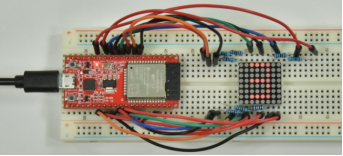


## 项目11 74HC595N控制8个LED

**1.项目介绍：**

在之前的项目中，我们已经学过了怎样点亮一个LED。

ESP32上只有32个IO端口，我们如何点亮大量的led呢? 有时可能会耗尽ESP32上的所有引脚，这时候就需要用移位寄存器扩展它。你可以使用74HC595N芯片一次控制8个输出，而只占用你的微控制器上的几个引脚。你还可以将多个寄存器连接在一起，以进一步扩展输出，在这个项目中，我们将使用ESP32，74HC595芯片和LED制作一个流水灯来了解74HC595芯片的功能。

**2.项目元件：**

|||||
| :--: | :--: | :--: | :--: |
|ESP32*1|面包板*1|74HC595N芯片*1|红色LED*8|
|| || |
|220Ω电阻*8|跳线若干|USB 线*1| |

**3.元件知识：**


**74HC595N芯片：** 简单来说就是具有8 位移位寄存器和一个存储器，以及三态输出功能。移位寄存器和存储器同步于不同的时钟，数据在移位寄存器时钟SCK的上升沿输入，在存储寄存器时钟RCK的上升沿进入的存储寄存器中去。如果两个时钟连在一起，则移位寄存器总是比存储寄存器早一个脉冲。移位寄存器有一个串行移位输入端（SI）和一个用于级联的串行输出端（SQH）,8位移位寄存器可以异步复位（低电平复位），存储寄存器有一个8位三态并行的总线输出，当输出使能（OE）被使能（低电平有效）将存储寄存器中输出至74HC595N的引脚（总线）。


**引脚说明：**

| 引脚： | 引脚说明： |
| :--: | :--: |
| 13引脚OE|	是一个输出使能引脚，用于确保锁存器的数据是否输入到Q0-Q7引脚。在低电平时，不输出高电平。在本实验中，我们直接连接GND，保持低电平输出数据。|
|14引脚SI/DS|这是74HC595接收数据的引脚，即串行数据输入端，一次只能输入一位，那么连续输入8次，就可以组成一个字节了。|
|10引脚SCLR/MR|一个初始化存储寄存器管脚的管脚。在低电平时初始化内部存储寄存器。在这个实验中，我们连接VCC以保持高水平。|
|11引脚SCK/SH_CP|移位寄存器的时钟引脚，上升沿时，移位寄存器中的数据整体后移，并接收新的数据输入。|
|12引脚RCK/ST_CP|存储寄存器的时钟输入引脚。上升沿时，数据从移位寄存器转存到存储寄存器中。这时数据就从Q0~Q7端口并行输出。|
|9引脚SQH|引脚是一个串行输出引脚，专门用于芯片级联，接下一个74HC595的SI端。|
|Q0--Q7(15引脚，1-7引脚)|八位并行输出端，可以直接控制数码管的8个段。|

**4.项目接线图：**

<span style="color: rgb(255, 76, 65);">注意：</span>需要注意74HC595N芯片插入的方向。


**5.项目代码：**


```
//**********************************************************************
/* 
 * 文件名 : 74HC595N 控制8个LED
 * 描述 : 用74HC575N驱动十个led流水灯.
*/
int dataPin = 14;   // 连接74HC595 DS的引脚(Pin14)  
int latchPin = 12;  // 74HC595的ST_CP连接引脚(Pin12)
int clockPin = 13;  // 74HC595的SH_CP连接引脚(Pin11)          

void setup() {
  // 设置引脚输出
  pinMode(latchPin, OUTPUT);
  pinMode(clockPin, OUTPUT);
  pinMode(dataPin, OUTPUT);
}

void loop() {
  // 定义一个单字节变量，用8位来表示LED柱状图的8个LED的状态。
  //该变量被赋值为0x01，即二进制00000001，表示只有一盏灯亮。
  byte x = 0x01;    // 0b 0000 0001
  for (int j = 0; j < 8; j++) { // 让led灯从右向左亮起
    writeTo595(LSBFIRST, x);
    x <<= 1; // 使变量向左移动一位，然后明亮的LED向左移动一步.
    delay(50);
  }
  delay(100);
  x = 0x80;       //0b 1000 0000
  for (int j = 0; j < 8; j++) { // 让led灯从左向右亮起
    writeTo595(LSBFIRST, x);
    x >>= 1;    
    delay(50);
  }
  delay(100);
}
void writeTo595(int order, byte _data ) {
  // 输出低电平到latchPin
  digitalWrite(latchPin, LOW);
  // 发送串行数据到74HC595
  shiftOut(dataPin, clockPin, order, _data);
  // 输出高电平到latchPin，74HC595将数据更新到并行输出端口.
  digitalWrite(latchPin, HIGH);
}
//**********************************************************************************

```


**6.项目现象：**

编译并上传代码到ESP32，代码上传成功后，利用USB线上电，可以看到的现象是：8个LED开始以流水模式闪烁。


## 项目12 有源蜂鸣器

**1.项目介绍：**

有源蜂鸣器是一个发声组件。它被广泛用作电脑、打印机、报警器、电子玩具、电话、计时器等的发声元件。它有一个内在的振动源，只需连接5V电源，即可持续发出嗡嗡声。在这个项目中，我们将使用ESP32控制有源蜂鸣器发出“滴滴”声。

**2.项目元件：**

|||||
| :--: | :--: | :--: | :--: |
|ESP32*1|面包板*1|有源蜂鸣器*1|NPN型晶体管(S8050)*1|
|| || |
|1KΩ电阻*1|跳线若干|USB线*1| |

**3.元件知识：**


**有源蜂鸣器：** 它内部有一个简单的振荡器电路，可以将恒定的直流电转换成特定频率的脉冲信号。一旦有源蜂鸣器收到一个高电平，它将产生声音。而无源蜂鸣器是一种内部没有振动源的集成电子蜂鸣器，它必须由2K-5K方波驱动，而不是直流信号。这两个蜂鸣器的外观非常相似，但是一个带有绿色电路板的蜂鸣器是无源蜂鸣器，而另一个带有黑色胶带的是有源蜂鸣器。无源蜂鸣器不能区分正极性而有源蜂鸣器是可以，如下所示：

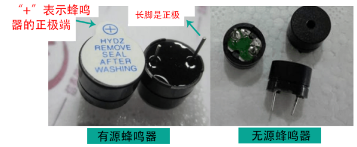


**晶体管:** 由于蜂鸣器需要很大的电流，ESP32输出能力的GPIO不能满足要求，这里需要一个NPN型晶体管来放大电流。晶体管，全称:半导体晶体管，是一种控制电流的半导体器件。晶体管可以用来放大微弱信号，也可以用作开关。它有三个电极(pin)：基极(b)，集电极(c)和发射极(e)。当电流通过“be”之间时，“ce”将允许几倍的电流通过(晶体管放大)，此时，晶体管在放大区工作。当“be”之间的电流超过某个值时，“ce”将不再允许电流增加，此时晶体管工作在饱和区。晶体管有两种类型如下所示：PNP和NPN


<span style="color: rgb(255, 76, 65);">在我们的套件中，PNP晶体管标记为8550, NPN晶体管标记为8050。</span>

基于晶体管的特性，它常被用作数字电路中的开关。由于单片机输出电流的能力很弱，我们将使用晶体管来放大电流和驱动大电流的元件。在使用NPN晶体管驱动蜂鸣器时，通常采用以下方法：如果GPIO输出高电平，电流将流过R1，晶体管将传导，蜂鸣器将发出声音。如果GPIO输出低电平，没有电流流过R1，晶体管就不会传导，蜂鸣器也不会响。在使用PNP晶体管驱动蜂鸣器时，通常采用以下方法：如果GPIO输出低电平，电流将流过R1，晶体管将传导，蜂鸣器将发出声音。如果GPIO输出高电平，没有电流流过R1，晶体管就不会传导，蜂鸣器也不会响。


**4.项目接线图：**

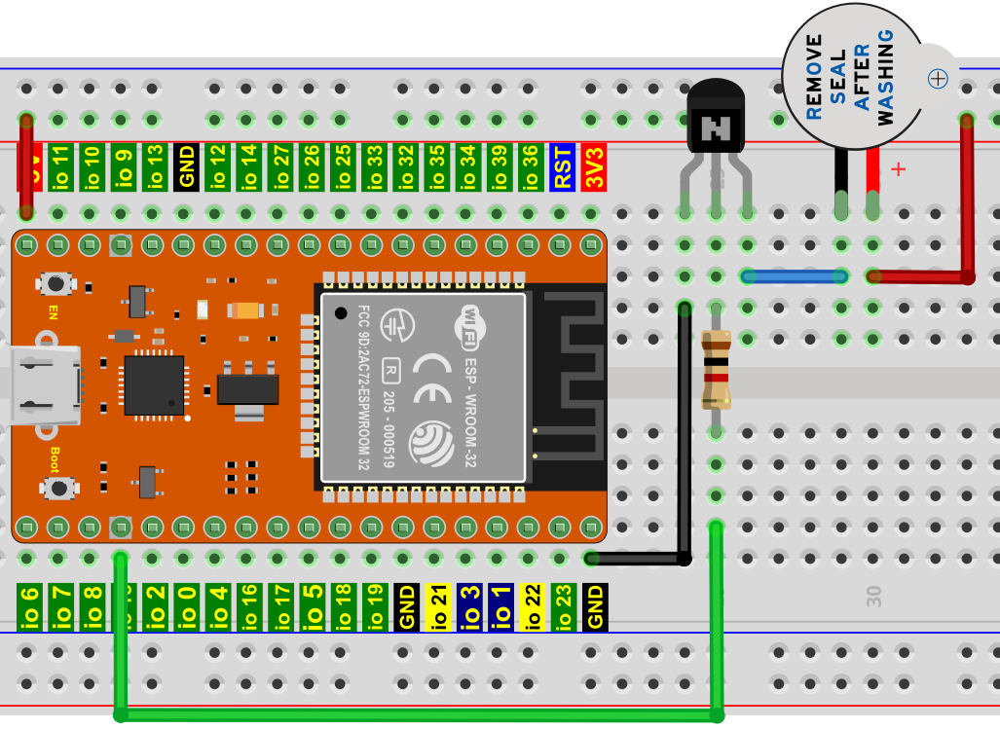

<span style="color: rgb(255, 76, 65);">注意：该电路中蜂鸣器的电源为5V。在3.3V的电源下，蜂鸣器可以工作，但会降低响度。</span>

**5.项目代码：**


```
//**********************************************************************
/* 
 * 文件名   : 有源蜂鸣器
 * 描述 : 有源蜂鸣器鸣叫.
*/
#define buzzerPin  15   //定义蜂鸣器引脚

void setup ()
{
  pinMode (buzzerPin, OUTPUT);
}
void loop ()
{
  digitalWrite (buzzerPin, HIGH);
  delay (500);
  digitalWrite (buzzerPin, LOW);
  delay (500);
}
//**********************************************************************************

```

**6.项目现象：**

编译并上传代码到ESP32，代码上传成功后，利用USB线上电，可以看到的现象是：有源蜂鸣器发出“滴滴”声。


## 项目13 无源蜂鸣器

**1.项目介绍：**

在之前的项目中，我们研究了有源蜂鸣器，它只能发出一种声音，可能会让你觉得很单调。这个项目将学习另一种蜂鸣器，无源蜂鸣器。与有源蜂鸣器不同，无源蜂鸣器可以发出不同频率的声音。在这个项目中，你将使用ESP32控制无源蜂鸣器工作。

**2.项目元件：**

|||||
| :--: | :--: | :--: | :--: |
|ESP32*1|面包板*1|无源蜂鸣器*1|NPN型晶体管(S8050)*1|
|| || |
|1KΩ电阻*1|跳线若干|USB线*1| |

**3.元件知识：**

  

**无源蜂鸣器：** 它是一种内部没有振动源的集成电子蜂鸣器。它必须由2K-5K方波驱动，而不是直流信号。这两个蜂鸣器的外观非常相似，但是一个带有绿色电路板的蜂鸣器是无源蜂鸣器，而另一个带有黑色胶带的是有源蜂鸣器。无源蜂鸣器不能区分正极性而有源蜂鸣器是可以，如下图：


**晶体管:** 请参考**项目12** 。

**4.项目接线图:**


**5.项目代码：**

```
//**********************************************************************
/*
 * 文件名   : 无源蜂鸣器
 * 描述 : 无源蜂鸣器发出警报.
*/
#define LEDC_CHANNEL_0 0

// LEDC定时器采用13位精度

#define LEDC_TIMER_13_BIT  13

// 定义工具I/O端口

#define BUZZER_PIN  15

//创建一个音乐旋律列表

int melody[] = {330, 330, 330, 262, 330, 392, 196, 262, 196, 165, 220, 247, 233, 220, 196, 330, 392, 440, 349, 392, 330, 262, 294, 247, 262, 196, 165, 220, 247, 233, 220, 196, 330, 392,440, 349, 392, 330, 262, 294, 247, 392, 370, 330, 311, 330, 208, 220, 262, 220, 262,

294, 392, 370, 330, 311, 330, 523, 523, 523, 392, 370, 330, 311, 330, 208, 220, 262,220, 262, 294, 311, 294, 262, 262, 262, 262, 262, 294, 330, 262, 220, 196, 262, 262,262, 262, 294, 330, 262, 262, 262, 262, 294, 330, 262, 220, 196};

//创建一个音调持续时间列表

int noteDurations[] = {8,4,4,8,4,2,2,3,3,3,4,4,8,4,8,8,8,4,8,4,3,8,8,3,3,3,3,4,4,8,4,8,8,8,4,8,4,3,8,8,2,8,8,8,4,4,8,8,4,8,8,3,8,8,8,4,4,4,8,2,8,8,8,4,4,8,8,4,8,8,3,3,3,1,8,4,4,8,4,8,4,8,2,8,4,4,8,4,1,8,4,4,8,4,8,4,8,2};
void setup() {
pinMode(BUZZER_PIN, OUTPUT); // 将蜂鸣器设置为输出模式
}

void loop() {

  int noteDuration; //创建一个变量noteDuration

  for (int i = 0; i < sizeof(noteDurations); ++i)

  {
      noteDuration = 800/noteDurations[i];

      ledcSetup(LEDC_CHANNEL_0, melody[i]*2, LEDC_TIMER_13_BIT);

      ledcAttachPin(BUZZER_PIN, LEDC_CHANNEL_0);

      ledcWrite(LEDC_CHANNEL_0, 50);

      delay(noteDuration * 1.30); //延时
  }
}
//**********************************************************************

```

**6.项目现象：**

编译并上传代码到ESP32，代码上传成功后，利用USB线上电，你会看到的现象是：无源蜂鸣器播放音乐。


## 项目14 小台灯

**1.项目介绍：**

你知道ESP32可以在你按下外接按键的时候点亮LED吗? 在这个项目中，我们将使用ESP32，一个按键开关和一个LED来制作一个迷你台灯。

**2.项目元件：**

|||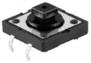|
| :--: | :--: | :--: |
|ESP32*1|面包板*1|按键*1|
||||
|10KΩ电阻*1|红色 LED*1|220Ω电阻*1|
|| ||
|按键帽*1|跳线若干|USB 线*1|

**3.元件知识：**


**按键：** 按键可以控制电路的通断，把按键接入电路中，不按下按键的时候电路是断开的，
一按下按键电路就通啦，但是松开之后就又断了。可是为什么按下才通电呢？这得从按键的内部构造说起。没按下之前，电流从按键的一端过不去另一端；按下的时候，按键内部的金属片把两边连接起来让电流通过。

按键内部结构如图：，未按下按键之前，1、2就是导通的，3、4也是导通的，但是1、3或1、4或2、3或2、4是断开（不通）的；只有按下按键时，1、3或1、4或2、3或2、4才是导通的。

在设计电路时，按键开关是最常用的一种元件。

**按键的原理图:**


  
**什么是按键抖动？**

我们想象的开关电路是“按下按键-立刻导通”“再次按下-立刻断开”，而实际上并非如此。
按键通常采用机械弹性开关，而机械弹性开关在机械触点断开闭合的瞬间（通常 10ms左右），会由于弹性作用产生一系列的抖动，造成按键开关在闭合时不会立刻稳定的接通电路，在断开时也不会瞬时彻底断开。


**那又如何消除按键抖动呢？**

常用除抖动方法有两种：软件方法和硬件方法。这里重点讲讲方便简单的软件方法。
我们已经知道弹性惯性产生的抖动时间为10ms 左右，用延时命令推迟命令执行的时间就可以达到除抖动的效果。

所以我们在代码中加入了0.02秒的延时以实现按键防抖的功能。


**4.项目接线图：**

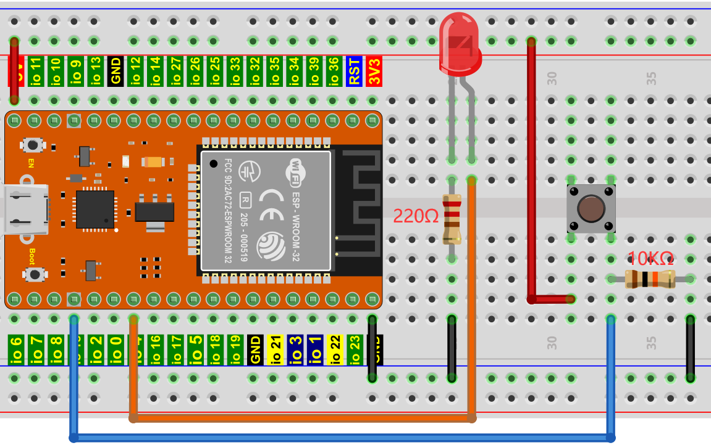

<span style="color: rgb(255, 76, 65);">注意: </span>

怎样连接LED 


怎样识别五色环220Ω电阻和五色环10KΩ电阻


**5.项目代码：**


```
//**********************************************************************
/* 
 * 文件名  : 小台灯
 * 描述 : 做一个小台灯.
*/
#define PIN_LED    4
#define PIN_BUTTON 15
bool ledState = false;

void setup() {
  // 初始化数字引脚PIN_LED作为输出.
  pinMode(PIN_LED, OUTPUT);
  pinMode(PIN_BUTTON, INPUT);
}

// 循环函数永远重复运行
void loop() {
  if (digitalRead(PIN_BUTTON) == LOW) {
    delay(20);
    if (digitalRead(PIN_BUTTON) == LOW) {
      reverseGPIO(PIN_LED);
    }
    while (digitalRead(PIN_BUTTON) == LOW);
  }
}

void reverseGPIO(int pin) {
  ledState = !ledState;
  digitalWrite(pin, ledState);
}
//**********************************************************************

```


**6.项目现象：**

编译并上传代码到ESP32，代码上传成功后，利用USB线上电，你会看到的现象是：按下按钮，LED亮起；当按钮松开时，LED仍亮着。再次按下按钮，LED熄灭；当按钮释放时，LED保持关闭。是不是很像个小台灯？


## 项目15 模拟沙漏

**1.项目介绍：**

古代人没有电子时钟，就发明了沙漏来测时间，沙漏两边的容量比较大，在一边装了细沙，中间有个很小的通道，将沙漏直立，有细沙的一边在上方，由于重力的作用，细沙就会往下流通过通道到沙漏的另一边，当细沙都流到下边了，就倒过来，把一天反复的次数记录下来，第二天就可以通过沙漏反复流动的次数而知道这一天大概的时间了。这一课我们将利用ESP32控制倾斜开关和LED灯来模拟沙漏，制作一个电子沙漏。

**2.项目元件：**

|||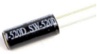||
| :--: | :--: | :--: | :--: |
|ESP32*1|面包板*1|倾斜开关*1|10KΩ电阻*1|
||| ||
|红色 LED*4|220Ω电阻*1|跳线若干|USB 线*1|

**3.元件知识：**


倾斜开关也叫数字开关或球形开关，里面有一个金属球。它用于检测小角度的倾斜。

原理很简单：当开关倾斜一定角度时，里面的球会向下滚动，接触到连接到外面引脚的两个触点，从而触发电路。否则，球将远离触点，从而断开电路。

这里用倾斜开关的内部结构来说明它是如何工作的，显示如下图：


**4.项目接线图：**


<span style="color: rgb(255, 76, 65);">注意: </span>

怎样连接LED 


怎样识别五色环220Ω电阻和五色环10KΩ电阻


**5.项目代码：**


```
//**********************************************************************
/* 
 * 文件名  : 倾斜和LED
 * 描述 : 倾斜开关和四个led模拟沙漏.
*/
#define SWITCH_PIN  15  // 倾斜开关连接Pin15
byte switch_state = 0;
void setup()
{
     for(int i=16;i<20;i++)
  {
        pinMode(i, OUTPUT);
  } 
    pinMode(SWITCH_PIN, INPUT);
 for(int i=16;i<20;i++)
  {
    digitalWrite(i,0);
  } 
  Serial.begin(9600);
}
void loop()
{
switch_state = digitalRead(SWITCH_PIN); 
Serial.println(switch_state);
 if (switch_state == 0) 
 {
 for(int i=16;i<20;i++)
  {
    digitalWrite(i,1);
    delay(500);
  } 
  }
   if (switch_state == 1) 
 {
   for(int i=19;i>15;i--)
   {
    digitalWrite(i,0);
    delay(500);
   }
  }
}
//**********************************************************************************

```


**6.项目现象：**

编译并上传代码到ESP32，代码上传成功后，利用USB线上电，你会看到的现象是：将面包板倾斜到一定角度，led就会一个一个地亮起来。当回到上一个角度时，led会一个一个关闭。就像沙漏一样，随着时间的推移，沙子漏了出来。

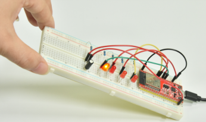


## 项目16 防窃警报器

**1.项目介绍：**

人体红外传感器测量运动物体发出的热的红外(IR)线。该传感器可以检测人、动物和汽车的运动，从而触发安全警报和照明。它们被用来检测移动，是安全的理想选择，如防盗警报和安全照明系统。在这个项目中，我们将使用ESP32控制人体红外传感器、蜂鸣器和LED来模拟防盗报警器。

**2.项目元件：**

|||||
| :--: | :--: | :--: | :--: |
|ESP32*1|面包板*1|人体红外传感器*1|NPN型晶体管(S8050)*1|
|||||
|有源蜂鸣器*1|红色 LED*1|220Ω电阻*1|1KΩ电阻*1|
|  | || |
|3P转杜邦线公单*1|跳线若干|USB 线*1| |

**3.元件知识：**

**人体红外传感器：** 是一款基于热释电效应的人体红外传感器，能检测到人体或动物身上发出的红外线，配合菲涅尔透镜能使传感器探测范围更远更广。它主要采用RE200B-P传感器元件，当附近有人或者动物运动时，该模块会输出一个高电平1；否则输出低电平0。特别注意，这个传感器可以检测在运动中的人、动物和汽车，静止中的人、动物和汽车是检测不到的，检测最远距离大约为7米左右。

<span style="color: rgb(255, 76, 65);">注意：人体红外传感器应避开日光、汽车头灯、白炽灯直接照射，也不能对着热源(如暖气片、加热器)或空调，以避免环境温度较大的变化而造成误报。同时还易受射频辐射的干扰。</span>

**传感器技术参数：**

最大输入电压：DC 5-15V 

最大工作电流：50MA

最大功率：0.3W

静态电流: <50uA

工作温度：-20 ~ 85℃

控制信号：数字信号(1/0)

延迟时间：大约2.3到3秒钟

感应角度：小于100度锥角

检测最远距离：大约7米左右

**传感器原理图：**


**4.项目接线图：**

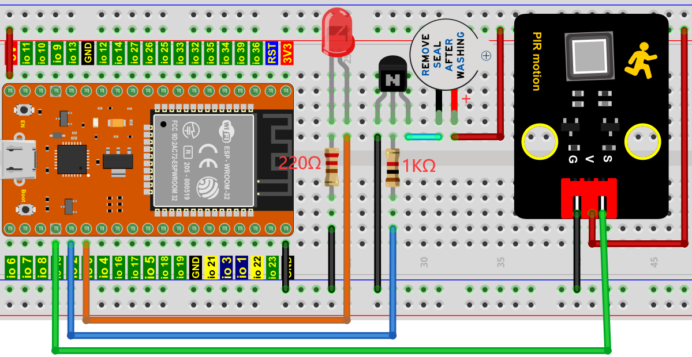

**5.项目代码：**


```
//**********************************************************************
/* 
 * 文件名  : 防盗报警器
 * 描述 : 人体红外传感器蜂鸣器和LED模拟防盗报警.
*/
#define buzzerPin   2   // 蜂鸣器的引脚
#define ledPin   0     // LED的引脚
#define pirPin   15     // PIR运动传感器的引脚
byte pirStat = 0;   // PIR运动传感器的状态
void setup() {
 pinMode(buzzerPin, OUTPUT); 
 pinMode(ledPin, OUTPUT);    
 pinMode(pirPin, INPUT);     
}
void loop()
{
 pirStat = digitalRead(pirPin); 

 if (pirStat == HIGH)
 {            // 如果检测到人或移动的动物
   digitalWrite(buzzerPin, HIGH);  // 蜂鸣器嗡嗡作响
   digitalWrite(ledPin, HIGH);  // led灯亮
   delay(500);
   digitalWrite(buzzerPin, LOW);  // 蜂鸣器不响
   digitalWrite(ledPin, LOW);  // led关闭
   delay(500);
 } 
 else {  // 否则，没有检测到人或移动的动物，
   digitalWrite(buzzerPin, LOW); // 关闭蜂鸣器
   digitalWrite(ledPin, LOW);  // led关闭
 }
}
//*********************************************************************************

```


**6.项目现象：**

编译并上传代码到ESP32，代码上传成功后，利用USB线上电，你会看到的现象是：如果人体红外传感器检测到附近有人移动时，蜂鸣器就会不断地发出警报，且LED不断地闪烁。

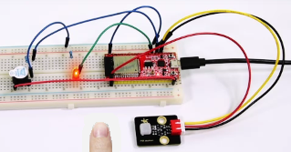


## 项目17 I2C 128×32 LCD

**1.项目介绍：**

在生活中，我们可以利用显示器等模块来做各种实验。你也可以DIY各种各样的小物件。例如，用一个温度传感器和显示器做一个温度测试仪，或者用一个超声波模块和显示器做一个距离测试仪。下面，我们将使用LCD_128X32_DOT模块作为显示器，将其连接到ESP32控制板上。将使用ESP32主板控制LCD_128X32_DOT显示屏显示各种英文文字、常用符号和数字。

**2.项目元件：**

||||
| :--: | :--: | :--: |
|ESP32*1|面包板*1|LCD_128X32_DOT*1|
||| |
|4P转杜邦线公单*1|USB 线*1| |

**3.元件知识：**


**LCD_128X32_DOT：** 一个像素为128*32的液晶屏模块，它的驱动芯片为ST7567A。模块使用IIC通信方式，它不仅可以显示英文字母、符号，还可以显示中文文字和图案。使用时，还可以在代码中设置，让英文字母和符号等显示不同大小。

**LCD_128X32_DOT原理图：**


**LCD_128X32_DOT技术参数：**

显示像素：128*32 字符

工作电压：DC 5V

工作电流：100mA (5V)

模块最佳工作电压：5V

亮度、对比度可通过程序指令控制

**4.项目接线图：**


**5.添加LCD_128×32库：**

本项目代码使用了一个名为“<span style="color: rgb(255, 76, 65);">LCD_128×32</span>”库。如果你已经添加好了“<span style="color: rgb(255, 76, 65);">LCD_128×32</span>”库，则跳过此步骤。如果你还没有添加，请在学习之前安装它。添加第三方库的步骤如下:

打开Arduino IDE，单击“**项目**”→“**包含库**”→“**添加.ZIP库...**”。在弹出窗口中找到该目录下名为**..\库文件\Arduino_C_Windows系统\LCD_128X32.ZIP**的文件，先选中**LCD_128X32.ZIP**文件，再单击“**打开**”。

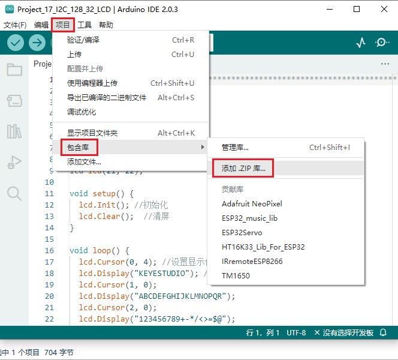

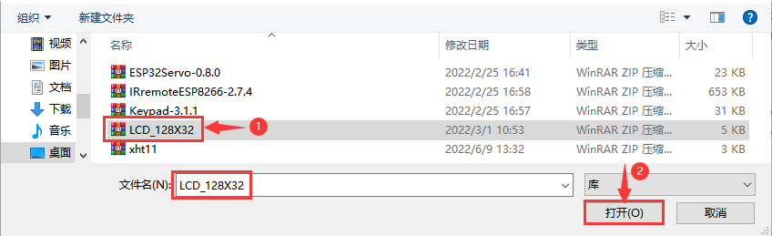

**6.项目代码：**


```
//**********************************************************************************
/*
 * 文件名  : LCD 128*32
 * 描述 : LCD 128*32显示字符串
*/
#include "lcd128_32_io.h"

//创建lCD128 *32引脚，sda--->21， scl--->22
lcd lcd(21, 22);

void setup() {
  lcd.Init(); //初始化
  lcd.Clear();  //清屏
}

void loop() {
  lcd.Cursor(0, 4); //设置显示位置
  lcd.Display("keyes"); //设置显示
  lcd.Cursor(1, 0);
  lcd.Display("ABCDEFGHIJKLMNOPQR");
  lcd.Cursor(2, 0);
  lcd.Display("123456789+-*/<>=$@");
  lcd.Cursor(3, 0);
  lcd.Display("%^&(){}:;'|?,.~\\[]");
}
//**********************************************************************************

```

**7.项目现象：**

编译并上传代码到ESP32，代码上传成功后，利用USB线上电，你会看到的现象是：128X32LCD模块显示屏第一行显示“keyes”、第二行显示“ABCDEFGHIJKLMNOPQR”、第三行显示“123456789+-*/<>=$@”、第四行显示“%^&(){}:;'|?,.~\\[]”。


## 项目18 小风扇

**1.项目介绍：** 

在炎热的夏季，需要电扇来给我们降温，那么在这个项目中，我们将使用ESP32控制直流电机和小扇叶来制作一个小电扇。

**2.项目元件：**

||||||
| :--: | :--: | :--: | :--: | :--: |
|ESP32*1|面包板*1|直流电机*1|面包板专用电源模块*1|6节5号电池盒*1|
|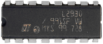|||||
|IC L293D*1|风扇叶*1|跳线若干|5号电池(<span style="color: rgb(255, 76, 65);">自备</span>)*6|USB 线*1|

**3.元件知识:**


L293D芯片：L293D是一种直流电动驱动IC，在一些机器人项目中可用来驱动直流电机或步进电机。它共有16个引脚，可以同时驱动两路直流电机。输入电压范围：4.5 V ~ 36 V，每通道输出电流：MAX 600mA，可以驱动感性负载，特别是其输入端可以与主控板直接相连，从而很方便地受主控板控制。当驱动小型直流电机时，可以直接控制两路电机，并且可以实现电机正转与反转，实现此功能只需改变输入端的高低电平。市面上有许多采用L293D芯片的电机驱动板，当然我们也可以自己通过简单连接来使用它。

**L293D引脚图：**

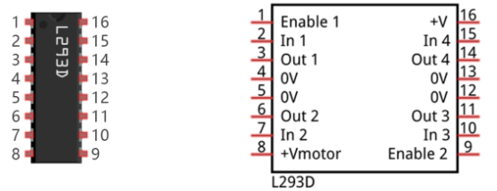
|引脚号| 引脚名称 | 描述 |
| :--: | :--: | :--: |
| 1 | Enable1 | 该引脚使能输入引脚Input 1(2)和Input 2(7)  |
| 2 | In1 | 直接控制输出1引脚，由数字电路控制 |
| 3 | Out1 | 连接到电机1的一端 |
| 4 | 0V | 接地引脚连接到电路的接地(0V) |
| 5 | 0V | 接地引脚连接到电路的接地(0V) |
| 6 |Out2 | 连接到电机1的另一端 |
| 7 | In2 | 直接控制输出2引脚。由数字电路控制 |
| 8 | +V motor | 连接到运行电机的电压引脚(4.5V至36V) |
| 9 | Enable2 |该引脚使能输入引脚输入3(10)和输入4(15) |
| 10 | In3 | 直接控制输出3引脚。由数字电路控制|
| 11 | Out3 | 连接到电机2的一端 |
| 12 | 0V | 接地引脚连接到电路的接地(0V) |
| 13 | 0V | 接地引脚连接到电路的接地(0V) |
| 14 | Out4 | 连接到电机2的另一端 |
| 15 |In4 | 直接控制输出4引脚，由数字电路控制|
| 16 | +V | 连接到+ 5V以启用IC功能 |

**面包板专用电源模块：**


**说明：**

此模块，能方便的给面包板提供3.3V和5V的电源，具有DC2.1输入（DC7－12V），另外，具备USB Type C接口的电源输入。

**规格：** 

 输入电压：DC座：7-12V；  Type C USB：5V 

 电流：3.3V：最大500mA；        5V：最大500mA；

 最大功率: 2.5W

 尺寸: 53mmx26.3mm

 环保属性: ROHS

**接口说明：**


**原理图：**


**4.项目接线图：**


(<span style="color: rgb(255, 76, 65);">注: 先接好线，然后在直流电机上安装一个小风扇叶片。</span>)

**5.项目代码：**


```
//**********************************************************************************
/*
 * 文件名  : 小风扇
 * 描述 : 小风扇逆时针旋转，停止，顺时针旋转，停止，循环。
*/
#define IN1 2  // L293D的IN1引脚
#define IN2 15  //L293D的IN2引脚
#define ENA_pwm 0  //L293D的ENA-pwm引脚
void setup()
{
pinMode(IN1,OUTPUT); //设置N1为OUTPUT
pinMode(IN2,OUTPUT); //设置N2为OUTPUT
ledcSetup(2, 1200, 8);//设置ledc通道2，频率为1200,PWM分辨率为8，占空比为256。
ledcAttachPin(0, 2); //将ledc通道2绑定到指定的ENA_pwm引脚GPIO0进行输出。
}
void loop()
{
//逆时针旋转5秒
digitalWrite(IN1,LOW);
digitalWrite(IN2,HIGH);
ledcWrite(2, 250); //ledc通道2被绑定到指定的ENA_pwm输出PWM值250。
delay(5000);
//停止 2s 
ledcWrite(2, 0); //ledc通道2被绑定到指定的ENA_pwm输出PWM值0。
delay(2000);
//顺时针旋转5秒
digitalWrite(IN1,HIGH);
digitalWrite(IN2,LOW);
ledcWrite(2, 250); //ledc通道2被绑定到指定的ENA_pwm输出PWM值250。
delay(5000);
//停止 2s
ledcWrite(2, 0); //ledc通道2被绑定到指定的ENA_pwm输出PWM值0。
delay(2000);
}
//********************************************************************************

```


**6.项目现象：**

编译并上传代码到ESP32，代码上传成功后，外接电源，上电后，你会看到的现象是：小风扇先逆时针转5秒，停止2秒，再顺时针转5秒，停止2秒，以此规律重复执行。


## 项目19 舵机

**1.项目介绍：**

舵机是一种可以非常精确地旋转的电机。目前已广泛应用于玩具车、遥控直升机、飞机、机器人等领域。在这个项目中，我们将使用ESP32控制舵机转动。

**2.项目元件：**

||||
| :--: | :--: | :--: |
|ESP32*1|面包板*1|舵机*1|
||| |
|跳线若干|USB 线*1| |

**3.元件知识：**


**舵机：** 舵机是一种位置伺服的驱动器，主要是由外壳、电路板、无核心马达、齿轮与位置检测器所构成。其工作原理是由接收机或者单片机发出信号给舵机，其内部有一个基准电路，产生周期为20ms，宽度为1.5ms 的基准信号，将获得的直流偏置电压与电位器的电压比较，获得电压差输出。经由电路板上的IC 判断转动方向，再驱动无核心马达开始转动，透过减速齿轮将动力传至摆臂，同时由位置检测器送回信号，判断是否已经到达定位。适用于那些需要角度不断变化并可以保持的控制系统。当电机转速一定时，通过级联减速齿轮带动电位器旋转，使得电压差为0，电机停止转动。一般舵机旋转的角度范围是0度到180 度。

控制舵机的脉冲周期为20ms，脉冲宽度为0.5ms ~ 2.5ms，对应位置为-90°~ +90°。下面是以一个180°角的舵机为例：


舵机有多种规格，但它们都有三根连接线，分别是棕色、红色、橙色(不同品牌可能有不同的颜色)。棕色为GND，红色为电源正极，橙色为信号线。


**4.项目接线图：**

舵机供电时请注意，电源电压应为3.3V-5V。请确保在将舵机连接到电源时不会出现任何错误。


**5.添加ESP32Servo库：**

如果你已经添加好了“<span style="color: rgb(255, 76, 65);">ESP32Servo</span>”库，则跳过此步骤。如果你还没有添加“<span style="color: rgb(255, 76, 65);">ESP32Servo</span>”库，请在学习之前添加它。添加第三方库的步骤如下:

**如何安装库？**

打开Arduino IDE，单击“**项目**”→“**包含库**”→“**添加.ZIP库...**”。在弹出窗口中找到该目录下名为**..\库文件\Arduino_C_Windows系统\ESP32Servo-0.8.0.ZIP**的文件，先选中**ESP32Servo-0.8.0.ZIP**文件，再单击“**打开**”。


**6.项目代码：**


```
//**********************************************************************
/*
 * 文件名  : 舵机转动
 * 描述 : 控制舵机进行清扫
*/
#include <ESP32Servo.h>

Servo myservo;  // 创建舵机对象来控制舵机

int posVal = 0;    // 变量来存储舵机位置
int servoPin = 15; // 舵机引脚

void setup() {
  myservo.setPeriodHertz(50);           // 标准50赫兹舵机
  myservo.attach(servoPin, 500, 2500);  // 将servoPin上的舵机附加到舵机对象上
}
void loop() {

  for (posVal = 0; posVal <= 180; posVal += 1) { // 从0°到180°
    // 以1度为阶梯
    myservo.write(posVal);       // 告诉舵机进入可变'posVal'位置
    delay(15);                   // 等待15ms舵机到达位置
  }
  for (posVal = 180; posVal >= 0; posVal -= 1) { // 从180°到0°
    myservo.write(posVal);       // 告诉舵机进入可变'posVal'位置
    delay(15);                   // 等待15ms舵机到达位置
  }
}
//********************************************************************************

```


**6.项目现象：**

编译并上传代码到ESP32，代码上传成功后，利用USB线上电，你会看到的现象是：舵机将从0°旋转到180°，然后反转方向使其从180°旋转到0°，并在一个无限循环中重复这些动作。


## 项目20 步进电机

**1.项目介绍：**

步进电机定位准确，是工业机器人、3D打印机、大型车床等机械设备中最重要的部件。在这个项目中，我们将使用ESP32控制ULN2003步进电机驱动板来驱动步进电机转动。

**2.项目元件：**

||||
| :--: | :--: | :--: |
|ESP32*1|面包板*1|ULN2003步进电机驱动板*1|
||||
|面包板专用电源模块*1|6节5号电池盒*1|步进电机*1|
||||
|公对母杜邦线若干|5号电池(<span style="color: rgb(255, 76, 65);">自备</span>)*6|USB 线*1|

**3.项目知识：**


**步进电机：** 是由一系列电磁线圈控制的电机。它可以根据需要旋转精确的度数(或步数)，允许你将它移动到一个精确的位置并保持该位置。它是通过在很短的时间内为电机内部的线圈供电来做到这一点的，但你必须一直为电机供电，以保持它在你想要的位置。有两种基本类型的步进电机，单极步进和双极步进。在本项目中，我们使用的是单极步进电机28-BYJ48。

 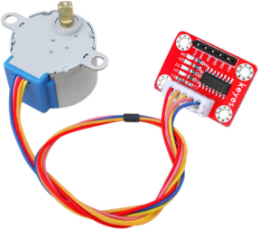
      
**28BYJ-48步进电机工作原理：**

步进电机主要由定子和转子组成，定子是固定不动的，如下图绕着A、B、C、D线圈组的部分，线圈组导通电就会产生磁场；转子就是转动的部分，如下图定子中间的部分，两极是永磁铁。
                         
单步4节拍的转动原理：开始A组线圈导通，转子两极正对着A组线圈；接着A组线圈断开，B组线圈导通，转子就会顺时针转到B组线圈，转子转了一步；B断开，C导通，转子转到C组；C断开，D导通，转子转到D组；D组断开，A组导通，转子转到A组线圈。这样转子就转了半圈180度，接着再重复一次，B-C-D-A，转子转回到A组线圈，这样转子就转了一圈，总共转动了8步。如下图所示，这就是步进电机单节拍转动的原理A - B - C - D - A ....。

 如果想让步进电机逆时针转动，那只要把节拍顺序反过来就行，D - C - B - A - D .....。


半步8节拍转动原理：8节拍，采用的是单双拍的形式，A - AB - B - BC - C - CD - D - DA - A ...... ，这样运转一拍，转子只会转动半步，例如，A组线圈导通，转子转到正对着A组线圈；接着A和B组一起导通，这样产生的磁场最强的地方在AB组线圈中间，转子两极就会转到AB组线圈中间，也就是顺时针转了半步。

**步进电机参数：**

我们所提供的步进电机需要转动32步，转子才能转一圈，还经过了1:64的减速齿轮组带动输出轴，这样输出轴转动一圈需要：32 * 64 = 2048 步。

电压5V，4相步进电机 ，4节拍模式的步进角为11.25， 8节拍模式步进角为5.625， 减速比为1:64。

**ULN2003步进电机驱动板：** ULN2003型步进电机驱动器，将微弱信号转换为更强的控制信号，从而驱动步进电机。

下面的原理图显示了如何使用ULN2003步进电机驱动板接口将一个单极步进电机接到ESP32的引脚上，并显示了如何使用四个TIP120的接口。 


**4.项目接线图：**


**5.项目代码：**


```
//**********************************************************************
/*
 * 文件名 : 步进电机
 * 描述 : 采用ULN2003驱动步进电机.
*/
// 连接步进电机驱动器接口
int outPorts[] = {15, 16, 17, 18};

void setup() {
  // 设置引脚输出
  for (int i = 0; i < 4; i++) {
    pinMode(outPorts[i], OUTPUT);
  }
}

void loop()
{
  // 转一整圈
  moveSteps(true, 32 * 64, 3);
  delay(1000);
  // 向另一个方向旋转一整圈
  moveSteps(false, 32 * 64, 3);
  delay(1000);
}

//建议:ms在3 ~ 20之间时，电机转动准确
void moveSteps(bool dir, int steps, byte ms) {
  for (unsigned long i = 0; i < steps; i++) {
    moveOneStep(dir); // 旋转一步
    delay(constrain(ms,3,20));        // 控制速度
  }
}

void moveOneStep(bool dir) {
  // 定义一个变量，用四个低位表示端口状态
  static byte out = 0x01;
  // 根据旋转方向确定换挡方向
  if (dir) {  // 环形左移
    out != 0x08 ? out = out << 1 : out = 0x01;
  }
  else {      // 环形右移
    out != 0x01 ? out = out >> 1 : out = 0x08;
  }
  // 输出信号到每个端口
  for (int i = 0; i < 4; i++) {
    digitalWrite(outPorts[i], (out & (0x01 << i)) ? HIGH : LOW);
  }
}

void moveAround(bool dir, int turns, byte ms){
  for(int i=0;i<turns;i++)
    moveSteps(dir,32*64,ms);
}
void moveAngle(bool dir, int angle, byte ms){
  moveSteps(dir,(angle*32*64/360),ms);
}
//********************************************************************************

```


**6.项目现象：**

编译并上传代码到ESP32，代码上传成功后，外接电源，上电后，你会看到的现象是：ULN2003驱动模块上的D1,D2,D3,D4四个LED点亮，步进电机先逆时针旋转，再顺时针旋转，并保持此状态循环。


## 项目21 继电器

**1.项目介绍：**

在日常生活中，我们一般使用交流来驱动电气设备，有时我们会用开关来控制电器。如果将开关直接连接到交流电路上，一旦发生漏电，人就有危险。从安全的角度考虑，我们特别设计了这款具有NO(常开)端和NC(常闭)端的继电器模块。在这节课我们将学习一个比较特殊，好用的开关，就是继电器模块。


**2.项目元件：**

|||||
| :--: | :--: | :--: |:--: |
|ESP32*1|面包板*1|继电器模块*1|红色LED*1|
|||| |
|3P转杜邦线公单*1|USB 线*1|220Ω电阻*1|跳线若干|

**3.元件知识：**

**继电器：** 它主要采用HK4100F-DC 5V-SHC继电器元件。继电器有3个接线柱用于外接电路，分别为NO、COM和NC端（背后丝印）。

常开（NO）：该引脚是常开的，除非向继电器模块的信号引脚提供信号，因此，普通接触针通过NC脚断开其连接，通过NO脚建立连接。

公共触点（COM）：此引脚用来连接其他模块/元器件，如LED。

LED：

常闭（NC）：此NC引脚通过COM引脚连接，形成闭合电路，可以通过ESP32等开发板，控制继电器模块，来切换闭合或断开。

当继电器没有接控制信号时，COM端和NC端连通，COM端和NO端断开。
控制时，把G接控制板的GND，V接控制板的5V，S接控制板的数字口。当S信号端设置为高电平时，继电器开启，继电器COM端和NC端断开，COM端和NO端连通；S信号端设置为低电平时，继电器关闭，继电器COM端和NC端连通，COM端和NO端断开。

- 工作电压：5V（DC）
- 工作电流：≤50MA
- 最大功率：0.25W
- 输入信号：数字信号
- 触点电流：<3A

**继电器原理图：**


**4.项目接线图：**


**5.项目代码：**


```
//**********************************************************************************
/*
 * 文件名  : 继电器
 * 描述 : 继电器开与关.
*/
#define  Relay  15 // 定义数字15
void setup()
{
pinMode(Relay, OUTPUT); // 将“继电器”设置为“输出”
}
void loop()
{
digitalWrite(Relay, HIGH); // 打开继电器
delay(1000); //延时 1 s
digitalWrite(Relay, LOW); // 关闭继电器
delay(1000); // 延时 1 s
}
//**********************************************************************************

```


**6.项目现象：**

代码上传成功后，利用USB线上电，你会看到的现象是：继电器将循环开与关，开启1秒LED点亮1秒，关闭1秒LED熄灭1秒。同时可以听到继电器开与关的声音，还可以看到继电器上的指示灯指示状态的变化。

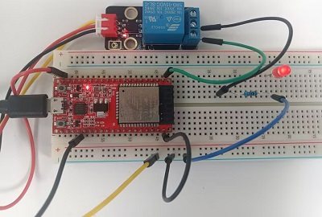


## 项目22 调光灯

**1.项目介绍：**

电位器是一个带有滑动或旋转触点的三端电阻器，它形成一个可调的分压器。它的工作原理是在均匀电阻上改变滑动触点的位置。在电位器中，整个输入电压被施加到电阻的整个长度上，输出电压是固定触点和滑动触点之间的电压值。在这个项目中，我们将学习使用ESP32读取电位器的值，并结合LED制作一个调光灯。

**2.项目元件：**

|||||
| :--: | :--: | :--: | :--: |
|ESP32*1|面包板*1|可调电位器*1|红色 LED*1|
||| | |  
|220Ω电阻*1|USB 线*1|跳线若干 | |

**3.元件知识：**


**可调电位器：** 可调电位器是电阻和模拟电子元件的一种，具有0和1两种状态(高电平和低电平)。模拟值不同，其数据状态呈现为1 ~ 1024等线性状态。

**ADC：** ADC是一种电子集成电路，用于将模拟信号(如电压)转换为由1和0组成的数字或二进制形式。我们在ESP32上的ADC的范围是12位，这意味着分辨率是2^12=4096，它表示一个范围(3.3V)将被平均划分为4096份，模拟值的范围对应于ADC值。因此，ADC拥有的比特越多，模拟的分区就越密集，最终转换的精度也就越高。

 

分节1: 0V—(3.3/4095)V 范围内的模拟量对应数字0;

分节2: (3.3/4095)V—2*(3.3/4095)V 范围内的模拟量对应于数字1;

......

下面的模拟将被相应地划分。换算公式如下：


**DAC：** 这一过程的可逆需要DAC，数字到模拟转换器。数字I/O端口可以输出高电平和低电平(0或1)，但不能输出中间电压值，这就是DAC有用的地方。ESP32有两个8位精度的DAC输出引脚GPIO25和GPIO26，可以将VCC(这里是3.3V)分成2^8=256个部分。例如，当数字量为1时，输出电压值为3.3/256×1V，当数字量为128时，输出电压值为3.3/256 ×128=1.65V, DAC的精度越高，输出电压值的精度就越高。

换算公式如下：


**ESP32主板上的ADC：** 

ESP32有16个引脚，可以用来测量模拟信号。GPIO引脚序列号和模拟引脚定义如下表所示：


**ESP32主板上的DAC：**


**4.读取电位器的ADC值，DAC值和电压值：**

我们将电位器连接到ESP32的模拟IO口上来读取电位器的ADC值，DAC值和电压值。接线请参照以下接线图：


```
//**********************************************************************************
/*  
 * 文件名   : 读取电位器模拟值
 * 描述 : ADC,DAC和电压的基本用法
*/
#define PIN_ANALOG_IN  36  //电位器的引脚

void setup() {
  Serial.begin(115200);
}

//在loop()中，使用analogRead()函数获取ADC值，
//然后使用map()函数将值转换为8位精度的DAC值。
//输入输出电压下式计算，
//信息最终被打印出来.

void loop() {
  int adcVal = analogRead(PIN_ANALOG_IN);
  int dacVal = map(adcVal, 0, 4095, 0, 255);
  double voltage = adcVal / 4095.0 * 3.3;
  Serial.printf("ADC Val: %d, \t DAC Val: %d, \t Voltage: %.2fV\n", adcVal, dacVal, voltage);
  delay(200);
}
//**********************************************************************************

```
编译并上传代码到ESP32，代码上传成功后，利用USB线上电，打开串口监视器，设置波特率为115200。可以看到的现象是：串口监视器窗口将打印出电位器的ADC值，DAC值和电压值，转动电位器手柄时，ADC值，DAC值和电压值发生变化。


**5.调光灯的接线图：**

在前面一步，我们读取了电位器的ADC值，DAC值和电压值，现在我们需要将电位器的ADC值转换成LED的亮度，来做成一个亮度可调的灯。见如下所示接线图：


**6.项目代码：**


```
//**********************************************************************************
/*  
 * 文件名  : 调光灯
 * 描述 : 通过电位器控制LED的亮度.
*/
#define PIN_ANALOG_IN    36  //电位器的引脚
#define PIN_LED     15  // LED的引脚
#define CHAN            0
void setup() {
  ledcSetup(CHAN, 1000, 12);
  ledcAttachPin(PIN_LED, CHAN);
}

void loop() {
  int adcVal = analogRead(PIN_ANALOG_IN); //读adc
  int pwmVal = adcVal;        // adcVal重映射到pwmVal
  ledcWrite(CHAN, pwmVal);    // 设置脉冲宽度.
  delay(10);
}
//**********************************************************************************

```
**7.项目现象：**

编译并上传代码到ESP32，代码上传成功后，利用USB线上电，你会看到的现象是：转动电位器手柄，LED的亮度会相应地改变。


## 项目23 火焰警报器

**1.项目介绍：**

火灾是一种可怕的灾害，火灾报警系统在房屋，商业建筑和工厂中是非常有用的。在本项目中，我们将使用ESP32控制火焰传感器，蜂鸣器和LED来模拟火灾报警装置。这是一个有意义的创客活动。

**2.项目元件：**

|||||
| :--: | :--: | :--: | :--: |
|ESP32*1|面包板*1|火焰传感器*1|红色 LED*1|
|||| |
|有源蜂鸣器*1|220Ω电阻*1|10KΩ电阻*1|跳线若干 |
|||| |
|NPN型晶体管(S8050)*1|1kΩ 电阻*1 |USB 线*1| |

**3.元件知识：**


**火焰传感器（红外接收三极管）：** 火焰会发出一定程度的IR光，这种光人眼是看不到的，但我们的红外接收三极管可以检测到它，并提醒微控制器（如ESP32）已经检测到火灾。红外接收三极管可以探测火焰，然后将火焰亮度转换为波动水平信号。红外接收三极管的短引脚是负极，另一个长引脚是正极。我们应该连接短引脚（负极)到5V，连接长引脚(正极)到模拟引脚，一个电阻和GND。如下图所示：


<span style="color: rgb(255, 76, 65);">注意：</span>火焰传感器应避开日光、汽车头灯、白炽灯直接照射，也不能对着热源(如暖气片、加热器)或空调，以避免环境温度较大的变化而造成误报。同时还易受射频辐射的干扰。

**4.读取火焰传感器的ADC值，DAC值和电压值：**

我们首先用一个简单的代码来读取火焰传感器的ADC值，DAC值和电压值并打印出来。接线请参照以下接线图：


```
//**********************************************************************************
/*  
 * 文件名  : 读取火焰传感器的模拟值
 * 描述 : ADC,DAC和电压的基本用法
*/
#define PIN_ANALOG_IN  36  //火焰传感器的引脚

void setup() {
  Serial.begin(115200);
}

//在loop()中，使用analogRead()函数获取ADC值，
//然后使用map()函数将值转换为8位精度的DAC值。
//输入输出电压按下式计算，
//信息最终被打印出来.

void loop() {
  int adcVal = analogRead(PIN_ANALOG_IN);
  int dacVal = map(adcVal, 0, 4095, 0, 255);
  double voltage = adcVal / 4095.0 * 3.3;
  Serial.printf("ADC Val: %d, \t DAC Val: %d, \t Voltage: %.2fV\n", adcVal, dacVal, voltage);
  delay(200);
}
//**********************************************************************************

```
编译并上传代码到ESP32，代码上传成功后，利用USB线上电，打开串口监视器，设置波特率为<span style="color: rgb(255, 76, 65);">115200</span>。可以看到的现象是：串口监视器窗口将打印火焰传感器读取的ADC值，DAC值和电压值，当火焰靠近火焰传感器时，ADC值，DAC值和电压值增大；反之，ADC值，DAC值和电压值减小。


**5.火焰报警的接线图：**

接下来，我们将使用火焰传感器和蜂鸣器、LED制作一个有趣的项目——火灾报警装置。当火焰传感器检测到火焰时，LED闪烁，蜂鸣器报警。


**6.项目代码：**

（<span style="color: rgb(255, 76, 65);">注意：代码中的阀值500可以根据实际情况自己重新设置</span>）


```
//**********************************************************************************
/*  
 * 文件名 : 火焰警报
 * 描述 : 通过火焰传感器控制蜂鸣器和LED.
*/
#define PIN_ADC0      36  //火焰传感器的引脚
#define PIN_LED       15  // LED的引脚
#define PIN_BUZZER    4  // 蜂鸣器的引脚

void setup() {
  pinMode(PIN_LED, OUTPUT);
  pinMode(PIN_BUZZER, OUTPUT);
  pinMode(PIN_ADC0, INPUT);
}

void loop() {
  int adcVal = analogRead(PIN_ADC0); //读取火焰传感器的ADC值
  if (adcVal >= 500) {
    digitalWrite (PIN_BUZZER, HIGH); //蜂鸣器鸣叫
    digitalWrite(PIN_LED, HIGH); // 点亮 LED
    delay(500); // 延时0.5s.
    digitalWrite (PIN_BUZZER, LOW);
    digitalWrite(PIN_LED, LOW); // 熄灭 LED
    delay(500); // 延时0.5s.
  }
 else
 {
    digitalWrite(PIN_LED, LOW);  //熄灭 LED
    digitalWrite (PIN_BUZZER, LOW); //关闭蜂鸣器
  }
}
//**********************************************************************************

```
**7.项目现象：**

编译并上传代码到ESP32，代码上传成功后，利用USB线上电，你会看到的现象是：当火焰传感器检测到火焰时，LED闪烁，蜂鸣器报警；否则，LED不亮，蜂鸣器不响。


## 项目24 小夜灯

**1.项目介绍：**

传感器或元件在我们的日常生活中是无处不在的。例如，一些公共路灯在晚上会自动亮起，而在白天会自动熄灭。为什么呢? 事实上，这些都是利用了一种光敏元件，可以感应外部环境光强度的元件。晚上，当室外亮度降低时，路灯会自动打开；到了白天，路灯会自动关闭。这其中的原理是很简单的，在本实验中我们使用ESP32控制LED就来实现这个路灯的效果。

**2.项目元件：**

|||||
| :--: | :--: | :--: | :--: |
|ESP32*1|面包板*1|光敏电阻*1|红色 LED*1|
||| ||
|220Ω电阻*1|10KΩ电阻*1|跳线若干 |USB 线*1|

**3.元件知识：**


光敏电阻：是一种感光电阻，其原理是光敏电阻表面上接收亮度(光)降低电阻，光敏电阻的电阻值会随着被探测到的环境光的强弱而变化。有了这个特性，我们可以使用光敏电阻来检测光强。光敏电阻及其电子符号如下：


下面的电路是用来检测光敏电阻电阻值的变化：


在上述电路中，当光敏电阻的电阻因光强的变化而改变时，光敏电阻与电阻R2之间的电压也会发生变化。因此，通过测量这个电压就可以得到光的强度。本项目是采用上图左边的电路来接线的。 

**4.读取光敏电阻的ADC值，DAC值和电压值：**

我们首先用一个简单的代码来读取光敏电阻的ADC值，DAC值和电压值并打印出来。接线请参照以下接线图：


```
//**********************************************************************************
/*  
 * 文件名  : 读取光敏传感器的模拟值
 * 描述 : ADC的基本用法
*/
#define PIN_ANALOG_IN  36  //光敏传感器的引脚

void setup() {
  Serial.begin(115200);
}

//在loop()中，使用analogRead()函数获取ADC值，
//然后使用map()函数将值转换为8位精度的DAC值。
//输入输出电压按下式计算，
//信息最终被打印出来.

void loop() {
  int adcVal = analogRead(PIN_ANALOG_IN);
  int dacVal = map(adcVal, 0, 4095, 0, 255);
  double voltage = adcVal / 4095.0 * 3.3;
  Serial.printf("ADC Val: %d, \t DAC Val: %d, \t Voltage: %.2fV\n", adcVal, dacVal, voltage);
  delay(200);
}
//**********************************************************************************

```
编译并上传代码到ESP32，代码上传成功后，利用USB线上电，打开串口监视器，设置波特率为115200。可以看到的现象是：串口监视器窗口将打印光敏电阻读取的ADC值，DAC值和电压值，当逐渐减弱光敏电阻所处环境中的光线强度时，ADC值，DAC值和电压值逐渐增大；反之，ADC值，DAC值和电压值逐渐减小。


**5.光控灯的接线图：**

我们在前面做了一个小小的调光灯，现在我们来做一个光控灯。它们的原理是相同的，即通过ESP32获取传感器的模拟值，然后调节LED的亮度。


**6.项目代码：**


```
//**********************************************************************************
/*  
 * 文件名  : 夜光灯
 * 描述 : 通过光敏传感器控制LED亮度.
*/
#define PIN_ANALOG_IN    36  // 光敏传感器的引脚
#define PIN_LED     15  // LED的引脚
#define CHAN            0
#define LIGHT_MIN       372
#define LIGHT_MAX       2048
void setup() {
  ledcSetup(CHAN, 1000, 12);
  ledcAttachPin(PIN_LED, CHAN);
}

void loop() {
  int adcVal = analogRead(PIN_ANALOG_IN); //读取 adc
  int pwmVal = map(constrain(adcVal, LIGHT_MIN, LIGHT_MAX), LIGHT_MIN, LIGHT_MAX, 0, 4095);  // adcVal重映射到pwmVal
  ledcWrite(CHAN, pwmVal);    // 设置脉冲宽度.
  delay(10);
}
//**********************************************************************************

```
**7.项目现象：**

编译并上传代码到ESP32，代码上传成功后，利用USB线上电，你会看到的现象是：当减弱光敏电阻所处环境中的光线强度时，LED变亮，反之，LED变暗。


## 项目25 人体感应灯

**1.项目介绍：**

人体感应灯一般都用在黑漆漆的楼道区域，随着科技的发展，人体感应灯的使用在我们现实生活中十分常见。小区的楼道，房间的卧室、地下城的车库、卫生间等区域都会用到人体感应灯。现实生活中的人体感应灯一般是由人体红外传感器、灯、光敏电阻传感器等组成的。
在本项目中，我们将学习如何利用人体红外传感器、LED、光敏电阻来制作一款人体感应灯。

**2.项目元件：**

|||||
| :--: | :--: | :--: | :--: |
|ESP32*1|面包板*1|光敏电阻*1|红色 LED*1|
||| ||
|220Ω电阻*1|10KΩ电阻*1|跳线若干 |USB 线*1|
||| | |
|人体红外传感器*1|3P转杜邦线公单*1| | |

**3.项目接线图：**


**4.项目代码：**


```
//**********************************************************************************
/*  
 * 文件名  : 人体感应灯
 * 描述 : 通过光敏传感器和PIR运动传感器控制LED.
*/
#define PIN_ADC0  36   //光敏传感器的引脚
#define PIN_LED   4  // LED的引脚
#define pirPin   15     // PIR传感器的引脚
byte pirStat = 0;   // PIR传感器的状态
void setup() {
  Serial.begin(115200);
  pinMode(PIN_LED, OUTPUT);
  pinMode(PIN_ADC0, INPUT);
  pinMode(pirPin, INPUT);
}

void loop() {
  int adcVal = analogRead(PIN_ADC0); //读取光敏传感器的ADC值
  pirStat = digitalRead(pirPin); //读取PIR传感器的值
  if (adcVal >= 2000) {
      if (pirStat == HIGH){
         digitalWrite(PIN_LED, HIGH);//点亮 LED
         } 
      else{
         digitalWrite(PIN_LED, LOW);//关闭 LED   
        }
  }
   else{
      digitalWrite(PIN_LED, LOW);//关闭 LED
      }
}
//**********************************************************************************

```
**5.项目现象：**

编译并上传代码到ESP32，代码上传成功后，利用USB线上电，你会看到的现象是：当你的手覆盖光敏电阻的感光部分来模拟黑暗状态时，然后用另一只手在人体红外传感器前面晃动，LED也点亮。如果光敏电阻的感光部分没有被覆盖，这时候用手在人体红外传感器前面晃动，LED处于熄灭状态。

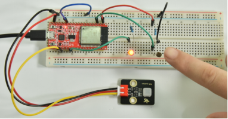


## 项目26 摇杆控制RGB灯

**1.项目介绍：**

摇杆模块是一个有两个模拟输入和一个数字输入的组件。广泛应用于游戏操作、机器人控制、无人机控制等领域。在这个项目中，我们使用ESP32和摇杆模块控制RGB。这样，你可以在实践中对摇杆模块的原理和操作有更深入的了解。 

**2.项目元件：**

|||||
| :--: | :--: | :--: | :--: |
|ESP32*1|面包板*1|摇杆模块*1|RGB LED*1|
|| ||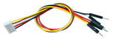|
|220Ω电阻*3|跳线若干|USB 线*1|5P转杜邦线公单*1|

**3.元件知识：**


**摇杆模块：** 主要是采用PS2手柄摇杆元件，实际上摇杆模块有3个信号端引脚，模拟3维空间，摇杆模块的引脚分别是GND、VCC、信号端（B、X、Y），其中信号端X、Y模拟空间的X轴和Y轴，控制时，模块的X、Y信号端是连接控制板模拟口，通过控制2个模拟输入值来控制物体在空间X、Y轴的坐标。信号端B模拟空间Z轴，它一般是接数字口，做按键使用。

VCC接控制板的电源输出端V/VCC（3.3/5V），GND接控制板的G/GND，原始状态下读出电压大约为1.65V/2.5V左右，对于X轴方向，当随箭头方向逐渐移动，读出电压值随着增加，且可以达到最大电压；随箭头相反方向逐渐移动，读出电压值逐渐减少，减少到最小电压。对于Y轴方向，当沿着模块上的箭头方向逐渐按下，读出电压值随着增加，且可以达到最大电压；随箭头相反方向逐渐按下，读出电压值逐渐减少，减少到最小电压。对于Z轴方向，信号端B接数字口，原始状态下输出0，按下输出1。这样，我们可以读取两个模拟值和一个数字口的高低电平情况，来判断模块上摇杆的工作状态。

**模块参数：**
- 输入电压：DC 3.3V ~ 5V
- 输出信号：X/Y双轴模拟值+Z轴数字信号
- 适用范围：适用于控制点坐标在平面内的运动，双自由度舵机的控制等。
- 产品特点：外观精美，摇杆手感优越，操作简单，反应灵敏，使用寿命长。

**4.读取摇杆模块的值：**

我们必须使用ESP32的模拟IO口从摇杆模块的X/Y引脚读取值，并使用数字IO口读取按钮的数字信号。请按照下面的接线图进行接线：


```
//**********************************************************************************
/*  
 * 文件名  : 读取摇杆值
 * 描述 : 从摇杆模块读取数据.
*/
int xyzPins[] = {36, 39, 14};   //引脚x,y,z
void setup() {
  Serial.begin(115200);
  pinMode(xyzPins[0], INPUT); //x 轴. 
  pinMode(xyzPins[1], INPUT); //y 轴. 
  pinMode(xyzPins[2], INPUT_PULLUP);   //z 轴是一个按键.
}

//在loop()中，使用analogRead()读取X轴和Y轴的值
//和使用digitalRead()读取Z轴的值，然后显示它们.

void loop() {
  int xVal = analogRead(xyzPins[0]);
  int yVal = analogRead(xyzPins[1]);
  int zVal = digitalRead(xyzPins[2]);
  Serial.println("X,Y,Z: " + String(xVal) + ", " +  String(yVal) + ", " + String(zVal));
  delay(500);
}
//**********************************************************************************

```
编译并上传代码到ESP32，代码上传成功后，利用USB线上电，打开串口监视器，设置波特率为115200。可以看到的现象是：串口监视器窗口将打印当前摇杆的模拟值和数字值，移动摇杆或按下摇杆帽将改变串口监视器窗口中的模拟值和数字值。

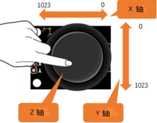

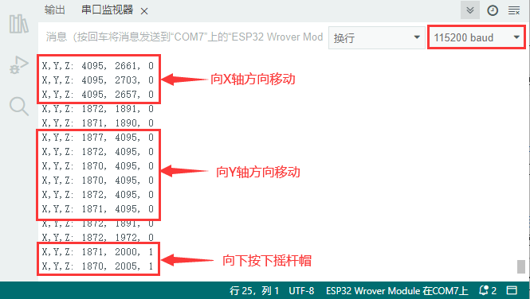


**5.摇杆模块控制RGB的接线图：** 

我们刚读了摇杆模块的值，这里我们需要用摇杆模块和RGB做一些事情，按照下图连接：


**6.项目代码：**


```
//**********************************************************************************
/*  
 * 文件名  : 摇杆控制灯
 * 描述 : 通过摇杆控制RGB来点亮不同的颜色.
*/
int x_Pin = 36;   //x 引脚
int y_Pin = 39;   //y 引脚
int z_Pin = 14;   //z 引脚
int ledPins[] = {4, 0, 2};    //定义红、绿、蓝引脚
const byte chns[] = {0, 1, 2};        //定义PWM通道

void setup() {
  pinMode(x_Pin, INPUT); //x 轴. 
  pinMode(y_Pin, INPUT); //y 轴. 
  pinMode(z_Pin, INPUT_PULLUP);   //z 轴 是一个按键.
  for (int i = 0; i < 3; i++) {   //设置pwm通道，1KHz,8bit
    ledcSetup(chns[i], 1000, 8);
    ledcAttachPin(ledPins[i], chns[i]);
  }
}

//在loop()中，使用analogRead()读取X轴和Y轴的值
//和使用digitalRead()读取Z轴的值，然后显示它们.

void loop() {
  int xVal = analogRead(x_Pin);
  int yVal = analogRead(y_Pin);
  int zVal = digitalRead(z_Pin);
  if (xVal < 1000){
     ledcWrite(chns[0], 255); //普通阴极LED，高电平开启LED.
     ledcWrite(chns[1], 0);
     ledcWrite(chns[2], 0);
   }
  else if (xVal > 3000){
     ledcWrite(chns[0], 0); 
     ledcWrite(chns[1], 255);
     ledcWrite(chns[2], 0);
   }
  else if (yVal < 1000){
     ledcWrite(chns[0], 0);
     ledcWrite(chns[1], 0);
     ledcWrite(chns[2], 255);
   }
  else if (yVal > 3000){
     ledcWrite(chns[0], 255); 
     ledcWrite(chns[1], 255);
     ledcWrite(chns[2], 255);
   }
}
//**********************************************************************************

```
**7.项目现象：**

编译并上传代码到ESP32，代码上传成功后，利用USB线上电，你会看到的现象是：①如果摇杆在X方向上移动到最左边，RGB光变成红色; ②如果摇杆在X方向上移动到最右边，RGB光变为绿色; ③如果摇杆在Y方向上移动到最上面，RGB光变成白色; ④如果摇杆在Y方向上移动到最下面，RGB光变成蓝色。


## 项目27 温湿度表

**1.项目介绍：**

在冬季时，空气中的湿度很低，就是空气很干燥，再加上寒冷，人体的皮肤就容易过于干燥而裂，所以需要在用加湿器给家里的空气增加湿度，但是怎么知道空气过于干燥了呢？那就需要检测空气湿度的设备，这节课就来学习温湿度传感器的使用。我们使用温湿度传感器制作一个温湿度计，并且还结合LCD 128X32 DOT来显示温度和湿度值。

**2.项目元件：**

|||||
| :--: | :--: | :--: | :--: |
|ESP32*1|面包板*1|LCD_128X32_DOT*1|温湿度传感器*1|
| ||| |
|3P转杜邦线公单*1|4P转杜邦线公单*1|USB 线*1| |

**3.元件知识：**


**温湿度传感器：** 是一款含有已校准数字信号输出的温湿度复合传感器，其精度湿度±5%RH， 温度±2℃，量程湿度20-90%RH， 温度0~50℃。温湿度传感器应用专用的数字模块采集技术和温湿度传感技术，确保产品具有极高的可靠性和卓越的长期稳定性。温湿度传感器包括一个电阻式感湿元件和一个NTC测温元件，非常适用于对精度和实时性要求不高的温湿度测量场合。
工作电压在3.3V-5.5V范围内。

温湿度传感器有三个引脚，分别为VCC，GND和S。S为数据输出的引脚。使用的是串行通讯。

**温湿度传感器的单总线格式定义：**

| 名称 |单总线格式定义 |
| :--: | :--: |
| 起始信号| 微处理器把数据总线(SDA)拉低一段时间至少 18ms(最大不得超过 30ms)，通知传感器准备数据。 | 
| 响应信号 | 传感器把数据总线（SDA）拉低 83µs，再接高 87µs 以响应主机的起始信号。 |
| 湿度 | 湿度高位为湿度整数部分数据，湿度低位为湿度小数部分数据  |
| 温度 |温度高位为温度整数部分数据，温度低位为温度小数部分数据，且温度低位 Bit8 为 1 则表示负温度，否则为正温度 |
| 校验位 | 校验位＝湿度高位+湿度低位+温度高位+温度低位 |

**温湿度传感器数据时序图：** 

用户主机（MCU）发送一次开始信号后，温湿度传感器从低功耗模式转换到高速模式，待主机开始信号结束后，温湿度传感器发送响应信号，送出 40bit 的数据，并触发一次信采集。信号发送如图所示。 


温湿度传感器可以很容易地将温湿度数据添加到您的DIY电子项目中。它是完美的远程气象站，家庭环境控制系统，和农场或花园监测系统。

**温湿度传感器的参数：**
- 工作电压：+5 V
- 温度范围：0-50 °C ，误差：± 2 °C
- 湿度范围：20-90% RH ，误差：± 5% RH
- 数字接口

**温湿度传感器的原理图：**


**4.读取温湿度值：**


**如何添加xht11库：**

本项目代码使用了一个名为“<span style="color: rgb(255, 76, 65);">xht11</span>”库。如果你已经添加好了“<span style="color: rgb(255, 76, 65);">xht11</span>”库，则跳过此步骤。如果你还没有添加，请在学习之前添加它。添加第三方库的步骤如下:

打开Arduino IDE，单击“**项目**”→“**包含库**”→“**添加.ZIP库...**”。在弹出窗口中找到该目录下名为**..\库文件\Arduino_C_Windows系统\xht11.ZIP**的文件，先选中**xht11.ZIP**文件，再单击“**打开**”。

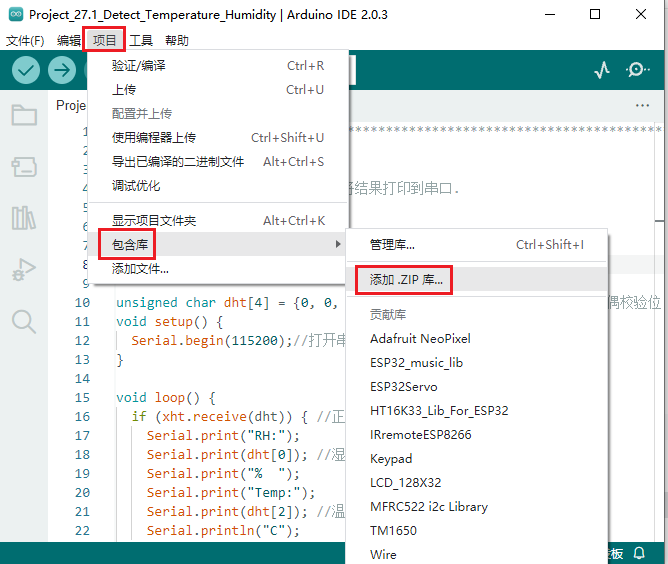

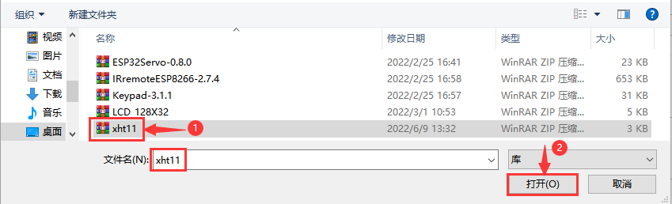


```
//**********************************************************************************
/*
 * 文件名  : 温湿度传感器
 * 描述 : 使用XHT11测量温湿度。将结果打印到串口.
*/
#include "xht11.h"
//gpio13
xht11 xht(13);

unsigned char dht[4] = {0, 0, 0, 0};//只接收数据的前32位，不接收奇偶校验位
void setup() {
  Serial.begin(115200);//打开串口监视器，将波特率设置为115200
}

void loop() {
  if (xht.receive(dht)) { //正确选中时返回true
    Serial.print("RH:");
    Serial.print(dht[0]); //湿度的积分部分，DHT[0]为小数部分
    Serial.print("%  ");
    Serial.print("Temp:");
    Serial.print(dht[2]); //温度的积分部分，DHT[3]是分数部分
    Serial.println("C");
  } else {    //读取错误
    Serial.println("sensor error");
  }
  delay(1000);  //设备读取等待时间为1000ms
}
//**********************************************************************************

```
编译并上传代码到ESP32，代码上传成功后，利用USB线上电，打开串口监视器，设置波特率为<span style="color: rgb(255, 76, 65);">115200</span>。你会看到的现象是：串口监视器窗口将打印当前显示当前环境中的温湿度数据，如下图。

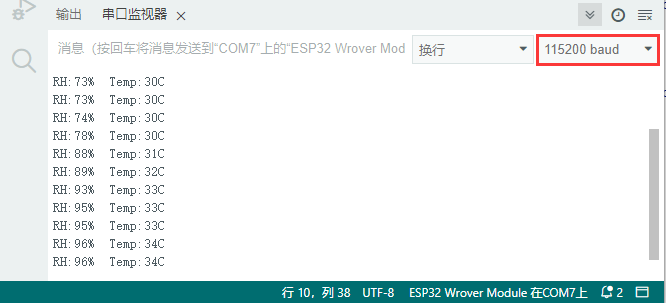


**5.温湿度仪表的接线图：**

现在我们开始用LCD_128X32_DOT打印温湿度传感器的值，我们会在LCD_128X32_DOT的屏幕上看到相应的值。让我们开始这个项目吧。请按照下面的接线图进行接线：

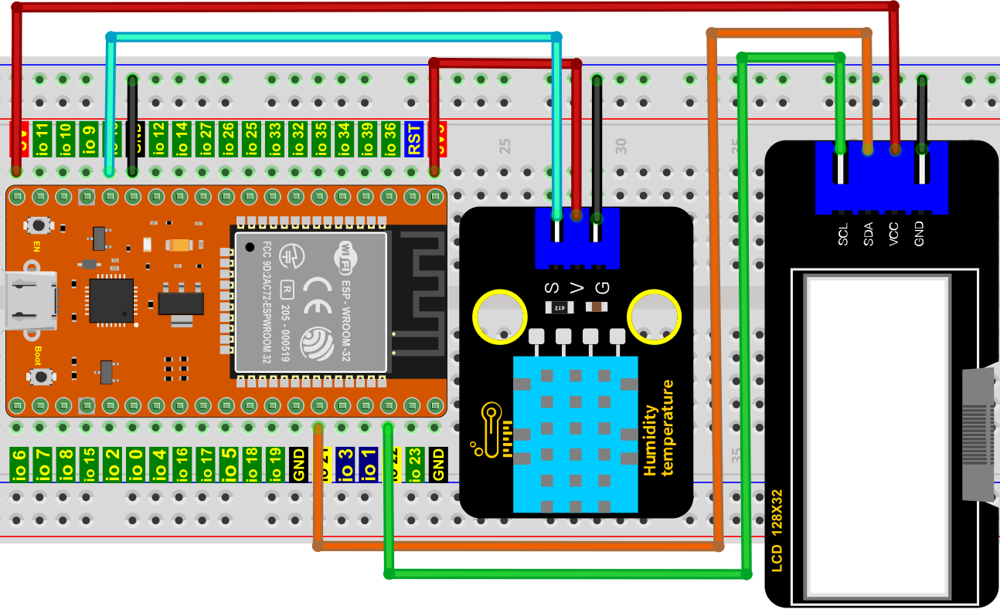

**6.项目代码：**

前面已经添加过<span style="color: rgb(255, 76, 65);">xht11</span>和<span style="color: rgb(255, 76, 65);">LCD_128×32</span>库，可以不用重复添加。如果没有添加，就需要添加<span style="color: rgb(255, 76, 65);">xht11</span>和<span style="color: rgb(255, 76, 65);">LCD_128×32</span>库，添加<span style="color: rgb(255, 76, 65);">xht11</span>库的方法请参照本项目的上面方法，添加<span style="color: rgb(255, 76, 65);">LCD_128×32</span>库的方法请参照**项目17 I2C 128×32 LCD**中的方法。


```
//**********************************************************************************
/*
 * 文件名  : 温湿度计
 * 描述 : LCD显示温度和湿度的数值.
*/
#include "xht11.h"
#include "lcd128_32_io.h"

//gpio13
xht11 xht(13);
unsigned char dht[4] = {0, 0, 0, 0};//只接收数据的前32位，不接收奇偶校验位

lcd lcd(21, 22); //创建lCD128 *32引脚，sda->21， scl->22

void setup() {
  lcd.Init(); //初始化
  lcd.Clear();  //清屏
}
char string[10];

//LCD显示湿度和温度值
void loop() {
  if (xht.receive(dht)) { //正确选中时返回true
    }
  lcd.Cursor(0,0); //设置显示位置
  lcd.Display("Temper:"); //设置显示
  lcd.Cursor(0,8);
  lcd.DisplayNum(dht[2]);
  lcd.Cursor(0,11);
  lcd.Display("C");
  lcd.Cursor(2,0); 
  lcd.Display("humid:");
  lcd.Cursor(2,8);
  lcd.DisplayNum(dht[0]);
  lcd.Cursor(2,11);
  lcd.Display("%");
  delay(200);
}
//**********************************************************************************

```
**7.项目现象：**

编译并上传代码到ESP32，代码上传成功后，利用USB线上电，你会看到的现象是：LCD 128X32 DOT的屏幕上显示温湿度传感器检测环境中相应的温度值和湿度值。


## 项目28 测距仪表

**1.项目介绍：**

HC-SR04超声波传感器是一种非常实惠的距离传感器，主要用于各种机器人项目中的物体躲避。它也被用于水位传感器，甚至作为一个停车传感器。我们把超声波传感器当作蝙蝠的眼睛，在黑暗中，蝙蝠仍然可以通过超声波识别前方的物体和方向。在本项目中，我们使用ESP32控制超声波传感器和LED模拟超声波测距仪。

**2.项目元件：**

|||||
| :--: | :--: | :--: | :--: |
|ESP32*1|面包板*1|超声波传感器*1|4P转杜邦线公单*1
|||||
|红色 LED*4|220Ω电阻*4|跳线若干|USB 线*1|

**3.元件知识：**

**HC-SR04超声波传感器：** 像蝙蝠一样使用声纳来确定与物体的距离，它提供了精准的非接触范围检测，高精度和稳定的读数。它的操作不受阳光或黑色材料的影响，就像精密的照相机(在声学上像布料这样比较软的材料很难被探测到)。它带有超声波发射器和接收器。


在超声波传感器的前面是两个金属圆筒，这些是转换器。转换器将机械能转换成电信号。在超声波传感器中，有发射转换器和接收转换器。发射转换器将电信号转换为超声波脉冲，接收转换器将反射的超声波脉冲转换回电信号。如果你看超声波传感器的背面，你会看到的发射转换器后面有一个IC。这是控制发射转换器的IC。在接收转换器后面也有一个IC，这是一个四运算放大器，它将接收转换器产生的信号放大成足以传输到微控制器的信号。

**时序图：**

图示HC-SR04的时序图。为了开始测量，SR04的Trig必须接受至少10us的高(5V)脉冲，这将启动传感器将发射出8个周期的40kHz的超声波脉冲，并等待反射的超声波脉冲。当传感器从接收器检测到超声波时，它将设置回波引脚为高(5V)和延迟一个周期(宽度)，与距离成比例。为了获得距离，测量Echo引脚的宽度。


时间=回波脉冲宽度，单位为us(微秒)

距离厘米=时间/ 58

距离(英寸)=时间/ 148

**4.读取超声波传感器距离值** 

我们将从一个简单的超声波测距开始，并打印测量的距离。 

 

HC-SR04超声波传感器有四个引脚：Vcc、Trig、Echo和GND。Vcc引脚提供产生超声波脉冲的电源，接Vcc/+5V。GND引脚接地/GND。Trig引脚是控制板发送信号来启动超声波脉冲的地方。Echo引脚是超声波传感器向控制板发送关于超声波脉冲行程持续时间的信息的地方。按下图接线：

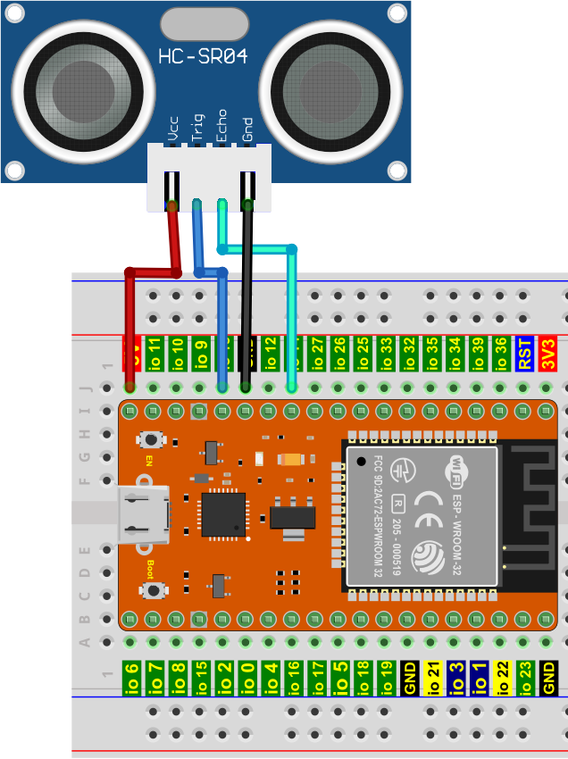


```
//**********************************************************************************
/*  
 * 文件名  : 超声波测距
 * 描述 : 使用超声波模块测量距离.
*/
const int TrigPin = 13; // 定义TrigPin
const int EchoPin = 14; // 定义EchoPin.
int duration = 0; // 定义持续时间的初始值为0
int distance = 0;//定义距离的初始值为0
void setup() 
{
  pinMode(TrigPin , OUTPUT); // 设置trigPin为输出模式
  pinMode(EchoPin , INPUT); // 设置echoPin为输入模式
  Serial.begin(115200);  // 设置波特率为115200的串口监视器.
}
void loop()
{
 // 使trigPin输出高电平持续10μs触发HC_SR04 
  digitalWrite(TrigPin , HIGH);
  delayMicroseconds(10);
  digitalWrite(TrigPin , LOW);
  // 等待HC-SR04回到高电平，测量这个等待时间
  duration = pulseIn(EchoPin , HIGH);
  // 根据时间计算距离
  distance = (duration/2) / 28.5 ;
  Serial.print("Distance: ");
  Serial.print(distance); //串口打印距离值
  Serial.println("cm");
  delay(300); // 等待300ms.
}
//**********************************************************************************

```

编译并上传代码到ESP32，代码上传成功后，利用USB线上电，打开串口监视器，设置波特率为<span style="color: rgb(255, 76, 65);">115200</span>。可以看到的现象是：串口监视器窗口将打印超声波传感器和物体之间的距离值。

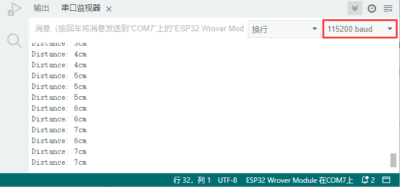


**5.超声波测距仪的接线图：**

接下来，我们将使用ESP32控制超声波传感器和4个LED模拟超声波测距仪。按如下图接好线：


**6.项目代码：**


```
//**********************************************************************************
/*  
 * 文件名  : 超声波测距仪
 * 描述 : 四个led由超声波测距控制.
*/
const int TrigPin = 13;    // 定义TrigPin
const int EchoPin = 14;    // 定义EchoPin.
const int PIN_LED1 = 4;    // 定义PIN_LED1
const int PIN_LED2 = 0;    // 定义PIN_LED2
const int PIN_LED3 = 2;    // 定义PIN_LED3
const int PIN_LED4 = 15;    // 定义PIN_LED4
int duration = 0;    // 定义持续时间的初始值为0
int distance = 0;   // 定义距离的初始值为0
void setup() 
{
  pinMode(TrigPin , OUTPUT); // 设置trigPin为输出模式
  pinMode(EchoPin , INPUT); // 设置echoPin为输入模式
  pinMode(PIN_LED1 , OUTPUT);  // 设置PIN_LED1为输出模式
  pinMode(PIN_LED2 , OUTPUT);  // 设置PIN_LED2为输出模式
  pinMode(PIN_LED3 , OUTPUT);  // 设置PIN_LED3为输出模式
  pinMode(PIN_LED4 , OUTPUT);  // 设置PIN_LED4为输出模式
  Serial.begin(115200);  //设置波特率为115200的串口监视器.
}
void loop()
{
// 使trigPin输出高电平持续10μs触发HC_SR04  
  digitalWrite(TrigPin , HIGH);
  delayMicroseconds(10);
  digitalWrite(TrigPin , LOW);
// 等待HC-SR04回到高电平，测量这个等待时间
  duration = pulseIn(EchoPin , HIGH);
// calculate the distance according to the time
  distance = (duration/2) / 28.5 ;
  Serial.print("Distance: ");
  Serial.print(distance); //串口打印距离值
  Serial.println("cm");
  if ( distance <= 5 )
  {
    digitalWrite(PIN_LED1, HIGH);
  }
  else
  {
    digitalWrite(PIN_LED1, LOW);
  }
  if ( distance <= 10 )
  {
    digitalWrite(PIN_LED2, HIGH);
  }
  else
  {
    digitalWrite(PIN_LED2, LOW);
  }
  if ( distance <= 15 )
  {
    digitalWrite(PIN_LED3, HIGH);
  }
  else
  {
    digitalWrite(PIN_LED3, LOW);
  }
  if ( distance <= 20 )
  {
    digitalWrite(PIN_LED4, HIGH);
  }
  else
  {
    digitalWrite(PIN_LED4, LOW);
  }
}     
//**********************************************************************************

```
**7.项目现象：**

编译并上传代码到ESP32，代码上传成功后，利用USB线上电，打开串口监视器，设置波特率为115200。可以看到的现象是：串口监视器窗口将打印超声波传感器和物体之间的距离值。另外，当我们用手在超声波传感器前移动时，相应的LED会亮起来。


## 项目29 温度仪表

**1.项目介绍：**

热敏电阻是一种电阻，其阻值取决于温度和温度的变化，广泛应用于园艺、家庭警报系统等装置中。因此，我们可以利用这一特性来制作温度仪表。

**2.项目元件：**

|||||
| :--: | :--: | :--: | :--: |
|ESP32*1|面包板*1|LCD_128X32_DOT*1|热敏电阻*1|
||||  |
|10KΩ电阻*1|4P转杜邦线公单*1|USB 线*1|跳线若干 |

**3.元件知识：**

**热敏电阻：** 热敏电阻是一种温度敏感电阻。当热敏电阻感应到温度的变化时，它的电阻就会发生变化。我们可以利用热敏电阻的这种特性来检测温度强度。热敏电阻及其电子符号如下所示。

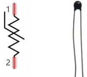

热敏电阻的电阻值与温度的关系为：


式中：

Rt为热敏电阻在T2温度下的电阻；

R为热敏电阻在T1温度下的标称阻值；

EXP[n]是e的n次幂；

B为温度指数；

T1，T2是开尔文温度(绝对温度)，开尔文温度=273.15 +摄氏温度。对于热敏电阻的参数，我们使用：B=3950, R=10KΩ，T1=25℃。热敏电阻的电路连接方法与光敏电阻类似，如下所示：


我们可以利用ADC转换器测得的值来得到热敏电阻的电阻值，然后利用公式来得到温度值。因此，温度公式可以推导为：


**4.读取热敏电阻的值：**

首先我们学习热敏电阻读取当前的ADC值、电压值和温度值并将其打印出来。请按下面的接线图接好线：


```
//**********************************************************************************
/*  
 * 文件名 : 热敏电阻
 * 描述 : 读取热敏电阻的阻值.
*/
#define PIN_ANALOG_IN   36
void setup() {
  Serial.begin(115200);
}

void loop() {
  int adcValue = analogRead(PIN_ANALOG_IN);                       //读ADC引脚
  double voltage = (float)adcValue / 4095.0 * 3.3;                // 计算电压
  double Rt = 10 * voltage / (3.3 - voltage);                     //计算热敏电阻电阻值
  double tempK = 1 / (1 / (273.15 + 25) + log(Rt / 10) / 3950.0); //计算温度(开尔文)
  double tempC = tempK - 273.15;                                  //计算温度(摄氏)
  Serial.printf("ADC value : %d,\tVoltage : %.2fV, \tTemperature : %.2fC\n", adcValue, voltage, tempC);
  delay(1000);
}
//**********************************************************************************

```
编译并上传代码到ESP32，代码上传成功后，利用USB线上电，打开串口监视器，设置波特率为<span style="color: rgb(255, 76, 65);">115200</span>。你会看到的现象是：串口监视器窗口将不断显示热敏电阻当前的ADC值、电压值和温度值。试着用食指和拇指捏一下热敏电阻(不要碰触导线)一小段时间，你应该会看到温度值增加。


**5.温度仪表的接线图：**


**6.添加LCD_128×32库：**

本项目代码使用了一个名为“<span style="color: rgb(255, 76, 65);">LCD_128×32</span>”库。如果你已经添加好了“<span style="color: rgb(255, 76, 65);">LCD_128×32</span>”库，则跳过此步骤。如果你还没有添加，请在学习之前安装它。添加第三方库的步骤如下:

打开Arduino IDE，单击“**项目**”→“**包含库**”→“**添加.ZIP库...**”。在弹出窗口中找到该目录下名为**库文件..\Arduino_C_Windows系统\LCD_128X32.ZIP**的文件，先选中**LCD_128X32.ZIP**文件，再单击“**打开**”。

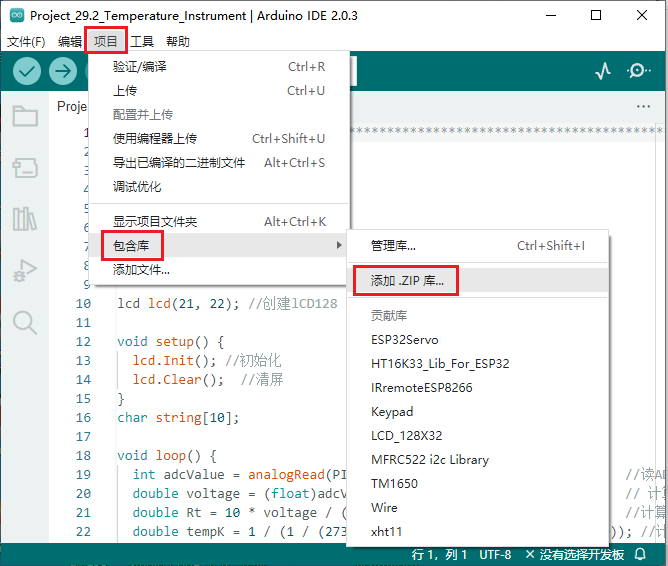


**7.项目代码：**


```
//**********************************************************************************
/*  
 * 文件名  : 温度仪表
 * 描述 : LCD显示热敏电阻的温度.
*/
#include "lcd128_32_io.h"

#define PIN_ANALOG_IN   36

lcd lcd(21, 22); //创建lCD128 *32引脚，sda->21， scl->22

void setup() {
  lcd.Init(); //初始化
  lcd.Clear();  //清屏
}
char string[10];

void loop() {
  int adcValue = analogRead(PIN_ANALOG_IN);                       //读ADC引脚
  double voltage = (float)adcValue / 4095.0 * 3.3;                // 计算电压
  double Rt = 10 * voltage / (3.3 - voltage);                     //计算热敏电阻电阻值
  double tempK = 1 / (1 / (273.15 + 25) + (log(Rt / 10) / 3950.0)); //计算温度(开尔文)
  double tempC = tempK - 273.15;                                  //计算温度(摄氏)
  lcd.Cursor(0,0); //设置显示位置
  lcd.Display("Voltage:"); //设置显示
  lcd.Cursor(0,8);
  lcd.DisplayNum(voltage);
  lcd.Cursor(0,11);
  lcd.Display("V");
  lcd.Cursor(2,0); 
  lcd.Display("tempC:");
  lcd.Cursor(2,8);
  lcd.DisplayNum(tempC);
  lcd.Cursor(2,11);
  lcd.Display("C");
  delay(200);
}
//**********************************************************************************

```
**8.项目现象：**

编译并上传代码到ESP32，代码上传成功后，利用USB线上电，你会看到的现象是：LCD 128X32 DOT的屏幕上显示热敏电阻的电压值和当前环境中的温度值。


## 项目30 密码锁

**1.项目介绍：**

常用的数字按钮传感器，一个按钮就使用一个IO口，而有时我们需要的按钮比较多时，就会占用过多的IO口，为了节省IO口的使用，把多个按钮做成了矩阵类型，通过行列线的控制，实现少IO口控制多个按钮。在本项目中，我们将来学习ESP32和薄膜4*4矩阵键盘控制舵机和蜂鸣器。

**2.项目元件：**

||||
| :--: | :--: | :--: | 
|ESP32*1|面包板*1|舵机*1|
||| |
|薄膜4×4矩阵键盘*1|USB 线*1| 跳线若干| 
||||
|NPN型晶体管(S8050)*1|有源蜂鸣器*1|1KΩ电阻*1|

**3.元件知识：**

**4×4矩阵键盘：** 键盘是一种集成了许多键的设备。如下图所示，一个4x4键盘集成16个键。


与LED矩阵集成一样，在4x4键盘中，每排键都是用一根引脚连接，每一列键都是一样的。这样的连接可以减少处理器端口的占用。内部电路如下所示。

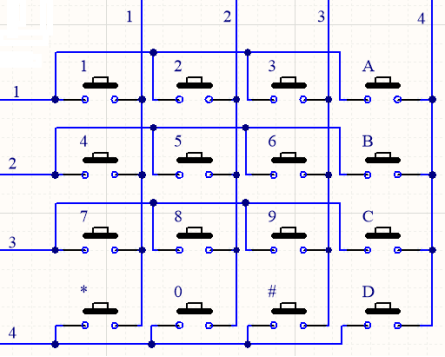 

使用方法类似于矩阵LED，即使用行扫描或列扫描方法检测每列或每行上的键的状态。以列扫描法为例，向第4列(Pin4)发送低电平，检测第1、2、3、4行电平状态，判断A、B、C、D键是否按下。然后依次将低电平发送到列3、2、1，检测是否有其它键被按下。然后，你可以获得所有键的状态。

**4.读取4*4矩阵键盘的键值：**

我们首先使用一个简单的代码读取4*4矩阵键盘的键值并将其打印出来，其接线图如下所示：


**如何安装Keypad库：**

本项目代码使用了一个名为“<span style="color: rgb(255, 76, 65);">Keypad</span>”库。如果已经添加好了“<span style="color: rgb(255, 76, 65);">Keypad</span>”库，则跳过此步骤。如果你还没有添加，请在学习之前安装它。添加第三方库的步骤如下:

打开Arduino IDE，单击“**项目**”→“**包含库**”→“**添加.ZIP库...**”。在弹出窗口中找到该目录下名为**..\库文件\Arduino_C_Windows系统\Keypad.ZIP**的文件，先选中**Keypad.ZIP**文件，再单击“**打开**”。

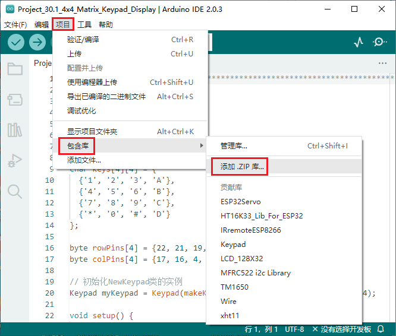


```
//**********************************************************************************
/*  
 * 文件名  : 4x4矩阵键盘显示 
 * 描述 : 获取矩阵键盘的值
*/
#include <Keypad.h>

//定义键盘按钮上的符号
char keys[4][4] = {
  {'1', '2', '3', 'A'},
  {'4', '5', '6', 'B'},
  {'7', '8', '9', 'C'},
  {'*', '0', '#', 'D'}
};

byte rowPins[4] = {22, 21, 19, 18}; // 连接到键盘的行引脚
byte colPins[4] = {17, 16, 4, 0};   // 连接到键盘的列引脚

// 初始化myKeypad类的实例
Keypad myKeypad = Keypad(makeKeymap(keys), rowPins, colPins, 4, 4);

void setup() {
  Serial.begin(115200); // 初始化串口，波特率设置为115200
  Serial.println("ESP32 is ready!");  // 打印字符串“ESP32 is ready!”
}

void loop() {
  // 获取字符输入
  char keyPressed = myKeypad.getKey();
  // 如果有字符输入，则发送到串口
  if (keyPressed) {
    Serial.println(keyPressed);
  }
}
//**********************************************************************************

```
编译并上传代码到ESP32，代码上传成功后，利用USB线上电，打开串口监视器，设置波特率为<span style="color: rgb(255, 76, 65);">115200</span>。你会看到的现象是：按下键盘，串口监视器窗口将打印对应的键值，如下图所示。


**5.密码锁的接线图：**

在上一实验中，我们已经知道了4×4矩阵键盘的键值，接下来，我们使用4×4矩阵键盘作为键盘来控制舵机和蜂鸣器。

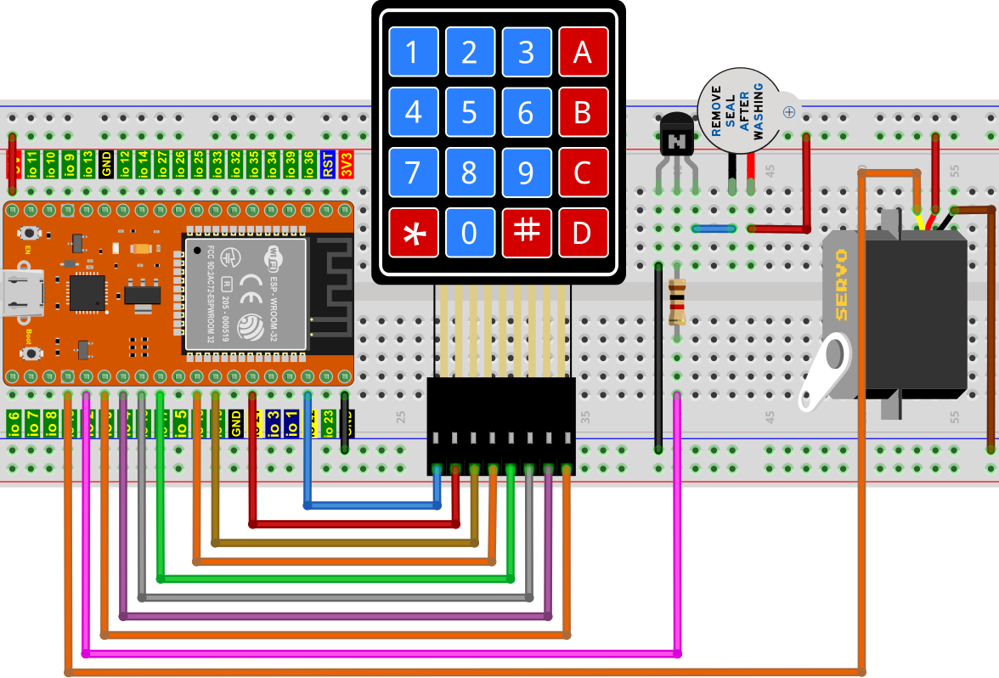

**6.添加Keypad和ESP32Servo库：**

前面已经添加过<span style="color: rgb(255, 76, 65);">Keypad</span>和<span style="color: rgb(255, 76, 65);">ESP32Servo</span>库，可以不用重复添加。如果没有添加，就需要添加<span style="color: rgb(255, 76, 65);">Keypad</span>和<span style="color: rgb(255, 76, 65);">ESP32Servo</span>库，添加第三方库的步骤如下:

**先添加ESP32Servo库：**

打开Arduino IDE，单击“**项目**”→“**包含库**”→“**添加.ZIP库...**”。在弹出窗口中找到该目录下名为**..\库文件\Arduino_C_Windows系统\ESP32Servo-0.8.0.ZIP**的文件，先选中**ESP32Servo-0.8.0.ZIP**文件，再单击“**打开**”。


**再添加Keypad库：**

打开Arduino IDE，单击“**项目**”→“**包含库**”→“**添加.ZIP库...**”。在弹出窗口中找到该目录下名为**Keyes ESP32 中级版学习套件\4. Arduino C 教程\1. Windows 系统\2. Arduino 库文件\Keypad.ZIP**的文件，先选中**Keypad.ZIP**文件，再单击“**打开**”。


**7.项目代码：**


```
//**********************************************************************************
/*  
 * 文件名 : 密码锁
 * 描述 : 制作一个简单的密码锁.
*/
#include <Keypad.h>
#include <ESP32Servo.h>

// 定义键盘按钮上的符号
char keys[4][4] = {
  {'1', '2', '3', 'A'},
  {'4', '5', '6', 'B'},
  {'7', '8', '9', 'C'},
  {'*', '0', '#', 'D'}
};

byte rowPins[4] = {22, 21, 19, 18};   // 连接到键盘的行引脚
byte colPins[4] = {17, 16, 4, 0};   // 连接到键盘的列引脚

// 初始化myKeypad类的实例
Keypad myKeypad = Keypad(makeKeymap(keys), rowPins, colPins, 4, 4);

Servo  myservo;     // 创建舵机对象来控制舵机
int servoPin = 15;  // 定义舵机引脚
int buzzerPin = 2; // 定义蜂鸣器引脚

char passWord[] = {"1234"}; // 保存正确密码

void setup() {
  myservo.setPeriodHertz(50);           // 标准50赫兹舵机
  myservo.attach(servoPin, 500, 2500);  // 将servoPin上的舵机附加到舵机对象上
                                        // 设置舵机的高电平时间范围，以实现精确的从0到180°转动
  myservo.write(0);                     // 设置舵机的初始角度
  pinMode(buzzerPin, OUTPUT);
  Serial.begin(115200);
}

void loop() {
  static char keyIn[4];     // 保存输入字符
  static byte keyInNum = 0; // 保存输入的字符数
  char keyPressed = myKeypad.getKey();  // 获取字符输入
  // 处理输入字符
  if (keyPressed) {
    // 每次按下该键时发出提示音
    digitalWrite(buzzerPin, HIGH);
    delay(100);
    digitalWrite(buzzerPin, LOW);
    // 保存输入字符
    keyIn[keyInNum++] = keyPressed;
    // 输入后判断正确性
    if (keyInNum == 4) {
      bool isRight = true;            // 保存密码是否正确
      for (int i = 0; i < 4; i++) {   // 判断每个字符的密码是否正确
        if (keyIn[i] != passWord[i])
          isRight = false;            // 如有错字，请标记错字.
      }
      if (isRight) {                  // 如果输入的密码正确
        myservo.write(90);           // 打开开关
        delay(2000);                  // 推迟一段时间
        myservo.write(0);            // 关闭开关
        Serial.println("passWord right!");
      }
      else {                          // 输入密码错误
        digitalWrite(buzzerPin, HIGH);// 密码错误提示音
        delay(1000);
        digitalWrite(buzzerPin, LOW);
        Serial.println("passWord error!");
      }
      keyInNum = 0; // 将输入字符数重置为0
    }
  }
}
//**********************************************************************************

```
**8.项目现象：**

编译并上传代码到ESP32，代码上传成功后，利用USB线上电，你会看到的现象是：按键盘输入4个字符的密码，如果输入正确（**正确密码：1234**），舵机会转动一定角度，然后回到原来的位置。如果输入错误，将发出输入错误警报。


## 项目31 红外遥控控制声音和LED

**1.项目介绍：**

红外遥控是一种低成本、易于使用的无线通信技术。IR光与可见光非常相似，除了它的波长稍长一点。这意味着红外线是人眼无法检测到的，这对于无线通信来说是完美的。例如，当你按下电视遥控器上的一个按钮时，一个红外LED会以每秒38000次的频率反复开关，将信息(如音量或频道控制)传送到电视上的红外感光器。

我们将首先解释常见的红外通信协议是如何工作的。然后我们将从一个遥控器和一个红外接收组件开始这个项目。

**2.项目元件：**

|||||
| :--: | :--: | :--: | :--: |
|ESP32*1|面包板*1|红外接收器*1|RGB LED*1|
|||| |
|有源蜂鸣器*1|220Ω电阻*3|10KΩ电阻*1|红外遥控器*1|
|||| |
|NPN型晶体管(S8050)*1|1kΩ电阻*1 |USB 线*1| 跳线若干|

**3.元件知识：**   

**红外(IR)遥控器：** 是一种可以发射红外光信号的设备。按下不同的按钮，位于遥控器前端的红外发射管会发出不同指令的红外线。红外遥控技术应用广泛，如电视、空调等。因此，在当今科技发达社会，红外遥控技术使你切换电视节目和调节空调温度都很方便。

我们使用的遥控器如下所示：


该红外遥控器采用NEC编码。

**红外(IR)接收器：** 它是一种元件，可以接收红外光，所以可以用它来接收红外遥控器发出的红外光信号。红外接收器解调接收到的红外光信号，并将其转换回二进制，然后将信息传递给微控制器。

红外信号调制过程图：


**4.解码红外信号：**

我们按照下面接线图将红外接收元件连接到ESP32。


**如何安装IRremoteESP8266库：**

本项目代码使用了一个名为“<span style="color: rgb(255, 76, 65);">IRremoteESP8266</span>”库。如果已经添加好了“<span style="color: rgb(255, 76, 65);">IRremoteESP8266</span>”库，则跳过此步骤。如果你还没有添加，请在学习之前安装它。添加第三方库的步骤如下:

打开Arduino IDE，单击“**项目**”→“**包含库**”→“**添加.ZIP库...**”。在弹出窗口中找到该目录下名为 **..\库文件\Arduino_C_Windows系统\IRremoteESP8266-2.7.4.ZIP** 的文件，先选中**IRremoteESP8266-2.7.4.ZIP**文件，再单击“**打开**”。

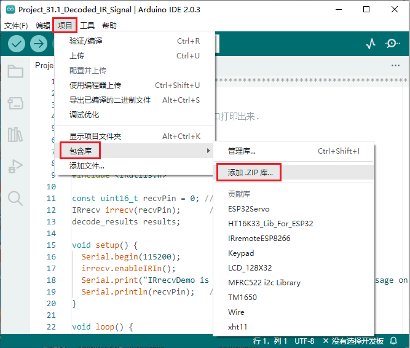

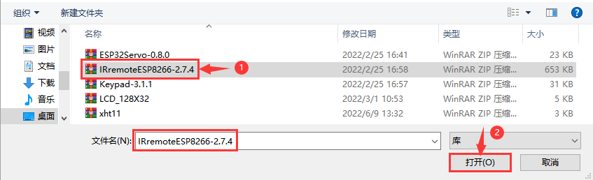


```
//**********************************************************************************
/*  
 * 文件名  : 解码的红外信号
 * 描述 : 红外遥控器解码后通过串口打印出来.
*/
#include <Arduino.h>
#include <IRremoteESP8266.h>
#include <IRrecv.h>
#include <IRutils.h>

const uint16_t recvPin = 0; // 红外接收引脚
IRrecv irrecv(recvPin);      // 创建用于接收器的类对象
decode_results results;       // 创建解码结果类对象

void setup() {
  Serial.begin(115200);       // 初始化串口，波特率设置为115200
  irrecv.enableIRIn();        // 启动接收器
  Serial.print("IRrecvDemo is now running and waiting for IR message on Pin ");
  Serial.println(recvPin);   //打印红外接收引脚接收到的信号
}

void loop() {
  if (irrecv.decode(&results)) {          // 等待解码
    serialPrintUint64(results.value, HEX);// 打印出解码结果
    Serial.println("");
    irrecv.resume();                      // 释放IRremote。接收下一个值
  }
  delay(1000);
}
//**********************************************************************************

```
编译并上传代码到ESP32，代码上传成功后，利用USB线上电，打开串口监视器，设置波特率为<span style="color: rgb(255, 76, 65);">115200</span>。你会看到的现象是：将红外遥控器发射器对准红外接收头，按下红外控制器上的按键，串口监视器将打印当前接收到的按键编码值。多次按下相同的按键以确保你拥有该按键的正确编码值。如果看到FFFFFFFF，请忽略它。


写下红外遥控器与每个按键相关联的按键编码值，因为你稍后将需要这些信息。


**5.红外遥控的接线图：**


**6.项目代码：**

前面已经添加过<span style="color: rgb(255, 76, 65);">IRremoteESP8266</span>库，可以不用重复添加。如果没有添加，就需要添加IRremoteESP8266库，添加方法如本项目上面所示。IRremoteESP8266库添加完成后，你可以打开我们提供的代码：


```
//**********************************************************************************
/*  
 * 文件名  : 红外控制声音和LED
 * 描述 : 红外遥控控制RGB和有源蜂鸣器.
*/
#include <Arduino.h>
#include <IRremoteESP8266.h>
#include <IRrecv.h>
#include <IRutils.h>

const uint16_t recvPin = 0; // 红外接收引脚
IRrecv irrecv(recvPin);      // 创建用于接收器的类对象
decode_results results;       // 创建解码结果类对象

int ledPins[] = {22, 21, 4};    //定义红、绿、蓝引脚
const byte chns[] = {0, 1, 2};        //定义PWM通道
int buzzerPin = 15;  // 蜂鸣器引脚的引脚

void setup() {
  irrecv.enableIRIn();                  // 启动接收器
  pinMode(buzzerPin, OUTPUT);
  for (int i = 0; i < 3; i++) {   //设置pwm通道，1KHz,8bit
    ledcSetup(chns[i], 1000, 8);
    ledcAttachPin(ledPins[i], chns[i]);
  }
}

void loop() {
  if(irrecv.decode(&results)) {        // 等待解码
    handleControl(results.value);       // 处理来自远程控制的命令
    irrecv.resume();                    // 接收下一个值
  }
}

void handleControl(unsigned long value) {
  // 当它接收到命令时发出声音
  digitalWrite(buzzerPin, HIGH);
  delay(100);
  digitalWrite(buzzerPin, LOW);
  // 处理命令
  if (value == 0xFF6897) // 收到数字“1”
  { 
      ledcWrite(chns[0], 255); //普通阴极LED，高电平开启LED.
      ledcWrite(chns[1], 0);
      ledcWrite(chns[2], 0);
      delay(1000);
  }
   else if (value == 0xFF9867) // 收到数字 '2'
   { 
      ledcWrite(chns[0], 0); 
      ledcWrite(chns[1], 255);
      ledcWrite(chns[2], 0);
      delay(1000);
   }
    else if (value == 0xFFB04F) // 收到数字 '3'
   { 
      ledcWrite(chns[0], 0);
      ledcWrite(chns[1], 0);
      ledcWrite(chns[2], 255);
      delay(1000);
    }
    else if (value == 0xFF30CF) // 收到数字 '4'
   {  
      ledcWrite(chns[0], 255);
      ledcWrite(chns[1], 255);
      ledcWrite(chns[2], 0);
      delay(1000);
    }
    else if (value == 0xFF18E7) // 收到数字 '5'
   {  
      ledcWrite(chns[0], 255);
      ledcWrite(chns[1], 0);
      ledcWrite(chns[2], 255);
      delay(1000);
    }
    else if (value == 0xFF7A85)  // 收到数字 '6'
   {  
      ledcWrite(chns[0], 0);
      ledcWrite(chns[1], 255);
      ledcWrite(chns[2], 255);
      delay(1000);
    }
    else if (value == 0xFF10EF)  // 收到数字 '7'
   {   
      ledcWrite(chns[0], 255);
      ledcWrite(chns[1], 255);
      ledcWrite(chns[2], 255);
      delay(1000);
    }
    else{
      ledcWrite(chns[0], 0);
      ledcWrite(chns[1], 0);
      ledcWrite(chns[2], 0);
      delay(1000);
      }
  }
//**********************************************************************************

```
**8.项目现象：**

编译并上传代码到ESP32，代码上传成功后，利用USB线上电，你会看到的现象是：按红外遥控器的1~7键，蜂鸣器都会鸣响一次，同时RGB分别亮红灯，绿灯，蓝灯，黄灯，洋红灯，蓝绿灯，白灯。按其他另一按键（除1-7键以外），RGB熄灭。


## 项目32 蓝牙

本章主要介绍如何通过ESP32的蓝牙与手机进行简单的数据传输。项目32.1 是常规蓝牙，项目32.2 是蓝牙控制LED。

**项目32.1 常规蓝牙**

**1. 项目元件：**

||||
| :--: | :--: |:--: |
| ESP32*1 | USB 线*1 |智能手机/平板电脑（<span style="color: rgb(255, 76, 65);">自备</span>）*1|

在本项目中，我们需要使用一个名为串口蓝牙终端的蓝牙应用程序来协助实验。如果您还没有安装它，请点击安装：[https://www.appsapk.com/serial-bluetooth-terminal/](https://www.appsapk.com/serial-bluetooth-terminal/) 。

下面是它的标志。


**2.元件知识：**

蓝牙是一种短距离通信系统，可分为两种类型，即低功耗蓝牙(BLE)和经典蓝牙。简单的数据传输有两种模式：主模式和从模式。

**主模式：** 在这种模式下，工作在主设备上完成，并且可以与从设备连接。我们可以搜索和选择附近的从设备来连接。当设备在主模式下发起连接请求时，需要其他蓝牙设备的地址和配对密码等信息。配对完成后，可直接与它们连接。

**从模式：** 处于从模式的蓝牙模块只能接受来自主机的连接请求，但不能发起连接请求。与主机设备连接后，可以向主机设备发送数据，也可以从主机设备接收数据。蓝牙设备之间可以进行数据交互，一个设备处于主模式，另一个设备处于从模式。当它们进行数据交互时，处于主模式的蓝牙设备会搜索并选择附近要连接的设备。在建立连接时，它们可以交换数据。当手机与ESP32进行数据交换时，手机通常处于主模式，ESP32为从模式。


**3.项目接线：**

使用USB线将ESP32主板连接到电脑上的USB口。


**4.项目代码：**


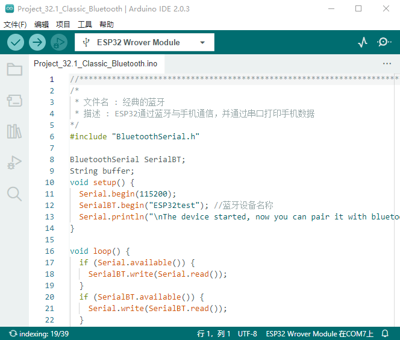

```
//**********************************************************************************
/*
 * 文件名 : 经典的蓝牙
 * 描述 : ESP32通过蓝牙与手机通信，并通过串口打印手机数据
*/
#include "BluetoothSerial.h"

BluetoothSerial SerialBT;
String buffer;
void setup() {
  Serial.begin(115200);
  SerialBT.begin("ESP32test"); //蓝牙设备名称
  Serial.println("\nThe device started, now you can pair it with bluetooth!");
}

void loop() {
  if (Serial.available()) {
    SerialBT.write(Serial.read());
  }
  if (SerialBT.available()) {
    Serial.write(SerialBT.read());
  }
  delay(20);
}
//**********************************************************************************

```

**5.项目现象：**

编译并上传代码到ESP32，上传成功后，打开串行监视器，波特率设置为<span style="color: rgb(255, 76, 65);">115200</span>。当您看到串行打印出字符串，如下所示，表示ESP32的蓝牙已就绪，等待与手机连接。(如果打开串口监视器且设置波特率为115200之后，串口监视器窗口没有显示如下信息，可以按下ESP32的复位键）


请确认你的手机已开启手机蓝牙，且已安装“**串口蓝牙终端**”的蓝牙应用程序。


手机自动搜索附近的蓝牙设备，点击“ESP32 test”进行配对，出现配对对话框，点击“**配对**”，这样“ESP32 test”设备就连接好了。


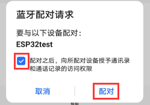


打开软件APP，点击终端左侧。选择 "Devices"。


选择经典蓝牙模式下的ESP32test，会出现如下图所示的连接成功提示。

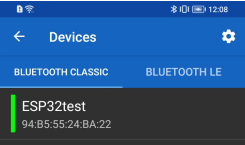

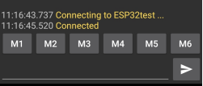

现在，数据可以通过ESP32在你的手机和电脑之间传输。

在IDE中的文本框输入“Hi!”,当手机收到它的时候，给你的手机回复“Hi!”；手机发送“Hello!”，当电脑收到它的时候，给你的电脑回复“Hello!”。

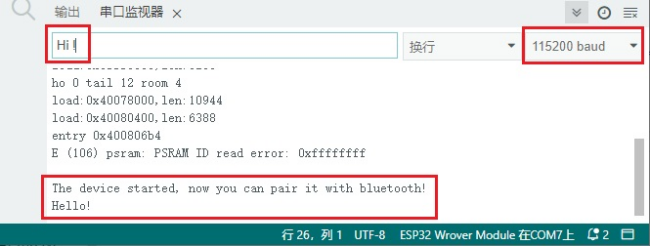


项目32.2 蓝牙控制LED

**1.项目元件：**

|||||
| :--: | :--: | :--: |:--: |
|ESP32*1|面包板*1|红色LED*1|智能手机/平板电脑（<span style="color: rgb(255, 76, 65);">自备</span>）*1|
|| || |
|220Ω电阻*1|跳线*2|USB 线*1| |

**2.项目接线：**


**3.项目代码：**

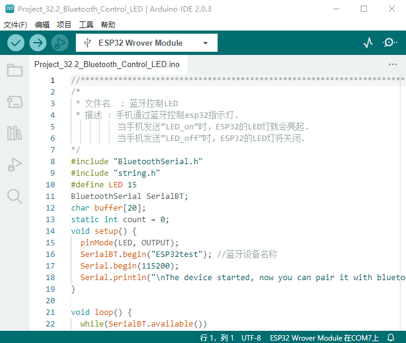

```
//**********************************************************************************
/*
 * 文件名  : 蓝牙控制LED
 * 描述 : 手机通过蓝牙控制esp32指示灯.
          当手机发送“LED_on”时，ESP32的LED灯就会亮起.
          当手机发送“LED_off”时，ESP32的LED灯将关闭.
*/
#include "BluetoothSerial.h"
#include "string.h"
#define LED 15
BluetoothSerial SerialBT;
char buffer[20];
static int count = 0;
void setup() {
  pinMode(LED, OUTPUT);
  SerialBT.begin("ESP32test"); //蓝牙设备名称
  Serial.begin(115200);
  Serial.println("\nThe device started, now you can pair it with bluetooth!");
}

void loop() {
  while(SerialBT.available())
  {
    buffer[count] = SerialBT.read();
    count++;
  }
  if(count>0){
    Serial.print(buffer);
    if(strncmp(buffer,"led_on",6)==0){
      digitalWrite(LED,HIGH);
    }
    if(strncmp(buffer,"led_off",7)==0){
      digitalWrite(LED,LOW);
    }
    count=0;
    memset(buffer,0,20);
  }
}
//**********************************************************************************

```

**4.项目现象：**

编译并上传代码到ESP32。APP的操作与**项目32.1**相同，要使外接LED亮灭，只需将发送内容更改为"led_on" 和 "led_off" 即可。移动APP发送的数据：

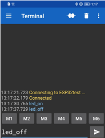

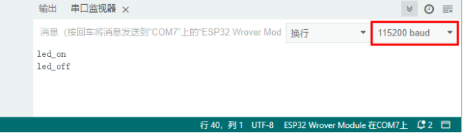

LED的现象：


<span style="color: rgb(255, 76, 65);">注意：</span> 如果发送的内容不是 "led_on'或"led_off"，那么LED的状态不会改变。如果LED是亮的，当接收到不相关内容时，LED继续亮；与之对应的是，如果LED是灭的，当接收到不相关内容时，LED继续熄灭。


## 项目33 WiFi 工作模式

在如今科技高速发展的时代，人们的生活质量越来越好，生活节奏越来越快，开始有人觉得复杂多样的智能化设备控制起来十分麻烦，通过手机统一控制智能化设备这种方法逐渐得到了人们的青睐。这种方法是利用单片机通过wifi模块和Internet网络建立手机和智能化设备之间的连接以此来实现对智能化设备的远程控制。在本章中，我们将重点关注ESP32的WiFi基础设施。ESP32有3种不同的WiFi工作模式：Station模式、AP模式和AP+Station模式。所有WiFi编程项目在使用WiFi前必须配置WiFi运行模式，否则无法使用WiFi。

**项目33.1: WIFI Station 模式**

**1.实验元件：**

|||
| :--: | :--: |
| USB 线 x1|ESP32x1|

**2.实验接线：**

使用USB线将ESP32主板连接到电脑上的USB口。


**3.元件知识：** 

**Station 模式：** 当ESP32选择Station模式时，它作为一个WiFi客户端。它可以连接路由器网络，通过WiFi连接与路由器上的其他设备通信。如下图所示，PC和路由器已经连接，ESP32如果要与PC通信，需要将PC和路由器连接起来。


**4.项目代码：**


```
//**********************************************************************************
/*
 * 文件名  : WiFi Station 模式
 * 模式 : 使用ESP32连接到路由器
*/
#include <WiFi.h> //包含ESP32的WiFi Library头文件.

//请输入正确的路由器名称和密码.
const char *ssid_Router     = "ChinaNet-2.4G-0DF0"; //输入路由器名称
const char *password_Router = "ChinaNet@233"; //输入路由器密码

void setup(){
  Serial.begin(115200);
  delay(2000);
  Serial.println("Setup start");
  WiFi.begin(ssid_Router, password_Router);//将ESP32设置为“Station 模式”，并连接到路由器。
  Serial.println(String("Connecting to ")+ssid_Router);
//每0.5s检查ESP32是否连接路由器成功.  
  while (WiFi.status() != WL_CONNECTED){
    delay(500);
    Serial.print(".");
  }
  Serial.println("\nConnected, IP address: ");
  Serial.println(WiFi.localIP());//串行监视器打印出分配给ESP32的IP地址.
  Serial.println("Setup End");
}
 
void loop() {
}
//**********************************************************************************

```
由于各地的WiFi名称和密码是不同，所以在程序代码运行之前，用户需要在下图所示的框中输入正确的WiFi名称和密码。

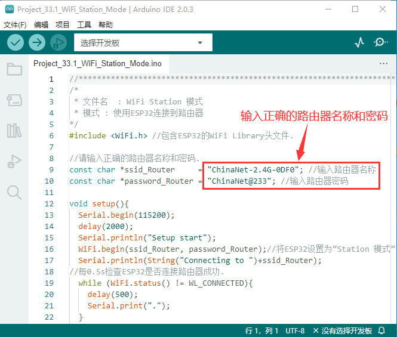

**5.项目现象：**

确认正确输入WiFi名称和密码后，编译并上传代码到ESP32主板，上传成功后，打开串口监视器，设置波特率为<span style="color: rgb(255, 76, 65);">115200</span>。当ESP32成功连接到ssid_Router时，串行监视器将打印出WiFi分配给ESP32的IP地址。然后串口监视器窗口将显示如下：(如果打开串口监视器且设置波特率为115200之后，串口监视器窗口没有显示如下信息，可以按下ESP32的复位键）

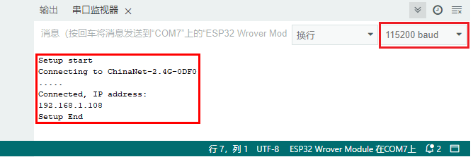


**项目33.2：WIFI AP 模式**

**1.实验元件&接线：**

实验元件和实验接线与上面的**项目33.1: WIFI Station 模式**相同。

**2.元件知识：**

**AP模式：** 当ESP32选择AP模式时，会创建一个独立于Internet的热点网络，等待其他WiFi设备连接。如下图所示，以ESP32为热点。如果手机或PC需要与ESP32通信，则必须连接到ESP32的热点。只有通过ESP32建立连接后才能进行通信。


**3.项目代码：**


```
//**********************************************************************************
/*
 * 文件名  : WiFi AP
 * 描述 : 设置ESP32打开接入点
*/
#include <WiFi.h> //包含ESP32的WiFi Library头文件.

const char *ssid_AP     = "ESP32_Wifi"; //输入AP名称
const char *password_AP = "12345678"; //输入AP密码

IPAddress local_IP(192,168,1,108);//设置ESP32本身的IP地址
IPAddress gateway(192,168,1,1);   //设置ESP32本身的网关
IPAddress subnet(255,255,255,0);  //设置ESP32本身的子网掩码

void setup(){
  Serial.begin(115200);
  delay(2000);
  Serial.println("Setting soft-AP configuration ... ");
  WiFi.disconnect();
  WiFi.mode(WIFI_AP);
  Serial.println(WiFi.softAPConfig(local_IP, gateway, subnet) ? "Ready" : "Failed!");
  Serial.println("Setting soft-AP ... ");
  boolean result = WiFi.softAP(ssid_AP, password_AP);
  if(result){
    Serial.println("Ready");
    Serial.println(String("Soft-AP IP address = ") + WiFi.softAPIP().toString());
    Serial.println(String("MAC address = ") + WiFi.softAPmacAddress().c_str());
  }else{
    Serial.println("Failed!");
  }
  Serial.println("Setup End");
}
 
void loop() {
}
//**********************************************************************************

```
在程序代码运行之前，你可以像下图所示对框中ESP32的AP名称和密码进行任何更改。当然，在默认情况下，你也可以不修改它。

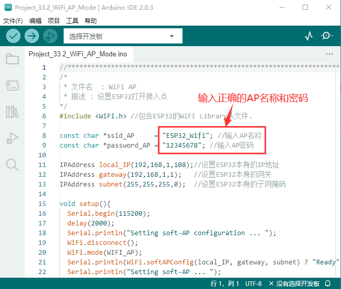

**4.项目现象：**

正确输入ESP32的AP名称和密码，编译并上传代码到ESP32主板，上传成功后，打开串口监视器，设置波特率为<span style="color: rgb(255, 76, 65);">115200</span>。然后串口监视器窗口将显示如下：(如果打开串口监视器且设置波特率为115200之后，串口监视器窗口没有显示如下信息，可以按下ESP32的复位键）

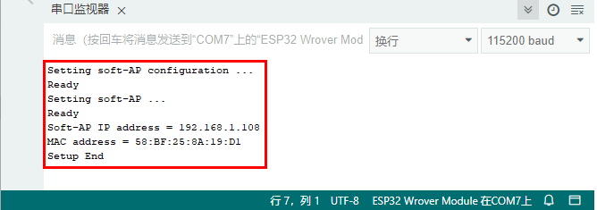

观察串口监视器打印信息时，打开手机WiFi扫描功能，可以看到ESP32上的ssid_AP被调用，在本程序代码中称为“ESP32_Wifi”。你可以输入密码“12345678”连接它，也可以通过修改程序代码来修改它的AP名称和密码。

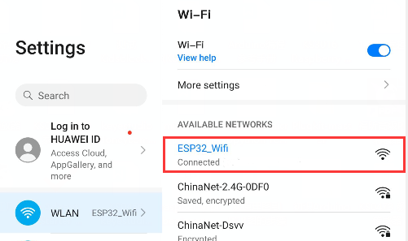


**项目33.3：WIFI AP+Station模式**

**1.实验元件&接线：**

实验元件和实验接线与上面的**项目33.1: WIFI Station 模式**和**项目33.2: WIFI AP 模式**相同。

**2.元件知识：**

**AP+Station模式：** ESP32除AP模式和Station模式外，还可以同时使用AP模式和Station模式。此模式包含前两种模式的功能。打开ESP32的Station模式，将其连接到路由器网络，它可以通过路由器与Internet通信。同时开启其AP模式，创建热点网络。其他WiFi设备可以选择连接路由器网络或热点网络与ESP32通信。

**3.项目代码：**


```
//**********************************************************************************
/*
 * 文件名 : WiFi AP+Station
 * 描述 : ESP32连接到用户的路由器，打开一个接入点
*/
#include <WiFi.h>
 
const char *ssid_Router     =  "ChinaNet-2.4G-0DF0";  //输入路由器名称
const char *password_Router =  "ChinaNet@233";  //输入路由器密码
const char *ssid_AP         =  "ESP32_Wifi"; //输入AP名称
const char *password_AP     =  "12345678";  //输入AP密码

void setup(){
  Serial.begin(115200);
  Serial.println("Setting soft-AP configuration ... ");
  WiFi.disconnect();
  WiFi.mode(WIFI_AP);
  Serial.println("Setting soft-AP ... ");
  boolean result = WiFi.softAP(ssid_AP, password_AP);
  if(result){
    Serial.println("Ready");
    Serial.println(String("Soft-AP IP address = ") + WiFi.softAPIP().toString());
    Serial.println(String("MAC address = ") + WiFi.softAPmacAddress().c_str());
  }else{
    Serial.println("Failed!");
  }
  
  Serial.println("\nSetting Station configuration ... ");
  WiFi.begin(ssid_Router, password_Router);
  Serial.println(String("Connecting to ")+ ssid_Router);
  while (WiFi.status() != WL_CONNECTED){
    delay(500);
    Serial.print(".");
  }
  Serial.println("\nConnected, IP address: ");
  Serial.println(WiFi.localIP());
  Serial.println("Setup End");
}

void loop() {
}
//**********************************************************************************

```
它类似于上面的**项目33.1**和**项目33.2**。在运行代码之前，你需要修改ssid_Router、password_Router、ssid_AP和password_AP，如下图中的红色框所示。

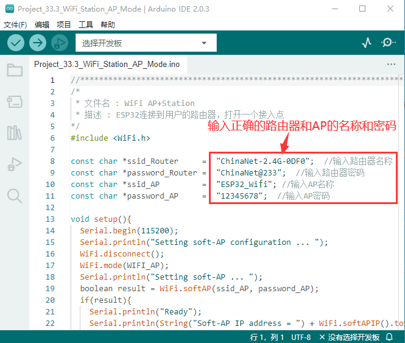

**4.项目现象：**

确认程序代码修改正确后，编译并上传代码到 ESP32主板上，上传成功后，打开串口监视器，设置波特率为<span style="color: rgb(255, 76, 65);">115200</span>。然后串口监视器窗口将显示如下：(如果打开串口监视器且设置波特率为115200之后，串口监视器窗口没有显示如下信息，可以按下ESP32的复位键）

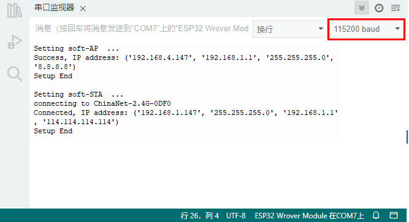

打开手机的WiFi搜索功能，可以在ESP32上看到ssid_AP被调用。


## 项目34 WiFi 测试

**1.实验简介：**

在本实验中，我们先使用ESP32的WiFi Station模式读取WiFi的IP地址，然后通过APP连接WiFi来读取APP上各功能按钮发送的字符。

**2.实验元件**

||||
| :--: | :--: | :--: |
| ESP32*1 | USB 线*1 |智能手机/平板电脑(<span style="color: rgb(255, 76, 65);">自备</span>)*1|

**3.实验接线：**

使用USB线将ESP32主板连接到电脑上的USB口。


**4.安装APP:**

(1) 安卓系统设备（手机/平板）APP：

我们提供了Android APP 的安装包：

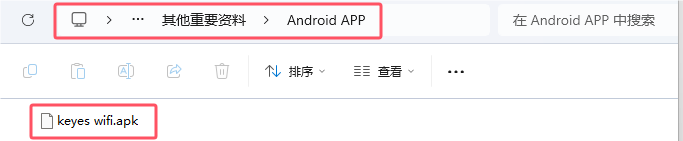

**安装步骤：**

A. 现将文件夹中的**keyes wifi.apk**文件转移到安卓系统手机或平板电脑上。

或者用安卓系统手机/平板电脑的浏览器中的扫码功能扫下面的二维码。


B. 点击keyes wifi.apk文件进入安装页面，点击“**允许**”按钮，然后点击“**安装**”按钮，过一会儿，安装完成后点击“**打开**”按钮就可以进入APP界面。


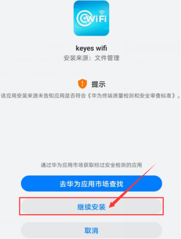


(2) IOS系统设备（手机/iPad）APP

a. 打开App Store。


b.在搜索框输入**keyes link**，点击搜索，出现下载界面，点击“”，就可以下载安装**keyes link**的APP。接下来的操作和安卓系统类似的，可以参考上面安卓系统的步骤进行操作。

**5.项目代码：**

<span style="background: rgb(255, 251, 0);"><span style="color: rgb(255, 76, 0);">**特别注意：**<span style="color: rgb(255, 76, 0);"></span>确保计算机网络，手机/平板的网络，ESP32主板，路由器，代码中输入你自己的WiFi名称和密码都必须是在同一个局域网（WiFi）下。</span></span>

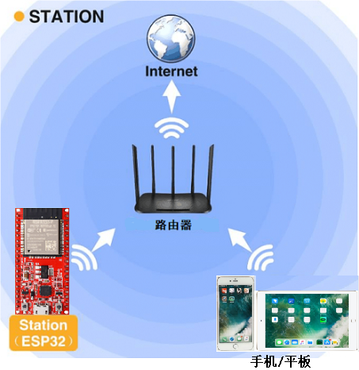

```
//**********************************************************************************
/*
 * 文件名   : WIFI 测试
 * 描述 : Wifi模块测试Wifi ip
*/

#include <Arduino.h>
#include <WiFi.h>
#include <ESPmDNS.h>
#include <WiFiClient.h>

String item = "0";
const char* ssid = "ChinaNet-2.4G-0DF0";
const char* password = "ChinaNet@233";
WiFiServer server(80);

void setup() {
  Serial.begin(115200);
  WiFi.begin(ssid, password);
  while (WiFi.status() != WL_CONNECTED) {
    delay(500);
    Serial.print(".");
  }
  Serial.println("");
  Serial.print("Connected to ");
  Serial.println(ssid);
  Serial.print("IP address: ");
  Serial.println(WiFi.localIP());
  server.begin();
  Serial.println("TCP server started");
  MDNS.addService("http", "tcp", 80);
}

void loop() {
  WiFiClient client = server.available();
  if (!client) {
      return;
  }
  while(client.connected() && !client.available()){
      delay(1);
  }
  String req = client.readStringUntil('\r');
  int addr_start = req.indexOf(' ');
  int addr_end = req.indexOf(' ', addr_start + 1);
  if (addr_start == -1 || addr_end == -1) {
      Serial.print("Invalid request: ");
      Serial.println(req);
      return;
  }
  req = req.substring(addr_start + 1, addr_end);
  item=req;
  Serial.println(item);
  String s;
  if (req == "/")
  {
      IPAddress ip = WiFi.localIP();
      String ipStr = String(ip[0]) + '.' + String(ip[1]) + '.' + String(ip[2]) + '.' + String(ip[3]);
      s = "HTTP/1.1 200 OK\r\nContent-Type: text/html\r\n\r\n<!DOCTYPE HTML>\r\n<html>Hello from ESP32 at ";
      s += ipStr;
      s += "</html>\r\n\r\n";
      Serial.println("Sending 200");
      client.println(s);
  }
  //client.print(s);
  client.stop();
}
//**********************************************************************************

```
<span style="color: rgb(255, 76, 65);">特别注意：</span>需要先将实验代码中的用户Wifi名称和用户Wifi密码改成你们自己的Wifi名称和Wifi密码。

**6.实验现象**

<span style="background: rgb(255, 251, 0);"><span style="color: rgb(255, 76, 0);">**特别注意：**<span style="color: rgb(255, 76, 0);"></span>确保计算机网络，手机/平板的网络，ESP32主板，路由器，代码中输入你自己的WiFi名称和密码都必须是在同一个局域网（WiFi）下。</span></span>


确认程序代码中的Wifi名称和Wifi密码修改正确后，编译并上传代码到ESP32主板上。

打开串口监视器，设置波特率为<span style="color: rgb(255, 76, 65);">115200</span>，这样，串口监视器打印检测到的WiFi IP地址，然后打开WiFi APP。 在WIFI按钮前面的文本框中输入检测到的WIFI IP地址（<span style="color: rgb(255, 76, 65);">例如，下上面串口监视器检测到的IP地址：192.168.1.136</span>），再点击WIFI按钮，“403 Forbidden”或“网页无法打开”就会变成“192.168.1.136”。这样，就说明APP已经连接上了WIFI。

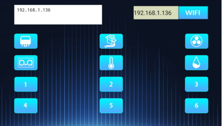

用手分别点击APP上的各个功能按钮，然后串口监视器会打印接收到的对应字符。


**注意：** 如果打开串口监视器且设置波特率为115200之后，串口监视器窗口没有显示如下信息，可以按下ESP32的复位键）


## 项目35 WiFi 智能家居

**1.实验说明：**

在前面的实验中，我们已经了解了ESP32的WiFi Station模式，WiFi AP模式和WiFi AP+Station模式等三种模式。那么在本章实验中，我们将使用ESP32的WiFi Station模式通过APP连接WIFI来控制多个传感器/模块工作，实现WiFi智能家居的效果。

**2.实验器材：**

|||||
| :--: | :--: | :--: | :--: |
|ESP32*1|面包板*1| 智能手机/平板电脑(<span style="color: rgb(255, 76, 65);">自备</span>)*1|继电器模块*1|
|||||
| 舵机*1 |温湿度传感器*1| 超声波传感器*1|4P转杜邦线公单*1|
|||||
|跳线若干|面包板专用电源模块*1|6节5号电池盒*1|3P转杜邦线公单*2|
|||  | |
|5号电池(<span style="color: rgb(255, 76, 65);">自备</span>)*6|MicroUSB线*1|  | |

**3.实验接线图：**

| 继电器| ESP32主板 | 温湿度传感器 | ESP32主板 |
| :--: | :--: | :--: | :--: |
| G | G| G | G |
| V | 5V | V | 5V |
| S | IO32 | S | IO15 |


| 超声波传感器| ESP32主板 |舵机| ESP32主板 |
| :--: | :--: | :--: | :--: |
| Vcc | 5V| 红色线 | 5V|
| Trig | IO14 |棕色线 | G |
| Echo | IO27 |  橙色线 | IO4 |
|Gnd|G| | |


(<span style="color: rgb(255, 76, 65);">注:</span> 先接好线，然后在直流电机上安装一个小风扇叶片。)

**4.安装APP:**

安装APP的方法请参照 <span style="color: rgb(255, 76, 65);">**项目34 WiFi测试**</span> 。这里就不重复讲解。

**5. 添加xht11和ESP32Servo库：**

本项目代码使用了名为“<span style="color: rgb(255, 76, 65);">xht11</span>”和“<span style="color: rgb(255, 76, 65);">ESP32Servo</span>”库。如果你还没有添加，请在学习之前添加它们。添加第三方库的步骤如下:

**先添加xht11库：**

打开Arduino IDE，单击“**项目**”→“**包含库**”→“**添加.ZIP库...**”。在弹出窗口中找到该目录下名为**..\库文件\Arduino_C_Windows系统\xht11.ZIP**的文件，先选中**xht11.ZIP**文件，再单击“**打开**”。

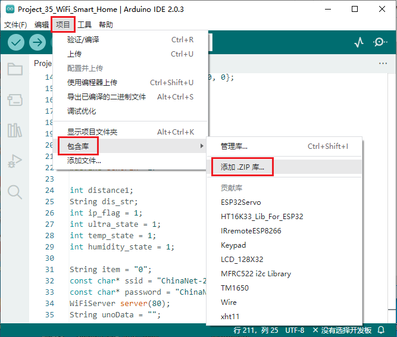


**再添加ESP32Servo库：**

打开Arduino IDE，单击“**项目**”→“**包含库**”→“**添加.ZIP库...**”。在弹出窗口中找到该目录下名为**..\库文件\Arduino_C_Windows系统\ESP32Servo-0.8.0.ZIP**的文件，先选中**ESP32Servo-0.8.0.ZIP**文件，再单击“**打开**”。


**6.项目代码：**

```
//**********************************************************************************
/*  
 * 文件名  : WiFi 智能家居.
 * 描述 : WiFi APP控制多个传感器/模块工作，实现WiFi智能家居的效果.
*/
#include <Arduino.h>
#include <WiFi.h>
#include <ESPmDNS.h>
#include <WiFiClient.h>

#include "xht11.h"
//gpio15
xht11 xht(15);
unsigned char dht[4] = {0, 0, 0, 0};

#include <ESP32Servo.h>
Servo myservo;
int servoPin = 4;
#define Relay  32

#define trigPin  14
#define echoPin  27

int distance1;
String dis_str;
int ip_flag = 1;
int ultra_state = 1;
int temp_state = 1;
int humidity_state = 1;

String item = "0";
const char* ssid = "ChinaNet-2.4G-0DF0"; //用户的WiFi名称
const char* password = "ChinaNet@233";  //用户的WiFi密码
WiFiServer server(80);
String unoData = "";

void setup() {
  Serial.begin(115200);
  pinMode(Relay, OUTPUT);
  myservo.setPeriodHertz(50);   
  myservo.attach(servoPin, 500, 2500);
  
  WiFi.begin(ssid, password);
  while (WiFi.status() != WL_CONNECTED) {
    delay(500);
    Serial.print(".");
  }
  Serial.println("");
  Serial.print("Connected to ");
  Serial.println(ssid);
  Serial.print("IP address: ");
  Serial.println(WiFi.localIP());
  server.begin();
  Serial.println("TCP server started");
  MDNS.addService("http", "tcp", 80);

  digitalWrite(Relay, LOW);
  pinMode(trigPin, OUTPUT);
  pinMode(echoPin, INPUT);
}

void loop() {
  WiFiClient client = server.available();
  if (!client) {
      return;
  }
  while(client.connected() && !client.available()){
      delay(1);
  }
  String req = client.readStringUntil('\r');
  int addr_start = req.indexOf(' ');
  int addr_end = req.indexOf(' ', addr_start + 1);
  if (addr_start == -1 || addr_end == -1) {
      Serial.print("Invalid request: ");
      Serial.println(req);
      return;
  }
  req = req.substring(addr_start + 1, addr_end);
  item=req;
  Serial.println(item);
  String s;
  if (req == "/")
  {
      IPAddress ip = WiFi.localIP();
      String ipStr = String(ip[0]) + '.' + String(ip[1]) + '.' + String(ip[2]) + '.' + String(ip[3]);
      s = "HTTP/1.1 200 OK\r\nContent-Type: text/html\r\n\r\n<!DOCTYPE HTML>\r\n<html>Hello from ESP32 at ";
      s += ipStr;
      s += "</html>\r\n\r\n";
      Serial.println("Sending 200");
      client.println(s);
  }
  else if(req == "/btn/0")
  {
    Serial.write('a');
    client.println(F("turn on the relay"));
    digitalWrite(Relay, HIGH);
  }
  else if(req == "/btn/1")
  {
    Serial.write('b');
    client.println(F("turn off the relay"));
    digitalWrite(Relay, LOW);
  }
  else if(req == "/btn/2")
  {
    Serial.write('c');
    client.println("Bring the steering gear over 180 degrees");
    myservo.write(180); 
    delay(200);
  }
  else if(req == "/btn/3")
  {
    Serial.write('d');
    client.println("Bring the steering gear over 0 degrees");
    myservo.write(0); 
    delay(200);
  }
  else if(req == "/btn/6")
  {
    Serial.write('g');
    while(Serial.available() > 0)
    {
      unoData = Serial.readStringUntil('#');
      client.println("Data");
    }
    while(ultra_state>0)
       {
          Serial.print("Distance = "); 
          Serial.print(checkdistance());
          Serial.println("#");
          Serial1.print("Distance = "); 
          Serial1.print(checkdistance());
          Serial1.println("#");  
          int t_val1 = checkdistance();
          client.print("Distance(cm) = ");
          client.println(t_val1); 
          ultra_state = 0;
        }
  }
  else if(req == "/btn/7")
  {
    Serial.write('h');
    client.println("turn off the ultrasonic");
    ultra_state = 1;
  }
  else if(req == "/btn/8")
  {
    Serial.write('i');
    while(Serial.available() > 0)
     {
      unoData = Serial.readStringUntil('#');
      client.println(unoData);
     }
    while(temp_state>0)
      {
        if (xht.receive(dht)) {
          Serial.print("Temperature = "); 
          Serial.print(dht[2],1);
          Serial.println("#");
          Serial1.print("Temperature = "); 
          Serial1.print(dht[2],1);
          Serial1.println("#");
          int t_val2 = dht[2];
          client.print("Temperature(℃) = ");
          client.println(t_val2);
        }
        temp_state = 0;
      }
  }
  else if(req == "/btn/9")
  {
    Serial.write('j');
    client.println("turn off the temperature");
    temp_state = 1;
  }
  else if(req == "/btn/10")
  {
    Serial.write('k');
    while(Serial.available() > 0)
     {
       unoData = Serial.readStringUntil('#');
       client.println(unoData);
     }
    while(humidity_state > 0)
      {
        if (xht.receive(dht)) {
          Serial.print("Humidity = "); 
          Serial.print(dht[0],1);
          Serial.println("#");
          Serial1.print("Humidity = "); 
          Serial1.print(dht[0],1);
          Serial1.println("#");
          int t_val3 = dht[0];
          client.print("Humidity(%) = ");
          client.println(t_val3);
        }
        humidity_state = 0;
      }
  }
  else if(req == "/btn/11")
  {
    Serial.write('l');
    client.println("turn off the humidity");
    humidity_state = 1;
    }
  //client.print(s);
  client.stop();
}

int checkdistance() {
  digitalWrite(14, LOW);
  delayMicroseconds(2);
  digitalWrite(14, HIGH);
  delayMicroseconds(10);
  digitalWrite(14, LOW);
  int distance = pulseIn(27, HIGH) / 58;
  
  delay(10);
  return distance;
}
//**********************************************************************************

```
<span style="color: rgb(255, 76, 65);">特别注意：</span>需要先将实验代码中的用户Wifi名称和用户Wifi密码改成你们自己的Wifi名称和Wifi密码。

**7. 实验现象：**

<span style="background: rgb(255, 251, 0);"><span style="color: rgb(255, 76, 0);">**特别注意：**<span style="color: rgb(255, 76, 0);"></span>确保计算机网络，手机/平板的网络，ESP32主板，路由器，代码中输入你自己的WiFi名称和密码都必须是在同一个局域网（WiFi）下。</span></span>


确认程序代码中的Wifi名称和Wifi密码修改正确后，编译并上传代码到ESP32主板上。

打开串口监视器，设置波特率为<span style="color: rgb(255, 76, 65);">115200</span>，这样，串口监视器打印检测到的WiFi IP地址。（**注意：** 如果打开串口监视器且设置波特率为115200之后，串口监视器窗口没有显示如下信息，可以按下ESP32的复位键）

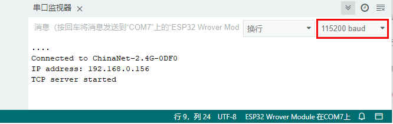

然后打开WiFi APP，在WIFI按钮前面的文本框中输入检测到的WIFI IP地址（<span style="color: rgb(255, 76, 65);">例如，上面串口监视器检测到的IP地址：192.168.0.156</span>），接着点击WIFI按钮来连接WiFi，同时WiFi IP地址前的文本框中会显示对应的WiFi IP地址“Hello from ESP32 at <span style="color: rgb(255, 76, 65);">192.168.0.156</span>”。这样，就说明APP已经连接上了WiFi。（<span style="color: rgb(255, 76, 65);">WiFi的IP地址有时候会改变，如果原来的IP地址不行，需要重新检测WiFi的IP地址</span>）


**APP已经连接上了WiFi后，开始进行如下操作：**


（1）点击按钮，继电器打开，APP上显示，模块上的指示灯点亮；再次点击按钮，继电器关闭，APP上显示，模块上的指示灯不亮。

（2）点击按钮，舵机转动180°，APP上显示；再次点击按钮，APP上显示，舵机转动0°。

（3）点击按钮，超声波传感器测距，在超声波传感器前放一个物体，APP上显示（<span style="color: rgb(255, 76, 65);">不同的距离显示不同的数字</span>），说明此时物体离超声波传感器的距离为6cm；再次点击按钮，关闭超声波，APP上显示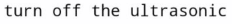。

（4）点击按钮，温湿度传感器测量环境中的温度，APP上显示（<span style="color: rgb(255, 76, 65);">不同的温度条件下显示不同的温度值</span>），说明此时环境中的温度为30℃；再次点击按钮，关闭温湿度传感器，APP上显示。

（5）点击按钮，温湿度传感器测量环境中的湿度，APP上显示（<span style="color: rgb(255, 76, 65);">不同的湿度条件下显示不同的湿度值</span>），说明此时环境中的湿度为55%；再次点击按钮，关闭温湿度传感器，APP上显示。


