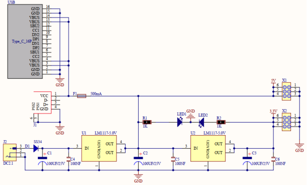

# 项目18 小风扇

## 1.项目介绍： 
在炎热的夏季，需要电扇来给我们降温，那么在这个项目中，我们将使用ESP32控制直流电机和小扇叶来制作一个小电扇。

## 2.项目元件：
||||||
| :--: | :--: | :--: | :--: | :--: |
|ESP32*1|面包板*1|直流电机*1|面包板专用电源模块*1|6节5号电池盒*1|
||||||
|IC L293D*1|风扇叶*1|跳线若干|5号电池(<span style="color: rgb(255, 76, 65);">自备</span>)*6|USB 线*1|

## 3.元件知识:

L293D芯片：L293D是一种直流电动驱动IC，在一些机器人项目中可用来驱动直流电机或步进电机。它共有16个引脚，可以同时驱动两路直流电机。输入电压范围：4.5 V ~ 36 V，每通道输出电流：MAX 600mA，可以驱动感性负载，特别是其输入端可以与主控板直接相连，从而很方便地受主控板控制。当驱动小型直流电机时，可以直接控制两路电机，并且可以实现电机正转与反转，实现此功能只需改变输入端的高低电平。市面上有许多采用L293D芯片的电机驱动板，当然我们也可以自己通过简单连接来使用它。
**L293D引脚图：**

|引脚号| 引脚名称 | 描述 |
| :--: | :--: | :--: |
| 1 | Enable1 | 该引脚使能输入引脚Input 1(2)和Input 2(7)  |
| 2 | In1 | 直接控制输出1引脚，由数字电路控制 |
| 3 | Out1 | 连接到电机1的一端 |
| 4 | 0V | 接地引脚连接到电路的接地(0V) |
| 5 | 0V | 接地引脚连接到电路的接地(0V) |
| 6 |Out2 | 连接到电机1的另一端 |
| 7 | In2 | 直接控制输出2引脚。由数字电路控制 |
| 8 | +V motor | 连接到运行电机的电压引脚(4.5V至36V) |
| 9 | Enable2 |该引脚使能输入引脚输入3(10)和输入4(15) |
| 10 | In3 | 直接控制输出3引脚。由数字电路控制|
| 11 | Out3 | 连接到电机2的一端 |
| 12 | 0V | 接地引脚连接到电路的接地(0V) |
| 13 | 0V | 接地引脚连接到电路的接地(0V) |
| 14 | Out4 | 连接到电机2的另一端 |
| 15 |In4 | 直接控制输出4引脚，由数字电路控制|
| 16 | +V | 连接到+ 5V以启用IC功能 |

**面包板专用电源模块：**

**说明：**
此模块，能方便的给面包板提供3.3V和5V的电源，具有DC2.1输入（DC7－12V），另外，具备USB Type C接口的电源输入。

**规格：** 
 输入电压：DC座：7-12V；  Type C USB：5V 
 电流：3.3V：最大500mA；        5V：最大500mA；
 最大功率: 2.5W
 尺寸: 53mmx26.3mm
 环保属性: ROHS

**接口说明：**


**原理图：**


## 4. 项目接线图：


(<span style="color: rgb(255, 76, 65);">注: 先接好线，然后在直流电机上安装一个小风扇叶片。</span>)

## 5.项目代码：
你可以打开我们提供的代码：

本项目中使用的代码保存在（即路径)：**..\Keyes ESP32 中级版学习套件\4. Arduino C 教程\1. Windows 系统\3. 项目教程\项目18 小风扇\Project_18_Small_Fan** 。

```
//**********************************************************************************
/*
 * 文件名  : 小风扇
 * 描述 : 小风扇逆时针旋转，停止，顺时针旋转，停止，循环。
*/
#define IN1 2  // L293D的IN1引脚
#define IN2 15  //L293D的IN2引脚
#define ENA_pwm 0  //L293D的ENA-pwm引脚
void setup()
{
pinMode(IN1,OUTPUT); //设置N1为OUTPUT
pinMode(IN2,OUTPUT); //设置N2为OUTPUT
ledcSetup(2, 1200, 8);//设置ledc通道2，频率为1200,PWM分辨率为8，占空比为256。
ledcAttachPin(0, 2); //将ledc通道2绑定到指定的ENA_pwm引脚GPIO0进行输出。
}
void loop()
{
//逆时针旋转5秒
digitalWrite(IN1,LOW);
digitalWrite(IN2,HIGH);
ledcWrite(2, 250); //ledc通道2被绑定到指定的ENA_pwm输出PWM值250。
delay(5000);
//停止 2s 
ledcWrite(2, 0); //ledc通道2被绑定到指定的ENA_pwm输出PWM值0。
delay(2000);
//顺时针旋转5秒
digitalWrite(IN1,HIGH);
digitalWrite(IN2,LOW);
ledcWrite(2, 250); //ledc通道2被绑定到指定的ENA_pwm输出PWM值250。
delay(5000);
//停止 2s
ledcWrite(2, 0); //ledc通道2被绑定到指定的ENA_pwm输出PWM值0。
delay(2000);
}
//********************************************************************************

```
ESP32主板通过USB线连接到计算机后开始上传代码。为了避免将代码上传至ESP32主板时出现错误，必须选择与计算机连接正确的控制板和端口（COM）。

点击“**工具**”→“**开发板**”，可以查看到各种不同型号ESP32开发板，选择对应的ESP32开发板型号。

点击“**工具**”→“**端口**”，选择对应的端口（COM）。

**注意：将ESP32主板通过USB线连接到计算机后才能看到对应的端口（COM）**。

单击将代码上传到ESP32主控板。

## 6.项目现象：
编译并上传代码到ESP32，代码上传成功后，外接电源，上电后，你会看到的现象是：小风扇先逆时针转5秒，停止2秒，再顺时针转5秒，停止2秒，以此规律重复执行。

<span style="color: rgb(255, 76, 65);">注意：</span> 如果上传代码不成功，可以再次点击后用手按住ESP32主板上的Boot键，出现上传进度百分比数后再松开Boot键，如下图所示：
