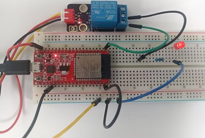

# 项目21 继电器

## 1.项目介绍：
在日常生活中，我们一般使用交流来驱动电气设备，有时我们会用开关来控制电器。如果将开关直接连接到交流电路上，一旦发生漏电，人就有危险。从安全的角度考虑，我们特别设计了这款具有NO(常开)端和NC(常闭)端的继电器模块。在这节课我们将学习一个比较特殊，好用的开关，就是继电器模块。

## 2.项目元件：
|||||
| :--: | :--: | :--: |:--: |
|ESP32*1|面包板*1|继电器模块*1|红色LED*1|
|||| |
|3P转杜邦线公单*1|USB 线*1|220Ω电阻*1|跳线若干|

## 3.元件知识：
**继电器：** 它主要采用HK4100F-DC 5V-SHC继电器元件。继电器有3个接线柱用于外接电路，分别为NO、COM和NC端（背后丝印）。

常开（NO）：该引脚是常开的，除非向继电器模块的信号引脚提供信号，因此，普通接触针通过NC脚断开其连接，通过NO脚建立连接。

公共触点（COM）：此引脚用来连接其他模块/元器件，如LED。

LED：

常闭（NC）：此NC引脚通过COM引脚连接，形成闭合电路，可以通过ESP32等开发板，控制继电器模块，来切换闭合或断开。

当继电器没有接控制信号时，COM端和NC端连通，COM端和NO端断开。
控制时，把G接控制板的GND，V接控制板的5V，S接控制板的数字口。当S信号端设置为高电平时，继电器开启，继电器COM端和NC端断开，COM端和NO端连通；S信号端设置为低电平时，继电器关闭，继电器COM端和NC端连通，COM端和NO端断开。

- 工作电压：5V（DC）
- 工作电流：≤50MA
- 最大功率：0.25W
- 输入信号：数字信号
- 触点电流：<3A

**继电器原理图：**


## 4.项目接线图：


## 5.项目代码：
你可以打开我们提供的代码：

本项目中使用的代码保存在（即路径)：**..\Keyes ESP32 中级版学习套件\4. Arduino C 教程\1. Windows 系统\3. 项目教程\项目21 继电器\Project_21_Relay** 。

```
//**********************************************************************************
/*
 * 文件名  : 继电器
 * 描述 : 继电器开与关.
*/
#define  Relay  15 // 定义数字15
void setup()
{
pinMode(Relay, OUTPUT); // 将“继电器”设置为“输出”
}
void loop()
{
digitalWrite(Relay, HIGH); // 打开继电器
delay(1000); //延时 1 s
digitalWrite(Relay, LOW); // 关闭继电器
delay(1000); // 延时 1 s
}
//**********************************************************************************

```
ESP32主板通过USB线连接到计算机后开始上传代码。为了避免将代码上传至ESP32主板时出现错误，必须选择与计算机连接正确的控制板和端口（COM）。

点击“**工具**”→“**开发板**”，可以查看到各种不同型号ESP32开发板，选择对应的ESP32开发板型号。

点击“**工具**”→“**端口**”，选择对应的端口（COM）。

**注意：将ESP32主板通过USB线连接到计算机后才能看到对应的端口（COM）**。

单击将代码上传到ESP32主控板。

## 6.项目现象：
代码上传成功后，利用USB线上电，你会看到的现象是：继电器将循环开与关，开启1秒LED点亮1秒，关闭1秒LED熄灭1秒。同时可以听到继电器开与关的声音，还可以看到继电器上的指示灯指示状态的变化。


<span style="color: rgb(255, 76, 65);">注意：</span> 如果上传代码不成功，可以再次点击后用手按住ESP32主板上的Boot键，出现上传进度百分比数后再松开Boot键，如下图所示：


