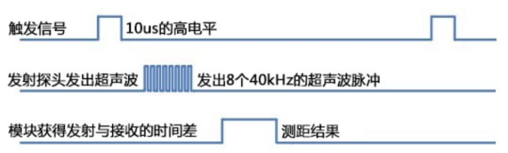
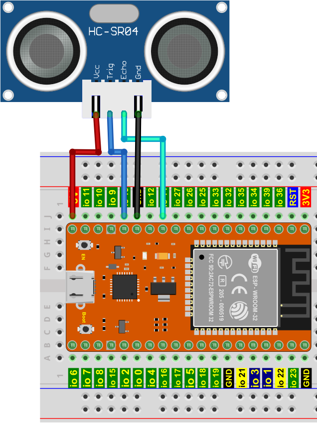
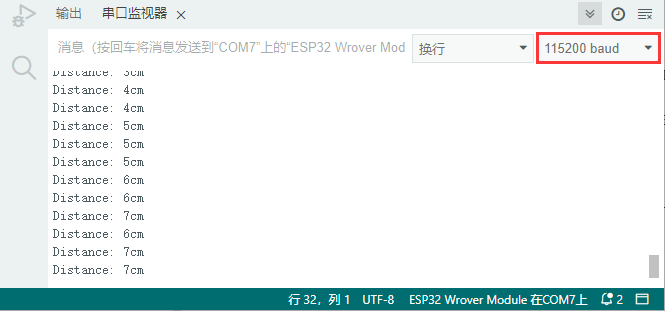
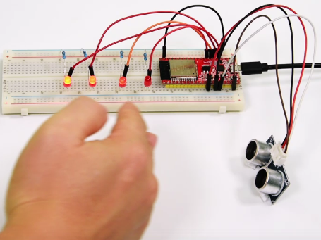

# 项目28 测距仪表

## 1.项目介绍：
HC-SR04超声波传感器是一种非常实惠的距离传感器，主要用于各种机器人项目中的物体躲避。它也被用于水位传感器，甚至作为一个停车传感器。我们把超声波传感器当作蝙蝠的眼睛，在黑暗中，蝙蝠仍然可以通过超声波识别前方的物体和方向。在本项目中，我们使用ESP32控制超声波传感器和LED模拟超声波测距仪。

## 2.项目元件：
|||||
| :--: | :--: | :--: | :--: |
|ESP32*1|面包板*1|超声波传感器*1|4P转杜邦线公单*1
|||||
|红色 LED*4|220Ω电阻*4|跳线若干|USB 线*1|

## 3.元件知识：                                                                     
**HC-SR04超声波传感器：** 像蝙蝠一样使用声纳来确定与物体的距离，它提供了精准的非接触范围检测，高精度和稳定的读数。它的操作不受阳光或黑色材料的影响，就像精密的照相机(在声学上像布料这样比较软的材料很难被探测到)。它带有超声波发射器和接收器。

在超声波传感器的前面是两个金属圆筒，这些是转换器。转换器将机械能转换成电信号。在超声波传感器中，有发射转换器和接收转换器。发射转换器将电信号转换为超声波脉冲，接收转换器将反射的超声波脉冲转换回电信号。如果你看超声波传感器的背面，你会看到的发射转换器后面有一个IC。这是控制发射转换器的IC。在接收转换器后面也有一个IC，这是一个四运算放大器，它将接收转换器产生的信号放大成足以传输到微控制器的信号。
**时序图：**
图示HC-SR04的时序图。为了开始测量，SR04的Trig必须接受至少10us的高(5V)脉冲，这将启动传感器将发射出8个周期的40kHz的超声波脉冲，并等待反射的超声波脉冲。当传感器从接收器检测到超声波时，它将设置回波引脚为高(5V)和延迟一个周期(宽度)，与距离成比例。为了获得距离，测量Echo引脚的宽度。

时间=回波脉冲宽度，单位为us(微秒)
距离厘米=时间/ 58
距离(英寸)=时间/ 148

## 4.读取超声波传感器距离值                                                      
我们将从一个简单的超声波测距开始，并打印测量的距离。 
                
HC-SR04超声波传感器有四个引脚：Vcc、Trig、Echo和GND。Vcc引脚提供产生超声波脉冲的电源，接Vcc/+5V。GND引脚接地/GND。Trig引脚是控制板发送信号来启动超声波脉冲的地方。Echo引脚是超声波传感器向控制板发送关于超声波脉冲行程持续时间的信息的地方。按下图接线：


你可以打开我们提供的代码：

本项目中使用的代码保存在（即路径)：**..\Keyes ESP32 中级版学习套件\4. Arduino C 教程\1. Windows 系统\3. 项目教程\项目28 测距仪表\Project_28.1_Ultrasonic_Ranging** 。

```
//**********************************************************************************
/*  
 * 文件名  : 超声波测距
 * 描述 : 使用超声波模块测量距离.
*/
const int TrigPin = 13; // 定义TrigPin
const int EchoPin = 14; // 定义EchoPin.
int duration = 0; // 定义持续时间的初始值为0
int distance = 0;//定义距离的初始值为0
void setup() 
{
  pinMode(TrigPin , OUTPUT); // 设置trigPin为输出模式
  pinMode(EchoPin , INPUT); // 设置echoPin为输入模式
  Serial.begin(115200);  // 设置波特率为115200的串口监视器.
}
void loop()
{
 // 使trigPin输出高电平持续10μs触发HC_SR04 
  digitalWrite(TrigPin , HIGH);
  delayMicroseconds(10);
  digitalWrite(TrigPin , LOW);
  // 等待HC-SR04回到高电平，测量这个等待时间
  duration = pulseIn(EchoPin , HIGH);
  // 根据时间计算距离
  distance = (duration/2) / 28.5 ;
  Serial.print("Distance: ");
  Serial.print(distance); //串口打印距离值
  Serial.println("cm");
  delay(300); // 等待300ms.
}
//**********************************************************************************

```

编译并上传代码到ESP32，代码上传成功后，利用USB线上电，打开串口监视器，设置波特率为<span style="color: rgb(255, 76, 65);">115200</span>。可以看到的现象是：串口监视器窗口将打印超声波传感器和物体之间的距离值。


<span style="color: rgb(255, 76, 65);">注意：</span> 如果上传代码不成功，可以再次点击后用手按住ESP32主板上的Boot键，出现上传进度百分比数后再松开Boot键，如下图所示：


## 5.超声波测距仪的接线图：
接下来，我们将使用ESP32控制超声波传感器和4个LED模拟超声波测距仪。按如下图接好线：


## 6.项目代码：
你可以打开我们提供的代码：

本项目中使用的代码保存在（即路径)：**..\Keyes ESP32 中级版学习套件\4. Arduino C 教程\1. Windows 系统\3. 项目教程\项目28 测距仪表\Project_28.2_Ultrasonic_Ranger** 。

```
//**********************************************************************************
/*  
 * 文件名  : 超声波测距仪
 * 描述 : 四个led由超声波测距控制.
*/
const int TrigPin = 13;    // 定义TrigPin
const int EchoPin = 14;    // 定义EchoPin.
const int PIN_LED1 = 4;    // 定义PIN_LED1
const int PIN_LED2 = 0;    // 定义PIN_LED2
const int PIN_LED3 = 2;    // 定义PIN_LED3
const int PIN_LED4 = 15;    // 定义PIN_LED4
int duration = 0;    // 定义持续时间的初始值为0
int distance = 0;   // 定义距离的初始值为0
void setup() 
{
  pinMode(TrigPin , OUTPUT); // 设置trigPin为输出模式
  pinMode(EchoPin , INPUT); // 设置echoPin为输入模式
  pinMode(PIN_LED1 , OUTPUT);  // 设置PIN_LED1为输出模式
  pinMode(PIN_LED2 , OUTPUT);  // 设置PIN_LED2为输出模式
  pinMode(PIN_LED3 , OUTPUT);  // 设置PIN_LED3为输出模式
  pinMode(PIN_LED4 , OUTPUT);  // 设置PIN_LED4为输出模式
  Serial.begin(115200);  //设置波特率为115200的串口监视器.
}
void loop()
{
// 使trigPin输出高电平持续10μs触发HC_SR04  
  digitalWrite(TrigPin , HIGH);
  delayMicroseconds(10);
  digitalWrite(TrigPin , LOW);
// 等待HC-SR04回到高电平，测量这个等待时间
  duration = pulseIn(EchoPin , HIGH);
// calculate the distance according to the time
  distance = (duration/2) / 28.5 ;
  Serial.print("Distance: ");
  Serial.print(distance); //串口打印距离值
  Serial.println("cm");
  if ( distance <= 5 )
  {
    digitalWrite(PIN_LED1, HIGH);
  }
  else
  {
    digitalWrite(PIN_LED1, LOW);
  }
  if ( distance <= 10 )
  {
    digitalWrite(PIN_LED2, HIGH);
  }
  else
  {
    digitalWrite(PIN_LED2, LOW);
  }
  if ( distance <= 15 )
  {
    digitalWrite(PIN_LED3, HIGH);
  }
  else
  {
    digitalWrite(PIN_LED3, LOW);
  }
  if ( distance <= 20 )
  {
    digitalWrite(PIN_LED4, HIGH);
  }
  else
  {
    digitalWrite(PIN_LED4, LOW);
  }
}     
//**********************************************************************************

```
## 7.项目现象：
编译并上传代码到ESP32，代码上传成功后，利用USB线上电，打开串口监视器，设置波特率为115200。可以看到的现象是：串口监视器窗口将打印超声波传感器和物体之间的距离值。另外，当我们用手在超声波传感器前移动时，相应的LED会亮起来。

<span style="color: rgb(255, 76, 65);">注意：</span> 如果上传代码不成功，可以再次点击后用手按住ESP32主板上的Boot键，出现上传进度百分比数后再松开Boot键，如下图所示：


