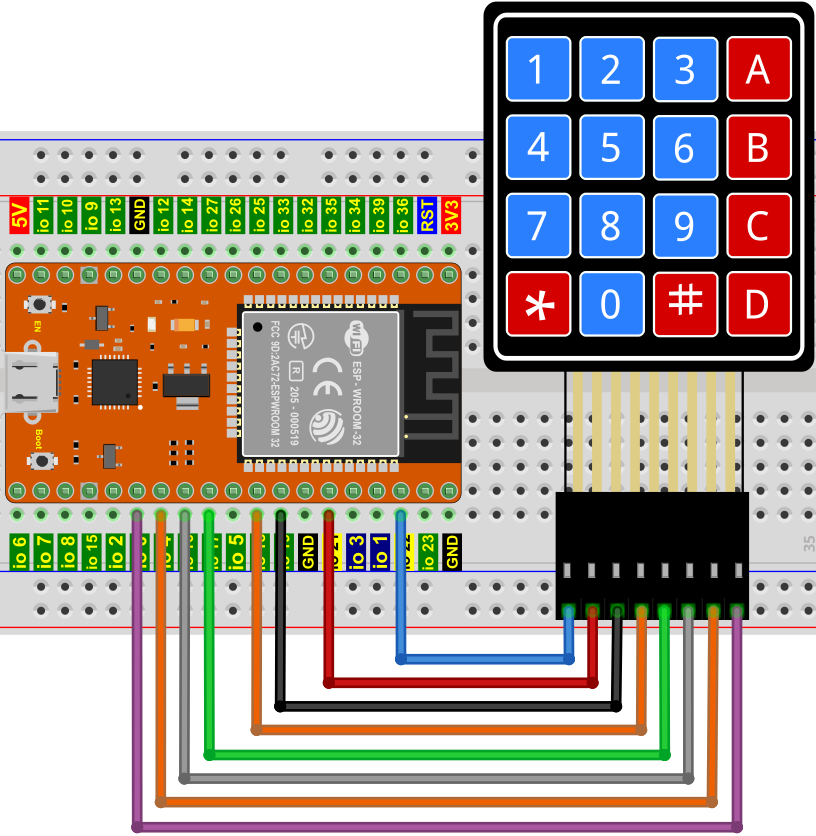
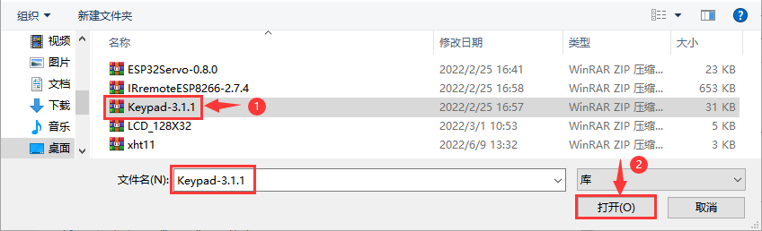
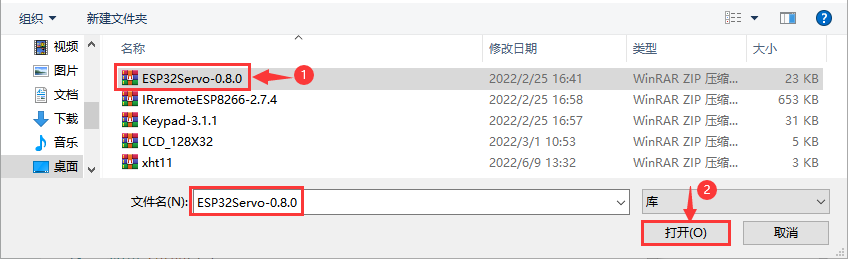

# 项目30 密码锁

## 1.项目介绍：
常用的数字按钮传感器，一个按钮就使用一个IO口，而有时我们需要的按钮比较多时，就会占用过多的IO口，为了节省IO口的使用，把多个按钮做成了矩阵类型，通过行列线的控制，实现少IO口控制多个按钮。在本项目中，我们将来学习ESP32和薄膜4*4矩阵键盘控制舵机和蜂鸣器。

## 2.项目元件：
||||
| :--: | :--: | :--: | 
|ESP32*1|面包板*1|舵机*1|
||| |
|薄膜4×4矩阵键盘*1|USB 线*1| 跳线若干| 
||||
|NPN型晶体管(S8050)*1|有源蜂鸣器*1|1KΩ电阻*1|

## 3.元件知识：
**4×4矩阵键盘：** 键盘是一种集成了许多键的设备。如下图所示，一个4x4键盘集成16个键。


与LED矩阵集成一样，在4x4键盘中，每排键都是用一根引脚连接，每一列键都是一样的。这样的连接可以减少处理器端口的占用。内部电路如下所示。
          
使用方法类似于矩阵LED，即使用行扫描或列扫描方法检测每列或每行上的键的状态。以列扫描法为例，向第4列(Pin4)发送低电平，检测第1、2、3、4行电平状态，判断A、B、C、D键是否按下。然后依次将低电平发送到列3、2、1，检测是否有其它键被按下。然后，你可以获得所有键的状态。

## 4.读取4*4矩阵键盘的键值：
我们首先使用一个简单的代码读取4*4矩阵键盘的键值并将其打印出来，其接线图如下所示：


**如何安装Keypad库：**

本项目代码使用了一个名为“<span style="color: rgb(255, 76, 65);">Keypad</span>”库。如果已经添加好了“<span style="color: rgb(255, 76, 65);">Keypad</span>”库，则跳过此步骤。如果你还没有添加，请在学习之前安装它。添加第三方库的步骤如下:

打开Arduino IDE，单击“**项目**”→“**包含库**”→“**添加.ZIP库...**”。在弹出窗口中找到该目录下名为**Keyes ESP32 中级版学习套件\4. Arduino C 教程\1. Windows 系统\2. Arduino 库文件\Keypad.ZIP**的文件，先选中**Keypad.ZIP**文件，再单击“**打开**”。



<span style="color: rgb(255, 76, 65);">Keypad</span>库添加完成后，你可以打开我们提供的代码：
<br>
<br>
本项目中使用的代码保存在（即路径)：**..\Keyes ESP32 中级版学习套件\4. Arduino C 教程\1. Windows 系统\3. 项目教程\项目30 密码锁\Project_30.1_4x4_Matrix_Keypad_Display** 。

```
//**********************************************************************************
/*  
 * 文件名  : 4x4矩阵键盘显示 
 * 描述 : 获取矩阵键盘的值
*/
#include <Keypad.h>

//定义键盘按钮上的符号
char keys[4][4] = {
  {'1', '2', '3', 'A'},
  {'4', '5', '6', 'B'},
  {'7', '8', '9', 'C'},
  {'*', '0', '#', 'D'}
};

byte rowPins[4] = {22, 21, 19, 18}; // 连接到键盘的行引脚
byte colPins[4] = {17, 16, 4, 0};   // 连接到键盘的列引脚

// 初始化myKeypad类的实例
Keypad myKeypad = Keypad(makeKeymap(keys), rowPins, colPins, 4, 4);

void setup() {
  Serial.begin(115200); // 初始化串口，波特率设置为115200
  Serial.println("ESP32 is ready!");  // 打印字符串“ESP32 is ready!”
}

void loop() {
  // 获取字符输入
  char keyPressed = myKeypad.getKey();
  // 如果有字符输入，则发送到串口
  if (keyPressed) {
    Serial.println(keyPressed);
  }
}
//**********************************************************************************

```
编译并上传代码到ESP32，代码上传成功后，利用USB线上电，打开串口监视器，设置波特率为<span style="color: rgb(255, 76, 65);">115200</span>。你会看到的现象是：按下键盘，串口监视器窗口将打印对应的键值，如下图所示。


<span style="color: rgb(255, 76, 65);">注意：</span> 如果上传代码不成功，可以再次点击后用手按住ESP32主板上的Boot键，出现上传进度百分比数后再松开Boot键，如下图所示：


## 5.密码锁的接线图：
在上一实验中，我们已经知道了4×4矩阵键盘的键值，接下来，我们使用4×4矩阵键盘作为键盘来控制舵机和蜂鸣器。


## 6.添加Keypad和ESP32Servo库：
前面已经添加过<span style="color: rgb(255, 76, 65);">Keypad</span>和<span style="color: rgb(255, 76, 65);">ESP32Servo</span>库，可以不用重复添加。如果没有添加，就需要添加<span style="color: rgb(255, 76, 65);">Keypad</span>和<span style="color: rgb(255, 76, 65);">ESP32Servo</span>库，添加第三方库的步骤如下:

**先添加ESP32Servo库：**

打开Arduino IDE，单击“**项目**”→“**包含库**”→“**添加.ZIP库...**”。在弹出窗口中找到该目录下名为**Keyes ESP32 中级版学习套件\4. Arduino C 教程\1. Windows 系统\2. Arduino 库文件\ESP32Servo-0.8.0.ZIP**的文件，先选中**ESP32Servo-0.8.0.ZIP**文件，再单击“**打开**”。



**再添加Keypad库：**

打开Arduino IDE，单击“**项目**”→“**包含库**”→“**添加.ZIP库...**”。在弹出窗口中找到该目录下名为**Keyes ESP32 中级版学习套件\4. Arduino C 教程\1. Windows 系统\2. Arduino 库文件\Keypad.ZIP**的文件，先选中**Keypad.ZIP**文件，再单击“**打开**”。


## 7.项目代码：
<span style="color: rgb(255, 76, 65);">Keypad</span>和<span style="color: rgb(255, 76, 65);">ESP32Servo</span>库添加完成后，你可以打开我们提供的代码：
<br>
<br>

本项目中使用的代码保存在（即路径)：**..\Keyes ESP32 中级版学习套件\4. Arduino C 教程\1. Windows 系统\3. 项目教程\项目30 密码锁\Project_30.2_Keypad_Door** 。

```
//**********************************************************************************
/*  
 * 文件名 : 密码锁
 * 描述 : 制作一个简单的密码锁.
*/
#include <Keypad.h>
#include <ESP32Servo.h>

// 定义键盘按钮上的符号
char keys[4][4] = {
  {'1', '2', '3', 'A'},
  {'4', '5', '6', 'B'},
  {'7', '8', '9', 'C'},
  {'*', '0', '#', 'D'}
};

byte rowPins[4] = {22, 21, 19, 18};   // 连接到键盘的行引脚
byte colPins[4] = {17, 16, 4, 0};   // 连接到键盘的列引脚

// 初始化myKeypad类的实例
Keypad myKeypad = Keypad(makeKeymap(keys), rowPins, colPins, 4, 4);

Servo  myservo;     // 创建舵机对象来控制舵机
int servoPin = 15;  // 定义舵机引脚
int buzzerPin = 2; // 定义蜂鸣器引脚

char passWord[] = {"1234"}; // 保存正确密码

void setup() {
  myservo.setPeriodHertz(50);           // 标准50赫兹舵机
  myservo.attach(servoPin, 500, 2500);  // 将servoPin上的舵机附加到舵机对象上
                                        // 设置舵机的高电平时间范围，以实现精确的从0到180°转动
  myservo.write(0);                     // 设置舵机的初始角度
  pinMode(buzzerPin, OUTPUT);
  Serial.begin(115200);
}

void loop() {
  static char keyIn[4];     // 保存输入字符
  static byte keyInNum = 0; // 保存输入的字符数
  char keyPressed = myKeypad.getKey();  // 获取字符输入
  // 处理输入字符
  if (keyPressed) {
    // 每次按下该键时发出提示音
    digitalWrite(buzzerPin, HIGH);
    delay(100);
    digitalWrite(buzzerPin, LOW);
    // 保存输入字符
    keyIn[keyInNum++] = keyPressed;
    // 输入后判断正确性
    if (keyInNum == 4) {
      bool isRight = true;            // 保存密码是否正确
      for (int i = 0; i < 4; i++) {   // 判断每个字符的密码是否正确
        if (keyIn[i] != passWord[i])
          isRight = false;            // 如有错字，请标记错字.
      }
      if (isRight) {                  // 如果输入的密码正确
        myservo.write(90);           // 打开开关
        delay(2000);                  // 推迟一段时间
        myservo.write(0);            // 关闭开关
        Serial.println("passWord right!");
      }
      else {                          // 输入密码错误
        digitalWrite(buzzerPin, HIGH);// 密码错误提示音
        delay(1000);
        digitalWrite(buzzerPin, LOW);
        Serial.println("passWord error!");
      }
      keyInNum = 0; // 将输入字符数重置为0
    }
  }
}
//**********************************************************************************

```
## 8.项目现象：
编译并上传代码到ESP32，代码上传成功后，利用USB线上电，你会看到的现象是：按键盘输入4个字符的密码，如果输入正确（**正确密码：1234**），舵机会转动一定角度，然后回到原来的位置。如果输入错误，将发出输入错误警报。

<span style="color: rgb(255, 76, 65);">注意：</span> 如果上传代码不成功，可以再次点击后用手按住ESP32主板上的Boot键，出现上传进度百分比数后再松开Boot键，如下图所示：
