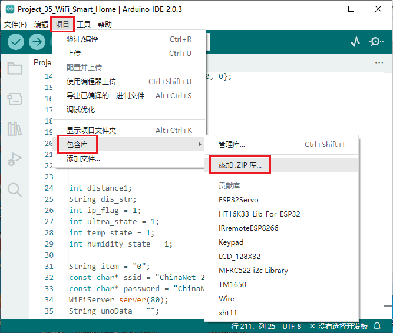
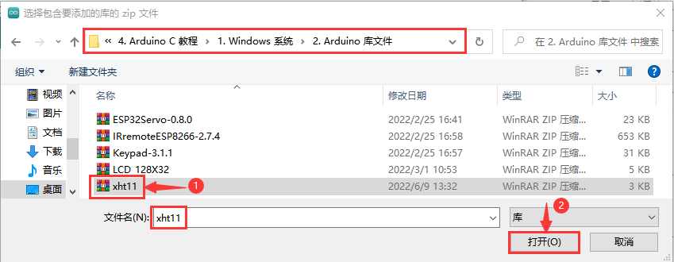
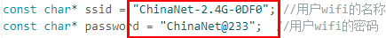
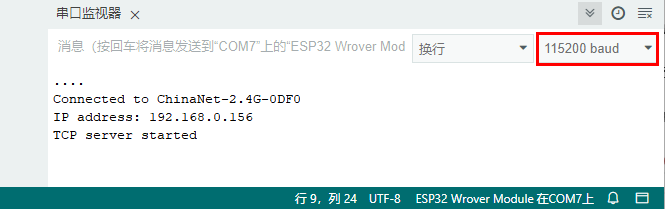
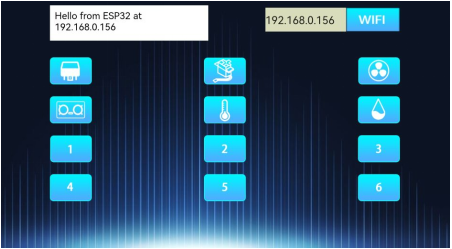
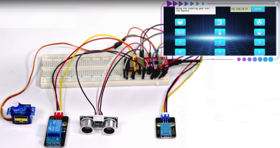
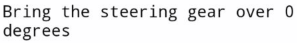

# 项目35 WiFi 智能家居

## 1.实验说明：
在前面的实验中，我们已经了解了ESP32的WiFi Station模式，WiFi AP模式和WiFi AP+Station模式等三种模式。那么在本章实验中，我们将使用ESP32的WiFi Station模式通过APP连接WIFI来控制多个传感器/模块工作，实现WiFi智能家居的效果。

## 2.实验器材：
|||||
| :--: | :--: | :--: | :--: |
|ESP32*1|面包板*1| 智能手机/平板电脑(<span style="color: rgb(255, 76, 65);">自备</span>)*1|继电器模块*1|
|||||
| 舵机*1 |温湿度传感器*1| 超声波传感器*1|4P转杜邦线公单*1|
|||||
|跳线若干|面包板专用电源模块*1|6节5号电池盒*1|3P转杜邦线公单*2|
|||  | |
|5号电池(<span style="color: rgb(255, 76, 65);">自备</span>)*6|MicroUSB线*1|  | |

## 3.实验接线图：
| 继电器| ESP32主板 | 温湿度传感器 | ESP32主板 |
| :--: | :--: | :--: | :--: |
| G | G| G | G |
| V | 5V | V | 5V |
| S | IO32 | S | IO15 |


| 超声波传感器| ESP32主板 |舵机| ESP32主板 |
| :--: | :--: | :--: | :--: |
| Vcc | 5V| 红色线 | 5V|
| Trig | IO14 |棕色线 | G |
| Echo | IO27 |  橙色线 | IO4 |
|Gnd|G| | |


(<span style="color: rgb(255, 76, 65);">注:</span> 先接好线，然后在直流电机上安装一个小风扇叶片。)

## 4.安装APP:
安装APP的方法请参照 <span style="color: rgb(255, 76, 65);">**项目34 WiFi测试**</span> 。这里就不重复讲解。

## 5. 添加xht11和ESP32Servo库：
本项目代码使用了名为“<span style="color: rgb(255, 76, 65);">xht11</span>”和“<span style="color: rgb(255, 76, 65);">ESP32Servo</span>”库。如果你还没有添加，请在学习之前添加它们。添加第三方库的步骤如下:

**先添加xht11库：**

打开Arduino IDE，单击“**项目**”→“**包含库**”→“**添加.ZIP库...**”。在弹出窗口中找到该目录下名为**Keyes ESP32 中级版学习套件\4. Arduino C 教程\1. Windows 系统\2. Arduino 库文件\xht11.ZIP**的文件，先选中**xht11.ZIP**文件，再单击“**打开**”。



**再添加ESP32Servo库：**

打开Arduino IDE，单击“**项目**”→“**包含库**”→“**添加.ZIP库...**”。在弹出窗口中找到该目录下名为**Keyes ESP32 中级版学习套件\4. Arduino C 教程\1. Windows 系统\2. Arduino 库文件\ESP32Servo-0.8.0.ZIP**的文件，先选中**ESP32Servo-0.8.0.ZIP**文件，再单击“**打开**”。


## 6. 项目代码：
<span style="color: rgb(255, 76, 65);">xht11</span>和<span style="color: rgb(255, 76, 65);">ESP32Servo</span>库添加完成后，你可以打开我们提供的代码：
<br>
<br>

本项目中使用的代码保存在在（即路径)：**..\Keyes ESP32 中级版学习套件\4. Arduino C 教程\1. Windows 系统\3. 项目教程\项目35 WiFi智能家居\Project_35_WiFi_Smart_Home** 。

```
//**********************************************************************************
/*  
 * 文件名  : WiFi 智能家居.
 * 描述 : WiFi APP控制多个传感器/模块工作，实现WiFi智能家居的效果.
*/
#include <Arduino.h>
#include <WiFi.h>
#include <ESPmDNS.h>
#include <WiFiClient.h>

#include "xht11.h"
//gpio15
xht11 xht(15);
unsigned char dht[4] = {0, 0, 0, 0};

#include <ESP32Servo.h>
Servo myservo;
int servoPin = 4;
#define Relay  32

#define trigPin  14
#define echoPin  27

int distance1;
String dis_str;
int ip_flag = 1;
int ultra_state = 1;
int temp_state = 1;
int humidity_state = 1;

String item = "0";
const char* ssid = "ChinaNet-2.4G-0DF0"; //用户的WiFi名称
const char* password = "ChinaNet@233";  //用户的WiFi密码
WiFiServer server(80);
String unoData = "";

void setup() {
  Serial.begin(115200);
  pinMode(Relay, OUTPUT);
  myservo.setPeriodHertz(50);   
  myservo.attach(servoPin, 500, 2500);
  
  WiFi.begin(ssid, password);
  while (WiFi.status() != WL_CONNECTED) {
    delay(500);
    Serial.print(".");
  }
  Serial.println("");
  Serial.print("Connected to ");
  Serial.println(ssid);
  Serial.print("IP address: ");
  Serial.println(WiFi.localIP());
  server.begin();
  Serial.println("TCP server started");
  MDNS.addService("http", "tcp", 80);

  digitalWrite(Relay, LOW);
  pinMode(trigPin, OUTPUT);
  pinMode(echoPin, INPUT);
}

void loop() {
  WiFiClient client = server.available();
  if (!client) {
      return;
  }
  while(client.connected() && !client.available()){
      delay(1);
  }
  String req = client.readStringUntil('\r');
  int addr_start = req.indexOf(' ');
  int addr_end = req.indexOf(' ', addr_start + 1);
  if (addr_start == -1 || addr_end == -1) {
      Serial.print("Invalid request: ");
      Serial.println(req);
      return;
  }
  req = req.substring(addr_start + 1, addr_end);
  item=req;
  Serial.println(item);
  String s;
  if (req == "/")
  {
      IPAddress ip = WiFi.localIP();
      String ipStr = String(ip[0]) + '.' + String(ip[1]) + '.' + String(ip[2]) + '.' + String(ip[3]);
      s = "HTTP/1.1 200 OK\r\nContent-Type: text/html\r\n\r\n<!DOCTYPE HTML>\r\n<html>Hello from ESP32 at ";
      s += ipStr;
      s += "</html>\r\n\r\n";
      Serial.println("Sending 200");
      client.println(s);
  }
  else if(req == "/btn/0")
  {
    Serial.write('a');
    client.println(F("turn on the relay"));
    digitalWrite(Relay, HIGH);
  }
  else if(req == "/btn/1")
  {
    Serial.write('b');
    client.println(F("turn off the relay"));
    digitalWrite(Relay, LOW);
  }
  else if(req == "/btn/2")
  {
    Serial.write('c');
    client.println("Bring the steering gear over 180 degrees");
    myservo.write(180); 
    delay(200);
  }
  else if(req == "/btn/3")
  {
    Serial.write('d');
    client.println("Bring the steering gear over 0 degrees");
    myservo.write(0); 
    delay(200);
  }
  else if(req == "/btn/6")
  {
    Serial.write('g');
    while(Serial.available() > 0)
    {
      unoData = Serial.readStringUntil('#');
      client.println("Data");
    }
    while(ultra_state>0)
       {
          Serial.print("Distance = "); 
          Serial.print(checkdistance());
          Serial.println("#");
          Serial1.print("Distance = "); 
          Serial1.print(checkdistance());
          Serial1.println("#");  
          int t_val1 = checkdistance();
          client.print("Distance(cm) = ");
          client.println(t_val1); 
          ultra_state = 0;
        }
  }
  else if(req == "/btn/7")
  {
    Serial.write('h');
    client.println("turn off the ultrasonic");
    ultra_state = 1;
  }
  else if(req == "/btn/8")
  {
    Serial.write('i');
    while(Serial.available() > 0)
     {
      unoData = Serial.readStringUntil('#');
      client.println(unoData);
     }
    while(temp_state>0)
      {
        if (xht.receive(dht)) {
          Serial.print("Temperature = "); 
          Serial.print(dht[2],1);
          Serial.println("#");
          Serial1.print("Temperature = "); 
          Serial1.print(dht[2],1);
          Serial1.println("#");
          int t_val2 = dht[2];
          client.print("Temperature(℃) = ");
          client.println(t_val2);
        }
        temp_state = 0;
      }
  }
  else if(req == "/btn/9")
  {
    Serial.write('j');
    client.println("turn off the temperature");
    temp_state = 1;
  }
  else if(req == "/btn/10")
  {
    Serial.write('k');
    while(Serial.available() > 0)
     {
       unoData = Serial.readStringUntil('#');
       client.println(unoData);
     }
    while(humidity_state > 0)
      {
        if (xht.receive(dht)) {
          Serial.print("Humidity = "); 
          Serial.print(dht[0],1);
          Serial.println("#");
          Serial1.print("Humidity = "); 
          Serial1.print(dht[0],1);
          Serial1.println("#");
          int t_val3 = dht[0];
          client.print("Humidity(%) = ");
          client.println(t_val3);
        }
        humidity_state = 0;
      }
  }
  else if(req == "/btn/11")
  {
    Serial.write('l');
    client.println("turn off the humidity");
    humidity_state = 1;
    }
  //client.print(s);
  client.stop();
}

int checkdistance() {
  digitalWrite(14, LOW);
  delayMicroseconds(2);
  digitalWrite(14, HIGH);
  delayMicroseconds(10);
  digitalWrite(14, LOW);
  int distance = pulseIn(27, HIGH) / 58;
  
  delay(10);
  return distance;
}
//**********************************************************************************

```
<span style="color: rgb(255, 76, 65);">特别注意：</span>需要先将实验代码中的用户Wifi名称和用户Wifi密码改成你们自己的Wifi名称和Wifi密码。

## 7. 实验现象：
确认程序代码中的Wifi名称和Wifi密码修改正确后，编译并上传代码到ESP32主板上。
<span style="color: rgb(255, 76, 65);">注意：</span> 如果上传代码不成功，可以再次点击后用手按住ESP32主板上的Boot键，出现上传进度百分比数后再松开Boot键，如下图所示：


打开串口监视器，设置波特率为<span style="color: rgb(255, 76, 65);">115200</span>，这样，串口监视器打印检测到的WiFi IP地址。（**注意：** 如果打开串口监视器且设置波特率为115200之后，串口监视器窗口没有显示如下信息，可以按下ESP32的复位键）


然后打开WiFi APP，在WIFI按钮前面的文本框中输入检测到的WIFI IP地址（<span style="color: rgb(255, 76, 65);">例如，上面串口监视器检测到的IP地址：192.168.0.156</span>），接着点击WIFI按钮来连接WiFi，同时WiFi IP地址前的文本框中会显示对应的WiFi IP地址“Hello from ESP32 at <span style="color: rgb(255, 76, 65);">192.168.0.156</span>”。这样，就说明APP已经连接上了WiFi。（<span style="color: rgb(255, 76, 65);">WiFi的IP地址有时候会改变，如果原来的IP地址不行，需要重新检测WiFi的IP地址</span>）


**APP已经连接上了WiFi后，开始进行如下操作：**


（1）点击按钮，继电器打开，APP上显示，模块上的指示灯点亮；再次点击按钮，继电器关闭，APP上显示，模块上的指示灯不亮。
（2）点击按钮，舵机转动180°，APP上显示；再次点击按钮，APP上显示，舵机转动0°。
（3）点击按钮，超声波传感器测距，在超声波传感器前放一个物体，APP上显示（<span style="color: rgb(255, 76, 65);">不同的距离显示不同的数字</span>），说明此时物体离超声波传感器的距离为6cm；再次点击按钮，关闭超声波，APP上显示。
（4）点击按钮，温湿度传感器测量环境中的温度，APP上显示（<span style="color: rgb(255, 76, 65);">不同的温度条件下显示不同的温度值</span>），说明此时环境中的温度为30℃；再次点击按钮，关闭温湿度传感器，APP上显示。
（5）点击按钮，温湿度传感器测量环境中的湿度，APP上显示（<span style="color: rgb(255, 76, 65);">不同的湿度条件下显示不同的湿度值</span>），说明此时环境中的湿度为55%；再次点击按钮，关闭温湿度传感器，APP上显示。


