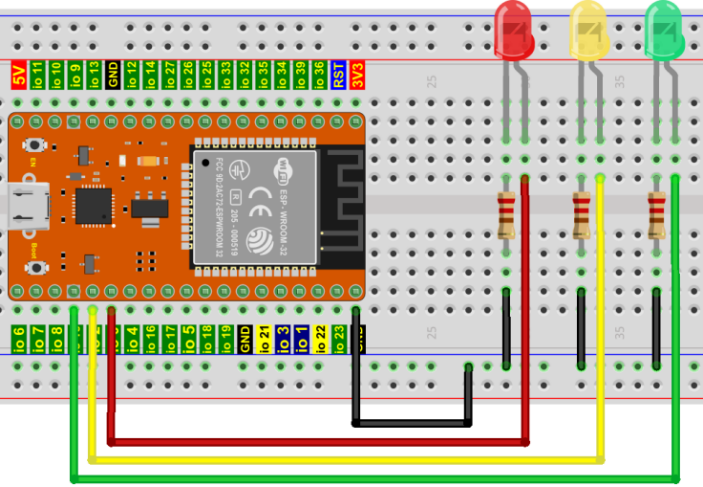

# 项目05 交通灯

## 1.项目介绍：
交通灯在我们的日常生活中很普遍。根据一定的时间规律，交通灯是由红、黄、绿三种颜色组成的。每个人都应该遵守交通规则，这可以避免许多交通事故。在这个项目中，我们将使用ESP32和一些led(红，黄，绿)来模拟交通灯。

## 2.项目元件：
|||||
| :--: | :--: | :--: | :--: |
|ESP32*1|面包板*1|红色LED*1|黄色 LED*1|
||| ||
|绿色LED*1|220Ω电阻*3|跳线若干|USB 线*1|

## 3.项目接线图： 


## 4.项目代码：
本项目中使用的代码保存在（即路径)：**..\Keyes ESP32 中级版学习套件\4. Arduino C 教程\2. 树莓派 系统\3. 项目教程\代码集**。你可以把代码移到任何地方。例如，我们将代码保存在Raspberry Pi系统的文件夹pi中，<span style="color: rgb(255, 76, 65);">**路径：../home/pi/代码集**</span>。

可以在此路径下打开代码“**Project_05_Traffic_Lights**”。

```
//**********************************************************************
/*
 * 文件名  : 交通灯
 * 描述 : 模拟交通灯.
*/
#define PIN_LED_RED   0   //定义红色引脚
#define PIN_LED_YELLOW   2   //定义黄色引脚
#define PIN_LED_GREEN  15   //定义绿色引脚

void setup() {
  pinMode(PIN_LED_RED, OUTPUT);
  pinMode(PIN_LED_YELLOW, OUTPUT);
  pinMode(PIN_LED_GREEN, OUTPUT);
}

void loop() {
   digitalWrite(PIN_LED_RED, HIGH);// 点亮红色的灯
   delay(5000);// 延时 5 s
   digitalWrite(PIN_LED_RED, LOW); // 熄灭红色的灯
   delay(500);// 延时 0.5 s
   for(int i=0;i<3;i++)// 闪烁 3 次.
  {
   digitalWrite(PIN_LED_YELLOW, HIGH);// 点亮黄色的灯
   delay(500);// 延时 0.5 s
   digitalWrite(PIN_LED_YELLOW, LOW);// 熄灭黄色的灯
   delay(500);// 延时 0.5 s
   } 
   digitalWrite(PIN_LED_GREEN, HIGH);// 点亮绿色的灯
   delay(5000);// 延时 5 s
   digitalWrite(PIN_LED_GREEN, LOW);// 
  delay(500);// 延时 0.5 s
}
//*************************************************************************************

```
在上传项目代码到ESP32之前，请检查Arduino IDE的配置。

单击“**工具**”，确认“**开发板**”板型和“**端口(COM)**”，如下所示：


单击将项目代码上传到ESP32主板上。


<span style="color: rgb(255, 76, 65);">注意：</span> 如果上传代码不成功，可以再次点击后用手按住ESP32主板上的Boot键，出现上传进度百分比数后再松开Boot键，如下图所示：


项目代码上传成功！


## 5.项目现象：
项目代码上传成功后，利用USB线上电，你会看到的现象是：1.首先，红灯会亮5秒，然后熄灭；2.其次，黄灯会闪烁3次，然后熄灭；3.然后，绿灯会亮5秒，然后熄灭；4.继续运行上述1-3个步骤。


