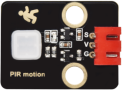
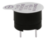
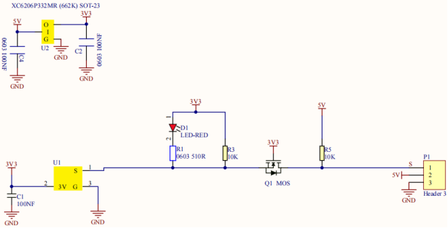
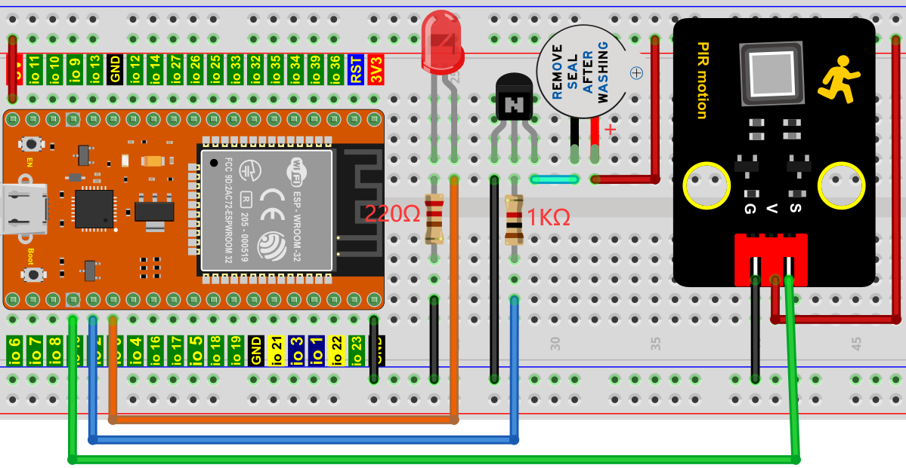

# 项目16 防窃警报器

## 1.项目介绍：
人体红外传感器测量运动物体发出的热的红外(IR)线。该传感器可以检测人、动物和汽车的运动，从而触发安全警报和照明。它们被用来检测移动，是安全的理想选择，如防盗警报和安全照明系统。在这个项目中，我们将使用ESP32控制人体红外传感器、蜂鸣器和LED来模拟防盗报警器。

## 2.项目元件：
|||||
| :--: | :--: | :--: | :--: |
|ESP32*1|面包板*1|人体红外传感器*1|NPN型晶体管(S8050)*1|
|||||
|有源蜂鸣器*1|红色 LED*1|220Ω电阻*1|1KΩ电阻*1|
|  | || |
|3P转杜邦线公单*1|跳线若干|USB 线*1| |

## 3.元件知识：
**人体红外传感器：** 是一款基于热释电效应的人体红外传感器，能检测到人体或动物身上发出的红外线，配合菲涅尔透镜能使传感器探测范围更远更广。它主要采用RE200B-P传感器元件，当附近有人或者动物运动时，该模块会输出一个高电平1；否则输出低电平0。特别注意，这个传感器可以检测在运动中的人、动物和汽车，静止中的人、动物和汽车是检测不到的，检测最远距离大约为7米左右。
<span style="color: rgb(255, 76, 65);">注意：人体红外传感器应避开日光、汽车头灯、白炽灯直接照射，也不能对着热源(如暖气片、加热器)或空调，以避免环境温度较大的变化而造成误报。同时还易受射频辐射的干扰。</span>

**传感器技术参数：**
最大输入电压：DC 5-15V 
最大工作电流：50MA
最大功率：0.3W
静态电流: <50uA
工作温度：-20 ~ 85℃
控制信号：数字信号(1/0)
延迟时间：大约2.3到3秒钟
感应角度：小于100度锥角
检测最远距离：大约7米左右

**传感器原理图：**


## 4.项目接线图：


## 5.项目代码：
本项目中使用的代码保存在（即路径)：**..\Keyes ESP32 中级版学习套件\4. Arduino C 教程\2. 树莓派 系统\3. 项目教程\代码集**。你可以把代码移到任何地方。例如，我们将代码保存在Raspberry Pi系统的文件夹pi中，<span style="color: rgb(255, 76, 65);">**路径：../home/pi/代码集**</span>。

可以在此路径下打开代码“**Project_16_Burglar_Alarm**”。

```
//**********************************************************************
/* 
 * 文件名  : 防盗报警器
 * 描述 : 人体红外传感器蜂鸣器和LED模拟防盗报警.
*/
#define buzzerPin   2   // 蜂鸣器的引脚
#define ledPin   0     // LED的引脚
#define pirPin   15     // PIR运动传感器的引脚
byte pirStat = 0;   // PIR运动传感器的状态
void setup() {
 pinMode(buzzerPin, OUTPUT); 
 pinMode(ledPin, OUTPUT);    
 pinMode(pirPin, INPUT);     
}
void loop()
{
 pirStat = digitalRead(pirPin); 

 if (pirStat == HIGH)
 {            // 如果检测到人或移动的动物
   digitalWrite(buzzerPin, HIGH);  // 蜂鸣器嗡嗡作响
   digitalWrite(ledPin, HIGH);  // led灯亮
   delay(500);
   digitalWrite(buzzerPin, LOW);  // 蜂鸣器不响
   digitalWrite(ledPin, LOW);  // led关闭
   delay(500);
 } 
 else {  // 否则，没有检测到人或移动的动物，
   digitalWrite(buzzerPin, LOW); // 关闭蜂鸣器
   digitalWrite(ledPin, LOW);  // led关闭
 }
}
//*********************************************************************************

```
ESP32主板通过USB线连接到计算机后开始上传代码。为了避免将代码上传至ESP32主板时出现错误，必须选择与计算机连接正确的控制板和端口（COM）。

点击“**工具**”→“**开发板**”，可以查看到各种不同型号ESP32开发板，选择对应的ESP32开发板型号。

点击“**工具**”→“**端口**”，选择对应的端口（COM）。

**注意：将ESP32主板通过USB线连接到计算机后才能看到对应的端口（COM）**。

单击将代码上传到ESP32主控板。

## 6.项目现象：
编译并上传代码到ESP32，代码上传成功后，利用USB线上电，你会看到的现象是：如果人体红外传感器检测到附近有人移动时，蜂鸣器就会不断地发出警报，且LED不断地闪烁。

<span style="color: rgb(255, 76, 65);">注意：</span> 如果上传代码不成功，可以再次点击后用手按住ESP32主板上的Boot键，出现上传进度百分比数后再松开Boot键，如下图所示：


