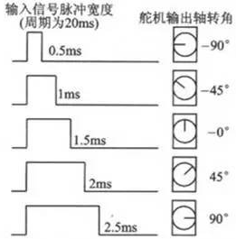

# 项目19 舵机

## 1.项目介绍：
舵机是一种可以非常精确地旋转的电机。目前已广泛应用于玩具车、遥控直升机、飞机、机器人等领域。在这个项目中，我们将使用ESP32控制舵机转动。

## 2.项目元件：
||||
| :--: | :--: | :--: |
|ESP32*1|面包板*1|舵机*1|
||| |
|跳线若干|USB 线*1| |

## 3.元件知识：

**舵机：** 舵机是一种位置伺服的驱动器，主要是由外壳、电路板、无核心马达、齿轮与位置检测器所构成。其工作原理是由接收机或者单片机发出信号给舵机，其内部有一个基准电路，产生周期为20ms，宽度为1.5ms 的基准信号，将获得的直流偏置电压与电位器的电压比较，获得电压差输出。经由电路板上的IC 判断转动方向，再驱动无核心马达开始转动，透过减速齿轮将动力传至摆臂，同时由位置检测器送回信号，判断是否已经到达定位。适用于那些需要角度不断变化并可以保持的控制系统。当电机转速一定时，通过级联减速齿轮带动电位器旋转，使得电压差为0，电机停止转动。一般舵机旋转的角度范围是0度到180 度。
控制舵机的脉冲周期为20ms，脉冲宽度为0.5ms ~ 2.5ms，对应位置为-90°~ +90°。下面是以一个180°角的舵机为例：


舵机有多种规格，但它们都有三根连接线，分别是棕色、红色、橙色(不同品牌可能有不同的颜色)。棕色为GND，红色为电源正极，橙色为信号线。


## 4.项目接线图：
舵机供电时请注意，电源电压应为3.3V-5V。请确保在将舵机连接到电源时不会出现任何错误。


## 5.添加ESP32Servo库：
如果你已经添加好了“<span style="color: rgb(255, 76, 65);">ESP32Servo</span>”库，则跳过此步骤。如果你还没有添加“<span style="color: rgb(255, 76, 65);">ESP32Servo</span>”库，请在学习之前添加它。添加第三方库的方法请参考“<span style="color: rgb(0, 209, 0);">开发环境设置</span>”。

## 6.项目代码：
本项目中使用的代码保存在（即路径)：**..\Keyes ESP32 中级版学习套件\4. Arduino C 教程\2. 树莓派 系统\3. 项目教程\代码集**。你可以把代码移到任何地方。例如，我们将代码保存在Raspberry Pi系统的文件夹pi中，<span style="color: rgb(255, 76, 65);">**路径：../home/pi/代码集**</span>。

可以在此路径下打开代码“**Project_19_Servo_Sweep**”。

```
//**********************************************************************
/*
 * 文件名  : 舵机转动
 * 描述 : 控制舵机进行清扫
*/
#include <ESP32Servo.h>

Servo myservo;  // 创建舵机对象来控制舵机

int posVal = 0;    // 变量来存储舵机位置
int servoPin = 15; // 舵机引脚

void setup() {
  myservo.setPeriodHertz(50);           // 标准50赫兹舵机
  myservo.attach(servoPin, 500, 2500);  // 将servoPin上的舵机附加到舵机对象上
}
void loop() {

  for (posVal = 0; posVal <= 180; posVal += 1) { // 从0°到180°
    // 以1度为阶梯
    myservo.write(posVal);       // 告诉舵机进入可变'posVal'位置
    delay(15);                   // 等待15ms舵机到达位置
  }
  for (posVal = 180; posVal >= 0; posVal -= 1) { // 从180°到0°
    myservo.write(posVal);       // 告诉舵机进入可变'posVal'位置
    delay(15);                   // 等待15ms舵机到达位置
  }
}
//********************************************************************************

```
ESP32主板通过USB线连接到计算机后开始上传代码。为了避免将代码上传至ESP32主板时出现错误，必须选择与计算机连接正确的控制板和端口（COM）。

点击“**工具**”→“**开发板**”，可以查看到各种不同型号ESP32开发板，选择对应的ESP32开发板型号。

点击“**工具**”→“**端口**”，选择对应的端口（COM）。

**注意：将ESP32主板通过USB线连接到计算机后才能看到对应的端口（COM）**。

单击将代码上传到ESP32主控板。

## 6.项目现象：
编译并上传代码到ESP32，代码上传成功后，利用USB线上电，你会看到的现象是：舵机将从0°旋转到180°，然后反转方向使其从180°旋转到0°，并在一个无限循环中重复这些动作。


<span style="color: rgb(255, 76, 65);">注意：</span> 如果上传代码不成功，可以再次点击后用手按住ESP32主板上的Boot键，出现上传进度百分比数后再松开Boot键，如下图所示：


