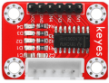

# 项目20 步进电机

## 1.项目介绍：
步进电机定位准确，是工业机器人、3D打印机、大型车床等机械设备中最重要的部件。在这个项目中，我们将使用ESP32控制ULN2003步进电机驱动板来驱动步进电机转动。

## 2.项目元件：
||||
| :--: | :--: | :--: |
|ESP32*1|面包板*1|ULN2003步进电机驱动板*1|
||||
|面包板专用电源模块*1|6节5号电池盒*1|步进电机*1|
||||
|公对母杜邦线若干|5号电池(<span style="color: rgb(255, 76, 65);">自备</span>)*6|USB 线*1|

## 3.项目知识：                                                                    

**步进电机：** 是由一系列电磁线圈控制的电机。它可以根据需要旋转精确的度数(或步数)，允许你将它移动到一个精确的位置并保持该位置。它是通过在很短的时间内为电机内部的线圈供电来做到这一点的，但你必须一直为电机供电，以保持它在你想要的位置。有两种基本类型的步进电机，单极步进和双极步进。在本项目中，我们使用的是单极步进电机28-BYJ48。
 
      
**28BYJ-48步进电机工作原理：**
步进电机主要由定子和转子组成，定子是固定不动的，如下图绕着A、B、C、D线圈组的部分，线圈组导通电就会产生磁场；转子就是转动的部分，如下图定子中间的部分，两极是永磁铁。
                         
单步4节拍的转动原理：开始A组线圈导通，转子两极正对着A组线圈；接着A组线圈断开，B组线圈导通，转子就会顺时针转到B组线圈，转子转了一步；B断开，C导通，转子转到C组；C断开，D导通，转子转到D组；D组断开，A组导通，转子转到A组线圈。这样转子就转了半圈180度，接着再重复一次，B-C-D-A，转子转回到A组线圈，这样转子就转了一圈，总共转动了8步。如下图所示，这就是步进电机单节拍转动的原理A - B - C - D - A ....。
 如果想让步进电机逆时针转动，那只要把节拍顺序反过来就行，D - C - B - A - D .....。


半步8节拍转动原理：8节拍，采用的是单双拍的形式，A - AB - B - BC - C - CD - D - DA - A ...... ，这样运转一拍，转子只会转动半步，例如，A组线圈导通，转子转到正对着A组线圈；接着A和B组一起导通，这样产生的磁场最强的地方在AB组线圈中间，转子两极就会转到AB组线圈中间，也就是顺时针转了半步。
**步进电机参数：**
我们所提供的步进电机需要转动32步，转子才能转一圈，还经过了1:64的减速齿轮组带动输出轴，这样输出轴转动一圈需要：32 * 64 = 2048 步。
电压5V，4相步进电机 ，4节拍模式的步进角为11.25， 8节拍模式步进角为5.625， 减速比为1:64。
**ULN2003步进电机驱动板：** ULN2003型步进电机驱动器，将微弱信号转换为更强的控制信号，从而驱动步进电机。
下面的原理图显示了如何使用ULN2003步进电机驱动板接口将一个单极步进电机接到ESP32的引脚上，并显示了如何使用四个TIP120的接口。 


## 4.项目接线图：


## 5.项目代码：
本项目中使用的代码保存在（即路径)：**..\Keyes ESP32 中级版学习套件\4. Arduino C 教程\2. 树莓派 系统\3. 项目教程\代码集**。你可以把代码移到任何地方。例如，我们将代码保存在Raspberry Pi系统的文件夹pi中，<span style="color: rgb(255, 76, 65);">**路径：../home/pi/代码集**</span>。

可以在此路径下打开代码“**Project_20_Stepping_Motor**”。

```
//**********************************************************************
/*
 * 文件名 : 步进电机
 * 描述 : 采用ULN2003驱动步进电机.
*/
// 连接步进电机驱动器接口
int outPorts[] = {15, 16, 17, 18};

void setup() {
  // 设置引脚输出
  for (int i = 0; i < 4; i++) {
    pinMode(outPorts[i], OUTPUT);
  }
}

void loop()
{
  // 转一整圈
  moveSteps(true, 32 * 64, 3);
  delay(1000);
  // 向另一个方向旋转一整圈
  moveSteps(false, 32 * 64, 3);
  delay(1000);
}

//建议:ms在3 ~ 20之间时，电机转动准确
void moveSteps(bool dir, int steps, byte ms) {
  for (unsigned long i = 0; i < steps; i++) {
    moveOneStep(dir); // 旋转一步
    delay(constrain(ms,3,20));        // 控制速度
  }
}

void moveOneStep(bool dir) {
  // 定义一个变量，用四个低位表示端口状态
  static byte out = 0x01;
  // 根据旋转方向确定换挡方向
  if (dir) {  // 环形左移
    out != 0x08 ? out = out << 1 : out = 0x01;
  }
  else {      // 环形右移
    out != 0x01 ? out = out >> 1 : out = 0x08;
  }
  // 输出信号到每个端口
  for (int i = 0; i < 4; i++) {
    digitalWrite(outPorts[i], (out & (0x01 << i)) ? HIGH : LOW);
  }
}

void moveAround(bool dir, int turns, byte ms){
  for(int i=0;i<turns;i++)
    moveSteps(dir,32*64,ms);
}
void moveAngle(bool dir, int angle, byte ms){
  moveSteps(dir,(angle*32*64/360),ms);
}
//********************************************************************************

```
ESP32主板通过USB线连接到计算机后开始上传代码。为了避免将代码上传至ESP32主板时出现错误，必须选择与计算机连接正确的控制板和端口（COM）。

点击“**工具**”→“**开发板**”，可以查看到各种不同型号ESP32开发板，选择对应的ESP32开发板型号。

点击“**工具**”→“**端口**”，选择对应的端口（COM）。

**注意：将ESP32主板通过USB线连接到计算机后才能看到对应的端口（COM）**。

单击将代码上传到ESP32主控板。

## 6.项目现象：
编译并上传代码到ESP32，代码上传成功后，外接电源，上电后，你会看到的现象是：ULN2003驱动模块上的D1,D2,D3,D4四个LED点亮，步进电机先逆时针旋转，再顺时针旋转，并保持此状态循环。


<span style="color: rgb(255, 76, 65);">注意：</span> 如果上传代码不成功，可以再次点击后用手按住ESP32主板上的Boot键，出现上传进度百分比数后再松开Boot键，如下图所示：


