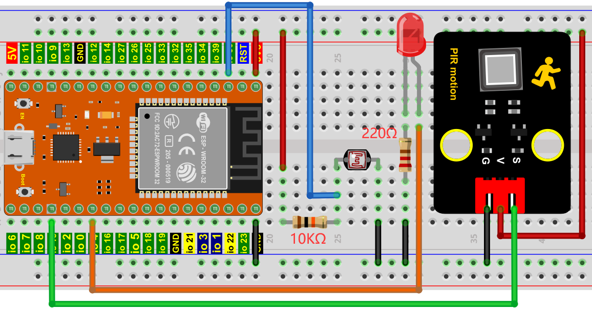
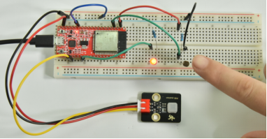

# 项目25 人体感应灯

## 1.项目介绍：
人体感应灯一般都用在黑漆漆的楼道区域，随着科技的发展，人体感应灯的使用在我们现实生活中十分常见。小区的楼道，房间的卧室、地下城的车库、卫生间等区域都会用到人体感应灯。现实生活中的人体感应灯一般是由人体红外传感器、灯、光敏电阻传感器等组成的。
在本项目中，我们将学习如何利用人体红外传感器、LED、光敏电阻来制作一款人体感应灯。

## 2.项目元件：
|||||
| :--: | :--: | :--: | :--: |
|ESP32*1|面包板*1|光敏电阻*1|红色 LED*1|
||| ||
|220Ω电阻*1|10KΩ电阻*1|跳线若干 |USB 线*1|
||| | |
|人体红外传感器*1|3P转杜邦线公单*1| | |

## 3.项目接线图：


## 4.项目代码：
本项目中使用的代码保存在（即路径)：**..\Keyes ESP32 中级版学习套件\4. Arduino C 教程\2. 树莓派 系统\3. 项目教程\代码集**。你可以把代码移到任何地方。例如，我们将代码保存在Raspberry Pi系统的文件夹pi中，<span style="color: rgb(255, 76, 65);">**路径：../home/pi/代码集**</span>。

可以在此路径下打开代码“**Project_25_Human_Induction_Lamp**”。

```
//**********************************************************************************
/*  
 * 文件名  : 人体感应灯
 * 描述 : 通过光敏传感器和PIR运动传感器控制LED.
*/
#define PIN_ADC0  36   //光敏传感器的引脚
#define PIN_LED   4  // LED的引脚
#define pirPin   15     // PIR传感器的引脚
byte pirStat = 0;   // PIR传感器的状态
void setup() {
  Serial.begin(115200);
  pinMode(PIN_LED, OUTPUT);
  pinMode(PIN_ADC0, INPUT);
  pinMode(pirPin, INPUT);
}

void loop() {
  int adcVal = analogRead(PIN_ADC0); //读取光敏传感器的ADC值
  pirStat = digitalRead(pirPin); //读取PIR传感器的值
  if (adcVal >= 2000) {
      if (pirStat == HIGH){
         digitalWrite(PIN_LED, HIGH);//点亮 LED
         } 
      else{
         digitalWrite(PIN_LED, LOW);//关闭 LED   
        }
  }
   else{
      digitalWrite(PIN_LED, LOW);//关闭 LED
      }
}
//**********************************************************************************

```
## 5.项目现象：
编译并上传代码到ESP32，代码上传成功后，利用USB线上电，你会看到的现象是：当你的手覆盖光敏电阻的感光部分来模拟黑暗状态时，然后用另一只手在人体红外传感器前面晃动，LED也点亮。如果光敏电阻的感光部分没有被覆盖，这时候用手在人体红外传感器前面晃动，LED处于熄灭状态。

<span style="color: rgb(255, 76, 65);">注意：</span> 如果上传代码不成功，可以再次点击后用手按住ESP32主板上的Boot键，出现上传进度百分比数后再松开Boot键，如下图所示：


