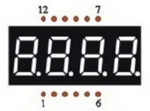
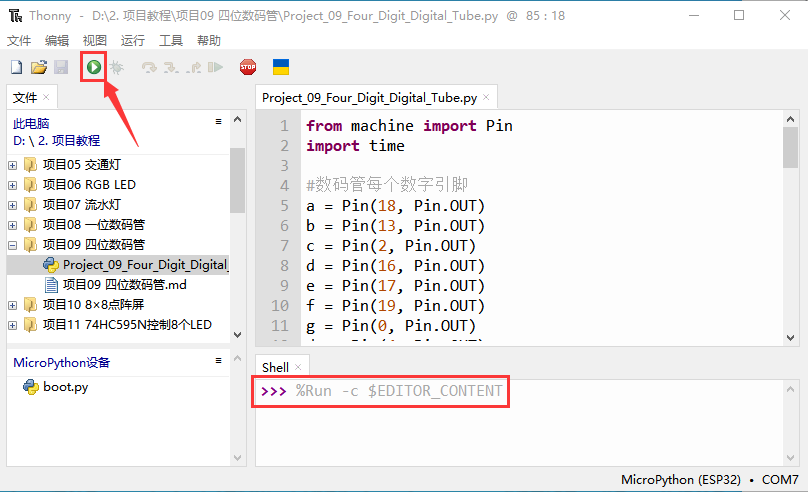

# 项目09 四位数码管

## 1.项目介绍：
四位数码管是一种非常实用的显示器件，电子时钟的显示，球场上的记分员，公园里的人数都是需要的。由于价格低廉，使用方便，越来越多的项目将使用4位数码管。在这个项目中，我们使用ESP32控制四位数码管来显示四位数字。

## 2.项目元件：
||| |
| :--: | :--: | :--: |
|ESP32*1|面包板*1|四位数码管*1|
|| ||
|220Ω电阻*8|跳线若干|USB 线*1|

## 3.元件知识：

**四位数码管：** 四位数码管有共阳极和共阴极两种四位数码管，显示原理是和一位数码管是类似的，都是8个GPIO口控制数码管的显示段，就是8个led灯，不过，这里是4位的，所以就还需要4个GPIO口来控制位选择端，就是选择哪个单个数码管亮，位的切换很快，肉眼区分不出来，这样看起来是多个数码管同时显示。
<span style="color: rgb(255, 76, 65);">我们的四位数码管是共阴极的</span>。
下图为4位数码管的引脚图，G1、G2、G3、G4就是控制位的引脚。


下图为4位数码管内部布线原理图



## 4.项目接线图：


## 5.项目代码：
本教程中使用的代码保存在：
“**..\Keyes ESP32 中级版学习套件\3. Python 教程\1. Windows 系统\2. 项目教程**”的路径中。


你可以把代码移到任何地方。例如，我们将代码保存在**D盘**中，<span style="color: rgb(0, 209, 0);">路径为D:\2. 项目教程</span>。


打开“Thonny”软件，点击“此电脑”→“D:”→“2. 项目教程”→“项目09 四位数码管”。并鼠标左键双击“Project_09_Four_Digit_Digital_Tube.py”。


```
from machine import Pin
import time

#数码管每个数字引脚
a = Pin(18, Pin.OUT)
b = Pin(13, Pin.OUT)
c = Pin(2, Pin.OUT)
d = Pin(16, Pin.OUT)
e = Pin(17, Pin.OUT)
f = Pin(19, Pin.OUT)
g = Pin(0, Pin.OUT)
dp = Pin(4, Pin.OUT)

G1 = Pin(21, Pin.OUT)
G2 = Pin(22, Pin.OUT)
G3 = Pin(14, Pin.OUT)
G4 = Pin(15, Pin.OUT)
 
#数码管a到dp对应的引脚
d_Pins=[Pin(i,Pin.OUT)  for i in [18,13,2,16,17,19,0,4]]
#数码管段G1、G2、G3、G4对应的引脚
w_Pins=[Pin(i,Pin.OUT)  for i in [21,22,14,15]]
 
number={
    '0':
    [1,1,1,1,1,1,0,0],#0
    '1':
    [0,1,1,0,0,0,0,0],#1
    '2':
    [1,1,0,1,1,0,1,0],#2
    '3':
    [1,1,1,1,0,0,1,0],#3
    '4':
    [0,1,1,0,0,1,1,0],#4
    '5':
    [1,0,1,1,0,1,1,0],#5
    '6':
    [1,0,1,1,1,1,1,0],#6
    '7':
    [1,1,1,0,0,0,0,0],#7
    '8':
    [1,1,1,1,1,1,1,0],#8
    '9':
    [1,1,1,1,0,1,1,0],#9
}
 
def display(num,dp):
    global number
    count=0
    for pin in d_Pins:#显示num的值 
        pin.value(number[num][count])
        count+=1
    if dp==1:
        d_Pins[7].value(0)
def clear():
    for i in w_Pins:
        i.value(0)
    for i in d_Pins:
        i.value(1)
def showData(num):
   #数值的百位、千位、个位和小数位
    d_num=num
    location=d_num.find('.')
    if location>0:
        d_num=d_num.replace('.','')
        while len(d_num)<4:
            d_num='0'+d_num
        for i in range(0,4):
            time.sleep(2)
            clear()
            w_Pins[3-i].value(1)
            if i==location-1:
                display(d_num[i],1)
            else:
                display(d_num[i],0)
    if location<0:
        for i in range(0,4):
            time.sleep(2)
            clear()
            w_Pins[3-i].value(1)
            display(d_num[i],0)
while True:
 
    num='9016'
    showData(num)
```
## 6.项目现象：
确保ESP32已经连接到电脑上，单击。


单击，代码开始执行，你会看到的现象是：四位数码管显示数字，并在一个无限循环中重复这些动作。按“Ctrl+C”或单击退出程序。



