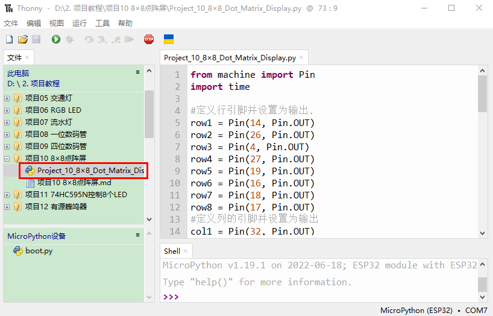
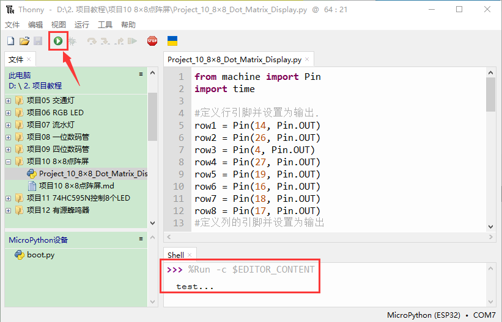

# 项目10 8×8点阵屏

## 1.项目介绍：
点阵屏是一种电子数字显示设备，可以显示机器、钟表、公共交通离场指示器和许多其他设备上的信息。在这个项目中，我们将使用ESP32控制8x8点阵屏来逐渐点亮点阵屏上的LED。

## 2.项目元件：
||||
| :--: | :--: | :--: |
|ESP32*1|面包板*1|8×8点阵屏*1|
|| ||
|220Ω电阻*8|跳线若干|USB 线*1|

## 3.元件知识：
**8×8点阵：** 是由64个led灯组成，有行共阳极和行共阴极两种，我们的模块是行共阳极的，也就是每一行有一条线将LED的正极连到一起，列就是将LED灯的负极连接到一起，看下图：


每个LED被放置在一行和一列的交叉点上。当某一行的电平为1，某列的电平为0时，对应的LED会亮起。如果你想点亮第一个点上的LED，你应该将引脚9设置为高电平，引脚13设置为低电平。如果你想点亮第一排的led，你应该把引脚9设置为高电平，把引脚13、3、4、10、6、11、15和16设置为低电平。如果您想点亮第一列的led，将引脚13设置为低电平，将引脚9、14、8、12、1、7、2和5设置为高电平。

**8×8点阵屏的外部视图如下所示：**


## 4.项目接线图：


## 5.项目代码：
本教程中使用的代码保存在：
“**..\Keyes ESP32 中级版学习套件\3. Python 教程\1. Windows 系统\2. 项目教程**”的路径中。


你可以把代码移到任何地方。例如，我们将代码保存在**D盘**中，<span style="color: rgb(0, 209, 0);">路径为D:\2. 项目教程</span>。


打开“Thonny”软件，点击“此电脑”→“D:”→“2. 项目教程”→“项目10 8×8点阵屏”。然后鼠标左键双击“Project_09_Four_Digit_Digital_Tube.py”。


```
from machine import Pin
import time

#定义行引脚并设置为输出.
row1 = Pin(14, Pin.OUT)
row2 = Pin(26, Pin.OUT)
row3 = Pin(4, Pin.OUT)
row4 = Pin(27, Pin.OUT)
row5 = Pin(19, Pin.OUT)
row6 = Pin(16, Pin.OUT)
row7 = Pin(18, Pin.OUT)
row8 = Pin(17, Pin.OUT)
#定义列的引脚并设置为输出
col1 = Pin(32, Pin.OUT)
col2 = Pin(21, Pin.OUT)
col3 = Pin(22, Pin.OUT)
col4 = Pin(12, Pin.OUT)
col5 = Pin(0, Pin.OUT)
col6 = Pin(13, Pin.OUT)
col7 = Pin(33, Pin.OUT)
col8 = Pin(25, Pin.OUT)

#将列的引脚设置为低电平
col1.value(0)
col2.value(0)
col3.value(0)
col4.value(0)
col5.value(0)
col6.value(0)
col7.value(0)
col8.value(0)

#由于点阵的列被设置为低电平，因此当该行的引脚处于高电平时，点阵的对应行将亮起
def Row(d):
    if(d ==1):
        row1.value(1)  #点亮第一条线
    if(d ==2):
        row2.value(1)  #点亮第二条线
    if(d ==3):
        row3.value(1)
    if(d ==4):
        row4.value(1)
    if(d ==5):
        row5.value(1)
    if(d ==6):
        row6.value(1)
    if(d ==7):
        row7.value(1)
    if(d ==8):
        row8.value(1)
    
#关闭格子
def off():
    row1.value(0)
    row2.value(0)
    row3.value(0)
    row4.value(0)
    row5.value(0)
    row6.value(0)
    row7.value(0)
    row8.value(0) 

try:
    print("test...")
    while True:
         for num in range(1,10):  #逐行点亮格子
             Row(num)
             if(num == 9):  #因为晶格只有8行，我在这里限定一下，等于9
                off()      #关闭格子
             time.sleep(0.2)

except:
    pass
```

## 6.项目现象：
确保ESP32已经连接到电脑上，单击。


单击，代码开始执行，你会看到的现象是：8x8点阵屏逐渐点亮。按“Ctrl+C”或单击退出程序。



