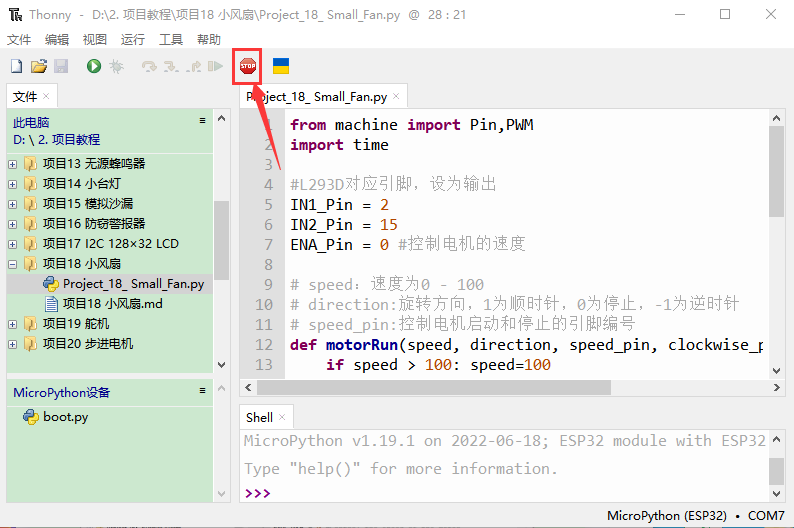
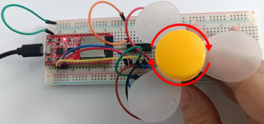

# 项目18 小风扇

## 1.项目介绍： 
在炎热的夏季，需要电扇来给我们降温，那么在这个项目中，我们将使用ESP32控制直流电机和小扇叶来制作一个小电扇。
## 2.项目元件：
||||||
| :--: | :--: | :--: | :--: | :--: |
|ESP32*1|面包板*1|直流电机*1|面包板专用电源模块*1|6节5号电池盒*1|
||||||
|IC L293D*1|风扇叶*1|跳线若干|5号电池(<span style="color: rgb(255, 76, 65);">自备</span>)*6|USB 线*1|

## 3.元件知识:

L293D芯片：L293D是一种直流电动驱动IC，在一些机器人项目中可用来驱动直流电机或步进电机。它共有16个引脚，可以同时驱动两路直流电机。输入电压范围：4.5 V ~ 36 V，每通道输出电流：MAX 600mA，可以驱动感性负载，特别是其输入端可以与主控板直接相连，从而很方便地受主控板控制。当驱动小型直流电机时，可以直接控制两路电机，并且可以实现电机正转与反转，实现此功能只需改变输入端的高低电平。市面上有许多采用L293D芯片的电机驱动板，当然我们也可以自己通过简单连接来使用它。
**L293D引脚图：**

|引脚号| 引脚名称 | 描述 |
| :--: | :--: | :--: |
| 1 | Enable1 | 该引脚使能输入引脚Input 1(2)和Input 2(7)  |
| 2 | In1 | 直接控制输出1引脚，由数字电路控制 |
| 3 | Out1 | 连接到电机1的一端 |
| 4 | 0V | 接地引脚连接到电路的接地(0V) |
| 5 | 0V | 接地引脚连接到电路的接地(0V) |
| 6 |Out2 | 连接到电机1的另一端 |
| 7 | In2 | 直接控制输出2引脚。由数字电路控制 |
| 8 | +V motor | 连接到运行电机的电压引脚(4.5V至36V) |
| 9 | Enable2 |该引脚使能输入引脚输入3(10)和输入4(15) |
| 10 | In3 | 直接控制输出3引脚。由数字电路控制|
| 11 | Out3 | 连接到电机2的一端 |
| 12 | 0V | 接地引脚连接到电路的接地(0V) |
| 13 | 0V | 接地引脚连接到电路的接地(0V) |
| 14 | Out4 | 连接到电机2的另一端 |
| 15 |In4 | 直接控制输出4引脚，由数字电路控制|
| 16 | +V | 连接到+ 5V以启用IC功能 |

**面包板专用电源模块：**

**说明：**
此模块，能方便的给面包板提供3.3V和5V的电源，具有DC2.1输入（DC7－12V），另外，具备USB Type C接口的电源输入。

**规格：** 
 输入电压：DC座：7-12V；  Type C USB：5V 
 电流：3.3V：最大500mA；        5V：最大500mA；
 最大功率: 2.5W
 尺寸: 53mmx26.3mm
 环保属性: ROHS

**接口说明：**


**原理图：**


## 4. 项目接线图：


(<span style="color: rgb(255, 76, 65);">注: 先接好线，然后在直流电机上安装一个小风扇叶片。</span>)

## 5.项目代码：
本教程中使用的代码保存在：
“**..\Keyes ESP32 中级版学习套件\3. Python 教程\1. Windows 系统\2. 项目教程**”的路径中。


你可以把代码移到任何地方。例如，我们将代码保存在**D盘**中，<span style="color: rgb(0, 209, 0);">路径为D:\2. 项目教程</span>。


打开“Thonny”软件，点击“此电脑”→“D:”→“2. 项目教程”→“项目18 小风扇”。并鼠标左键双击“Project_18_ Small_Fan.py”。


```
from machine import Pin,PWM
import time

#L293D对应引脚，设为输出 
IN1_Pin = 2
IN2_Pin = 15
ENA_Pin = 0 #控制电机的速度

# speed：速度为0 - 100
# direction:旋转方向，1为顺时针，0为停止，-1为逆时针
# speed_pin:控制电机启动和停止的引脚编号
def motorRun(speed, direction, speed_pin, clockwise_pin, anti_clockwise_pin):
    if speed > 100: speed=100
    if speed < 0: speed=0
    in1 = Pin(anti_clockwise_pin, Pin.OUT)
    in2 = Pin(clockwise_pin, Pin.OUT)
    pwm = PWM(Pin(speed_pin))
    pwm.freq(50)
    pwm.duty(int(speed/100*4096))
    if direction < 0:
        in2.value(0)
        in1.value(1)
    if direction == 0:
        in2.value(0)
        in1.value(0)
    if direction > 0:
        in2.value(1)
        in1.value(0)

while True:
    motorRun(100, 1, ENA_Pin, IN2_Pin, IN1_Pin)
    time.sleep(5)
    motorRun(100, 0, ENA_Pin, IN2_Pin, IN1_Pin)
    time.sleep(2)
    motorRun(100, -1, ENA_Pin, IN2_Pin, IN1_Pin)
    time.sleep(5)
    motorRun(100, 0, ENA_Pin, IN2_Pin, IN1_Pin)
    time.sleep(2)

```

## 6.项目现象：
确保ESP32已经连接到电脑上，单击。


单击，代码开始执行，你会看到的现象是：小风扇先逆时针转5秒，停止2秒，再顺时针转5秒，停止2秒，以此规律重复执行。按“Ctrl+C”或单击退出程序。




