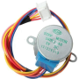
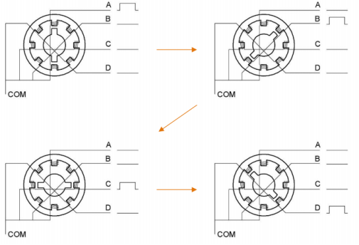
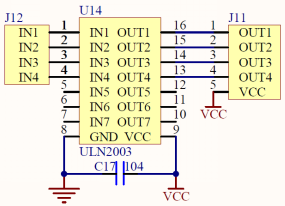
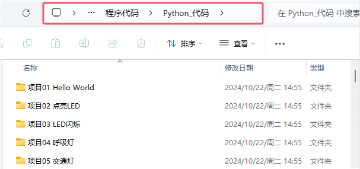

# 项目20 步进电机

## 1.项目介绍：
步进电机定位准确，是工业机器人、3D打印机、大型车床等机械设备中最重要的部件。在这个项目中，我们将使用ESP32控制ULN2003步进电机驱动板来驱动步进电机转动。

## 2.项目元件：
||||
| :--: | :--: | :--: |
|ESP32*1|面包板*1|ULN2003步进电机驱动板*1|
||||
|面包板专用电源模块*1|6节5号电池盒*1|步进电机*1|
||||
|公对母杜邦线若干|5号电池(<span style="color: rgb(255, 76, 65);">自备</span>)*6|USB 线*1|

## 3.项目知识：                                                                    

**步进电机：** 是由一系列电磁线圈控制的电机。它可以根据需要旋转精确的度数(或步数)，允许你将它移动到一个精确的位置并保持该位置。它是通过在很短的时间内为电机内部的线圈供电来做到这一点的，但你必须一直为电机供电，以保持它在你想要的位置。有两种基本类型的步进电机，单极步进和双极步进。在本项目中，我们使用的是单极步进电机28-BYJ48。
 
      
**28BYJ-48步进电机工作原理：**
步进电机主要由定子和转子组成，定子是固定不动的，如下图绕着A、B、C、D线圈组的部分，线圈组导通电就会产生磁场；转子就是转动的部分，如下图定子中间的部分，两极是永磁铁。
                         
单步4节拍的转动原理：开始A组线圈导通，转子两极正对着A组线圈；接着A组线圈断开，B组线圈导通，转子就会顺时针转到B组线圈，转子转了一步；B断开，C导通，转子转到C组；C断开，D导通，转子转到D组；D组断开，A组导通，转子转到A组线圈。这样转子就转了半圈180度，接着再重复一次，B-C-D-A，转子转回到A组线圈，这样转子就转了一圈，总共转动了8步。如下图所示，这就是步进电机单节拍转动的原理A - B - C - D - A ....。
 如果想让步进电机逆时针转动，那只要把节拍顺序反过来就行，D - C - B - A - D .....。


半步8节拍转动原理：8节拍，采用的是单双拍的形式，A - AB - B - BC - C - CD - D - DA - A ...... ，这样运转一拍，转子只会转动半步，例如，A组线圈导通，转子转到正对着A组线圈；接着A和B组一起导通，这样产生的磁场最强的地方在AB组线圈中间，转子两极就会转到AB组线圈中间，也就是顺时针转了半步。
**步进电机参数：**
我们所提供的步进电机需要转动32步，转子才能转一圈，还经过了1:64的减速齿轮组带动输出轴，这样输出轴转动一圈需要：32 * 64 = 2048 步。
电压5V，4相步进电机 ，4节拍模式的步进角为11.25， 8节拍模式步进角为5.625， 减速比为1:64。
**ULN2003步进电机驱动板：** ULN2003型步进电机驱动器，将微弱信号转换为更强的控制信号，从而驱动步进电机。
下面的原理图显示了如何使用ULN2003步进电机驱动板接口将一个单极步进电机接到ESP32的引脚上，并显示了如何使用四个TIP120的接口。 


## 4.项目接线图：


## 5.项目代码：
本教程中使用的代码保存在：
“**..\Keyes ESP32 中级版学习套件\3. Python 教程\1. Windows 系统\2. 项目教程**”的路径中。


你可以把代码移到任何地方。例如，我们将代码保存在**D盘**中，<span style="color: rgb(0, 209, 0);">路径为D:\2. 项目教程</span>。


打开“Thonny”软件，点击“此电脑”→“D:”→“2. 项目教程”→“项目20 步进电机”。并鼠标左键双击“Project_20_Stepping_Motor.py”。


```
from machine import Pin
import time
 
# 引脚初始化
in1 = Pin(15, Pin.OUT)
in2 = Pin(16, Pin.OUT)
in3 = Pin(17, Pin.OUT)
in4 = Pin(18, Pin.OUT)
 
# 延时
delay = 1
 
# 电机旋转一圈所需的步数，(约360°)，会有轻微偏差.
ROUND_VALUE = 509
 
# 四相八拍步进电机顺序值:A-AB-B-BC-C-CD-D-DA-A.
STEP_VALUE = [
    [1, 0, 0, 0],
    [1, 1, 0, 0],
    [0, 1, 0, 0],
    [0, 1, 1, 0],
    [0, 0, 1, 0],
    [0, 0, 1, 1],
    [0, 0, 0, 1],
    [1, 0, 0, 1],
]
 
# 引脚输出电平低
def reset():
    in1(0)
    in2(0)
    in3(0)
    in4(0)
 
# 如果count是正整数，则顺时针旋转，如果count是负整数，则逆时针旋转
def step_run(count):
    direction = 1     # 顺时针转
    if count < 0:
        direction = -1  # 逆时针旋转
        count = -count
    for x in range(count):
        for bit in STEP_VALUE[::direction]:
            in1(bit[0])
            in2(bit[1])
            in3(bit[2])
            in4(bit[3])
            time.sleep_ms(delay)
    reset()
 
# 如果a是正整数，则顺时针旋转，如果a是负整数，则逆时针旋转
def step_angle(a):
    step_run(int(ROUND_VALUE * a / 360))
 
# 循环:顺时针转一圈，再逆时针转一圈.
while True:
    step_run(509)
    step_run(-509)
    step_angle(360)
    step_angle(-360)
```
## 6.项目现象：
确保ESP32已经连接到电脑上，单击。


单击，代码开始执行，你会看到的现象是：ULN2003驱动模块上的D1,D2,D3,D4四个LED点亮，步进电机先逆时针旋转，再顺时针旋转，并保持此状态循环。按“Ctrl+C”或单击退出程序。


