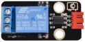
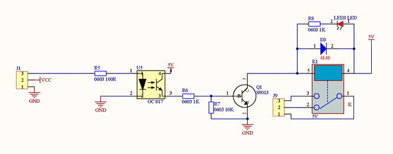
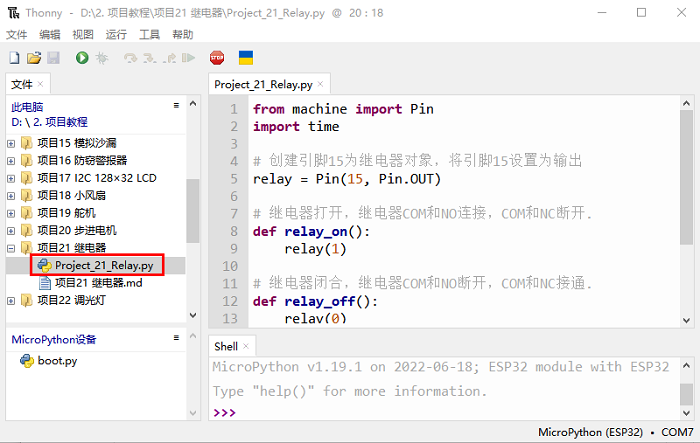
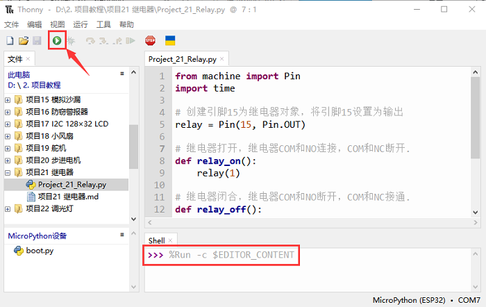

# 项目21 继电器

## 1.项目介绍：
在日常生活中，我们一般使用交流来驱动电气设备，有时我们会用开关来控制电器。如果将开关直接连接到交流电路上，一旦发生漏电，人就有危险。从安全的角度考虑，我们特别设计了这款具有NO(常开)端和NC(常闭)端的继电器模块。在这节课我们将学习一个比较特殊，好用的开关，就是继电器模块。

## 2.项目元件：
|||||
| :--: | :--: | :--: |:--: |
|ESP32*1|面包板*1|继电器模块*1|红色LED*1|
|||| |
|3P转杜邦线公单*1|USB 线*1|220Ω电阻*1|跳线若干|

## 3.元件知识：
**继电器：** 它主要采用HK4100F-DC 5V-SHC继电器元件。继电器有3个接线柱用于外接电路，分别为NO、COM和NC端（背后丝印）。

常开（NO）：该引脚是常开的，除非向继电器模块的信号引脚提供信号，因此，普通接触针通过NC脚断开其连接，通过NO脚建立连接。

公共触点（COM）：此引脚用来连接其他模块/元器件，如LED。

LED：

常闭（NC）：此NC引脚通过COM引脚连接，形成闭合电路，可以通过ESP32等开发板，控制继电器模块，来切换闭合或断开。

当继电器没有接控制信号时，COM端和NC端连通，COM端和NO端断开。
控制时，把G接控制板的GND，V接控制板的5V，S接控制板的数字口。当S信号端设置为高电平时，继电器开启，继电器COM端和NC端断开，COM端和NO端连通；S信号端设置为低电平时，继电器关闭，继电器COM端和NC端连通，COM端和NO端断开。

- 工作电压：5V（DC）
- 工作电流：≤50MA
- 最大功率：0.25W
- 输入信号：数字信号
- 触点电流：<3A

**继电器原理图：**


## 4.项目接线图：


## 5.项目代码：
本教程中使用的代码保存在：
“**..\Keyes ESP32 中级版学习套件\3. Python 教程\1. Windows 系统\2. 项目教程**”的路径中。


你可以把代码移到任何地方。例如，我们将代码保存在**D盘**中，<span style="color: rgb(0, 209, 0);">路径为D:\2. 项目教程</span>。


打开“Thonny”软件，点击“此电脑”→“D:”→“2. 项目教程”→“项目21 继电器”。并鼠标左键双击“Project_21_Relay.py”。


```
from machine import Pin
import time

# 创建引脚15为继电器对象，将引脚15设置为输出 
relay = Pin(15, Pin.OUT)
 
# 继电器打开，继电器COM和NO连接，COM和NC断开.
def relay_on():
    relay(1)
 
# 继电器闭合，继电器COM和NO断开，COM和NC接通.
def relay_off():
    relay(0)
 
# 循环，继电器开一秒，关一秒
while True:
    relay_on()
    time.sleep(1)
    relay_off()
    time.sleep(1)
```
## 6.项目现象：
确保ESP32已经连接到电脑上，单击。


单击，代码开始执行，你会看到的现象是：继电器将循环开与关，开启1秒LED点亮1秒，关闭1秒LED熄灭1秒。同时可以听到继电器开与关的声音，还可以看到继电器上的指示灯指示状态的变化。按“Ctrl+C”或单击退出程序。



