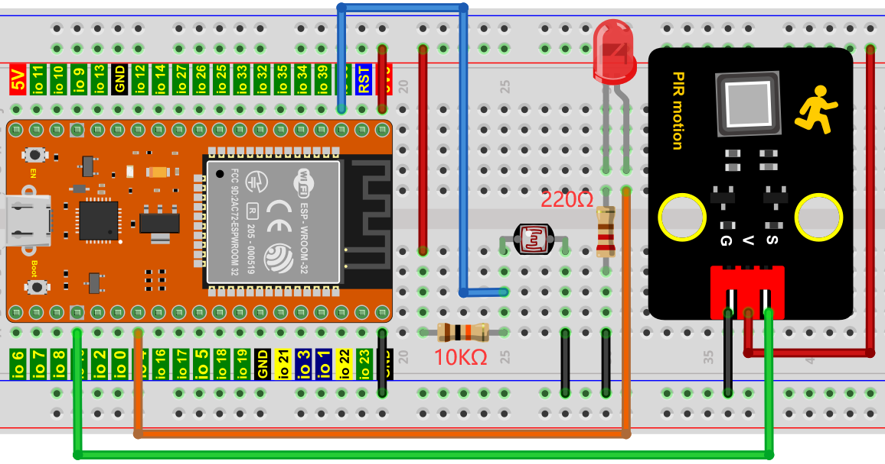
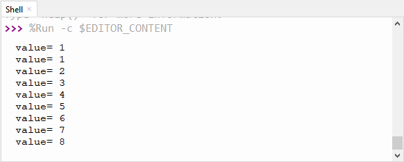

# 项目25 人体感应灯

## 1.项目介绍：
人体感应灯一般都用在黑漆漆的楼道区域，随着科技的发展，人体感应灯的使用在我们现实生活中十分常见。小区的楼道，房间的卧室、地下城的车库、卫生间等区域都会用到人体感应灯。现实生活中的人体感应灯一般是由人体红外传感器、灯、光敏电阻传感器等组成的。
在本项目中，我们将学习如何利用人体红外传感器、LED、光敏电阻来制作一款人体感应灯。

## 2.项目元件：
|||||
| :--: | :--: | :--: | :--: |
|ESP32*1|面包板*1|光敏电阻*1|红色 LED*1|
||| ||
|220Ω电阻*1|10KΩ电阻*1|跳线若干 |USB 线*1|
||| | |
|人体红外传感器*1|3P转杜邦线公单*1| | |

## 3.项目接线图：


## 4.项目代码：
本教程中使用的代码保存在：
“**..\Keyes ESP32 中级版学习套件\3. Python 教程\1. Windows 系统\2. 项目教程**”的路径中。


你可以把代码移到任何地方。例如，我们将代码保存在**D盘**中，<span style="color: rgb(0, 209, 0);">路径为D:\2. 项目教程</span>。


打开“Thonny”软件，点击“此电脑”→“D:”→“2. 项目教程”→“项目25 人体感应灯”。并鼠标左键双击“Project_25_Human_Induction_Lamp.py”。


```
from machine import Pin, ADC
import time
 
# 人体红外传感器引脚
human = Pin(15, Pin.IN)
 
# 初始化光敏光传感器引脚到GP36 (ADC函数)
adc=ADC(Pin(36))
adc.atten(ADC.ATTN_11DB)
adc.width(ADC.WIDTH_10BIT)
#创建引脚4为LED对象，设置引脚4为输出 
led = Pin(4, Pin.OUT)

def detect_someone():
    if human.value() == 1:
        return True
    return False
 
abc = 0
 
while True:
    adcVal=adc.read()
    if adcVal >= 500:
        if detect_someone() == True:
            abc += 1
            led.value(1)
            print("value=", abc)
            time.sleep(1)
        else:
            if abc != 0:
                abc = 0
                led.value(0)
    else:
        led.value(0)
 
    time.sleep(0.1)
```
## 5.项目现象：
确保ESP32已经连接到电脑上，单击。


单击，代码开始执行，你会看到的现象是：当你的手覆盖光敏电阻的感光部分来模拟黑暗状态时，然后用另一只手在人体红外传感器前面晃动，LED也点亮，而且延时几秒钟后LED会自动关闭，同时Thonny IDE下的”Shell”窗口将打印LED点亮的延时时间。如果光敏电阻的感光部分没有被覆盖，这时候用手在人体红外传感器前面晃动，LED处于熄灭状态。按“Ctrl+C”或单击退出程序。




